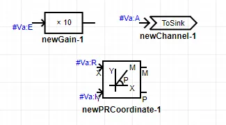

CloudPSS SimStudio移频电磁暂态仿真平台提供了针对复包络信号的量测功能。

在移频电磁暂态仿真中，可能会产生需要量测某点电压、电流的复包络信号的实部、虚部、模、或原信号时域瞬时值的需求。此时需要使用复包络信号的扩展引脚名。

## 扩展引脚名

对于电气量(电压、电流、功率等)的量测的基本使用方法参见[量测和输出系统](../../Basic/Measure.md)案例及模板，此处仅介绍其在移频电磁暂态仿真平台中的扩展。

1. 首先，在测量元件，或电气元件的Monitoring页面内，填入待量测信号的引脚名，这里与[量测和输出系统](../../Basic/Measure.md)中要求一致。如下图所示。

 

2. 然后，在其它需要用到该信号的实部/虚部/模/原信号的地方，使用带有后缀的信号名。扩展引脚名为原信号后接“`:R`”、“`:I`”、“`:E`”、“`:A`”符号。如下图所示。

 

如果直接调用原信号，那么调用的将是解析包络的原信号（即电磁暂态的时域实数信号）。

移频后的解析包络信号$x$的不同扩展引脚对应的含义如下：

[扩展引脚含义]
| 扩展引脚类型 | 含义 | 数学表达式 |
| :------------: | :-----------: | :-----------: |
| **x:R** | x的实部 | ${\mathop{\rm Re}\nolimits} \left( x \right)$ |
| **x:I** | x的虚部 | ${\mathop{\rm Im}\nolimits} \left( x \right)$ |
| **x:E** | x的包络 | $\sqrt{ {\mathop{\rm Re}\nolimits} { {\left( x \right)}^2} + {\mathop{\rm Im}\nolimits} { {\left( x \right)}^2} }$ |
| **x:A** | x的原信号 | ${\mathop{\rm Re}\nolimits} \left( {x \cdot {e^{j{\omega _s}t} } } \right)$ |
| **x** | 同**x:A** | ${\mathop{\rm Re}\nolimits} \left( {x \cdot {e^{j{\omega _s}t} } } \right)$ |

