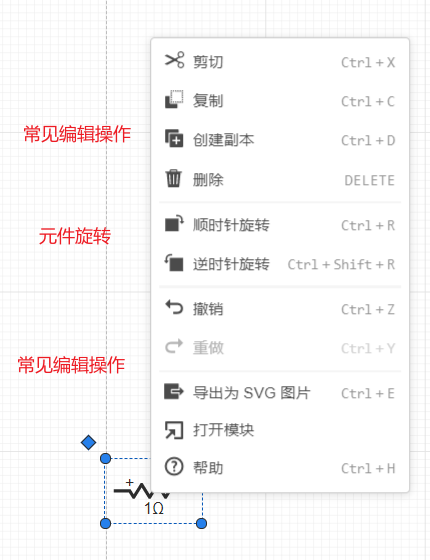

## 常见编辑操作

打开算例项目，[[鼠标右键]]可以选择剪切、复制、粘贴、创建副本、删除、全选、撤销、重做、顺时针旋转、逆时针旋转、导出为SVG图片、更新元件、元件表操作，或者通过快捷键实现上述操作。

## 跨网页复制

跨网页复制可以将单个或多个元件复制到不同的算例中（即，不同的网页），实现单个或多个元件构成的复杂参数和拓扑的复制使用。

跨网页复制直接在本算例中复制单个或多个元件，然后在另外一个需要的算例中进行粘贴即可实现。

