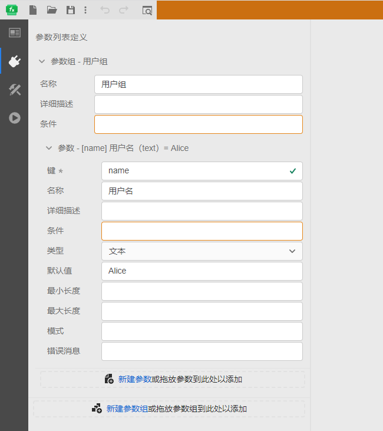
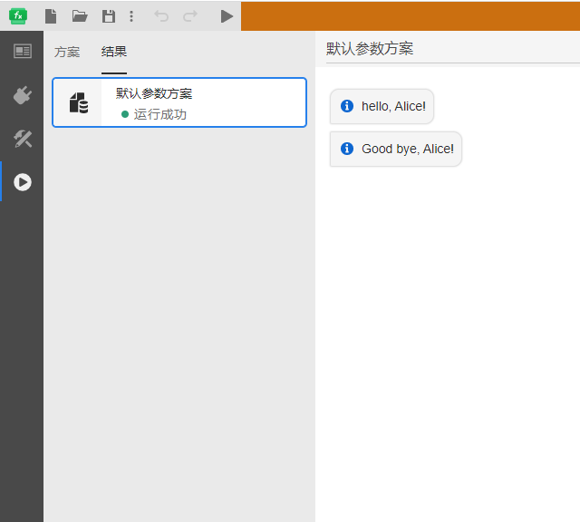

::: info

**本节主要介绍如何在云端JavaScript 模块实现函数。**

:::

可以，将代码提交到远程服务器，使用远程服务器的资源运行函数。实现目前只支持 JavaScript。

###  FuncStudio 支持的标准 JavaScript 代码
 
 在云端 JavaScript 模块实现页面的代码编辑区中编写代码

 ```JavaScript
 /**
 * @param {Record<string, unknown>} args
 * @param {AbortSignal} signal
 * @param {Record<string, unknown>} env
 */
export default async function* (args,signal,env) {
    yield "hello, "+args.name+"!"
    yield "Good bye, "+args.name+"!"
}  
 ```
 

::: tip

注意args.键名的参数调用形式。

:::

 其中，`name` 是在参数列表中添加的参数键名，如下图所示：

 

 保存项目后，在`运行`标签页点击`启动任务` ,函数执行结果如下所示：

 