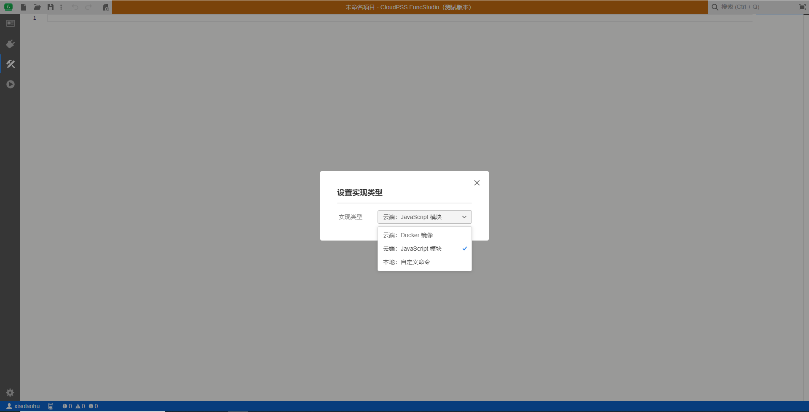
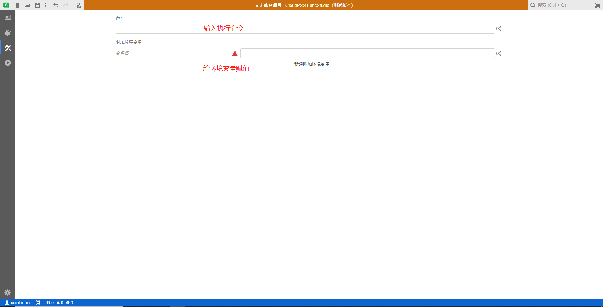
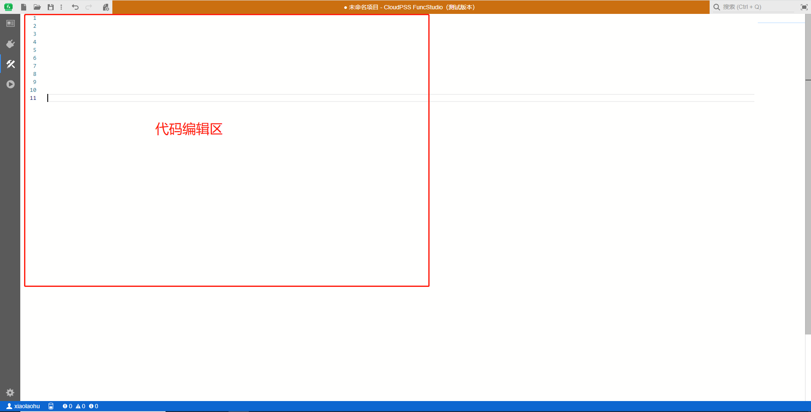
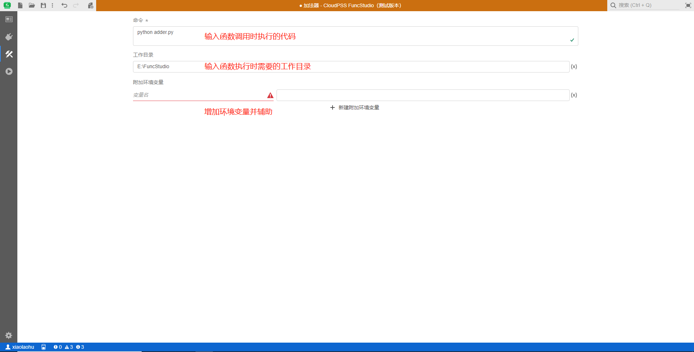

::: info

**`实现`标签页代码、命令配置函数的实现，用户在该标签页内通过点击`更改实现类型`快捷按钮来切换实现类型，包括`云端：Docker镜像`、`云端：JavaScript 模块`和`本地：自定义命令`。**

:::

选择不同的实现方式将会进入不同的实现页面。

### 1)	云端：Docker镜像

可以在云端 Docker 命令实现页面的命令窗口中输入执行命令，并将命令提交到远程 Docker 服务器中，使用远程服务器的资源运行命令。新建附加环境变量用于对具体的环境变量赋值。`目前版本该实现方法禁用!`

### 2)	云端：JavaScript 模块

可以在云端代码实现页面的代码编辑区中编写代码，并将代码提交到远程服务器，使用远程服务器的资源运行代码。该实现方式目前只支持JavaScript 代码。

### 3)	本地：自定义命令

本地命令实现页面中直接使用命令来执行对应的本地程序，只能使用本地的计算资源。命令窗口用于输入执行命令，工作目录用来指定命令执行时使用的目录，参数提供环境变量传入，新建附加环境变量用于对环境变量赋值。

