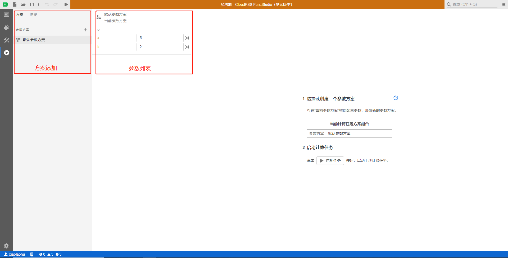
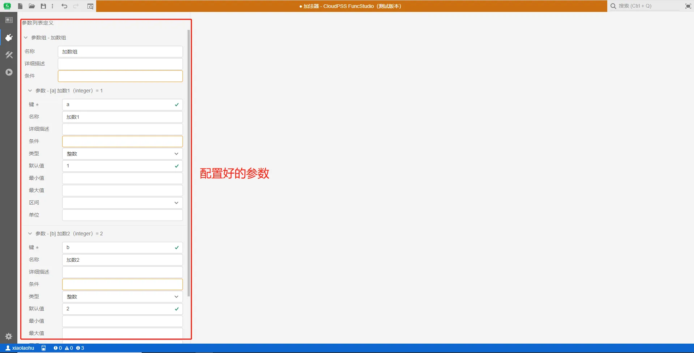
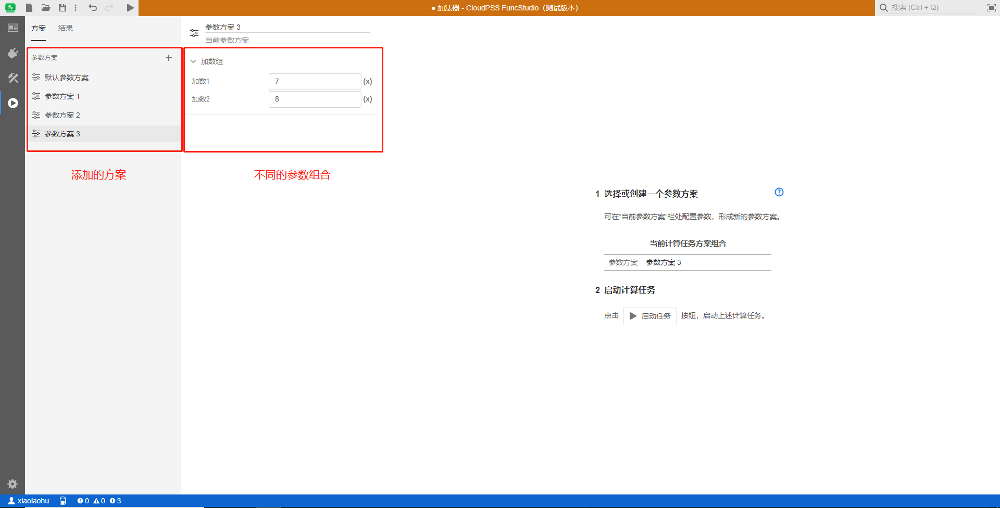
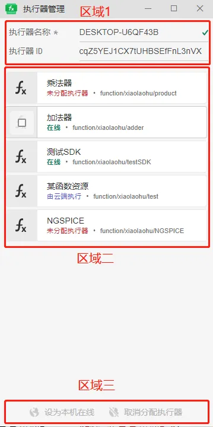
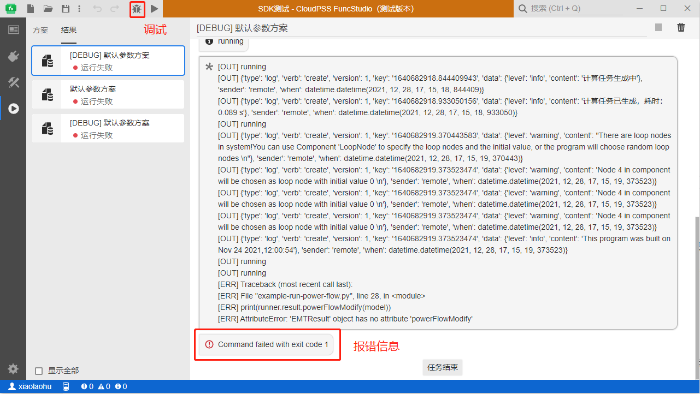
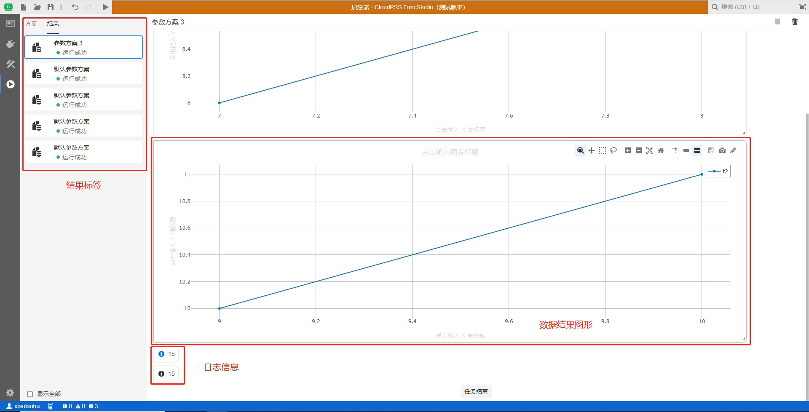
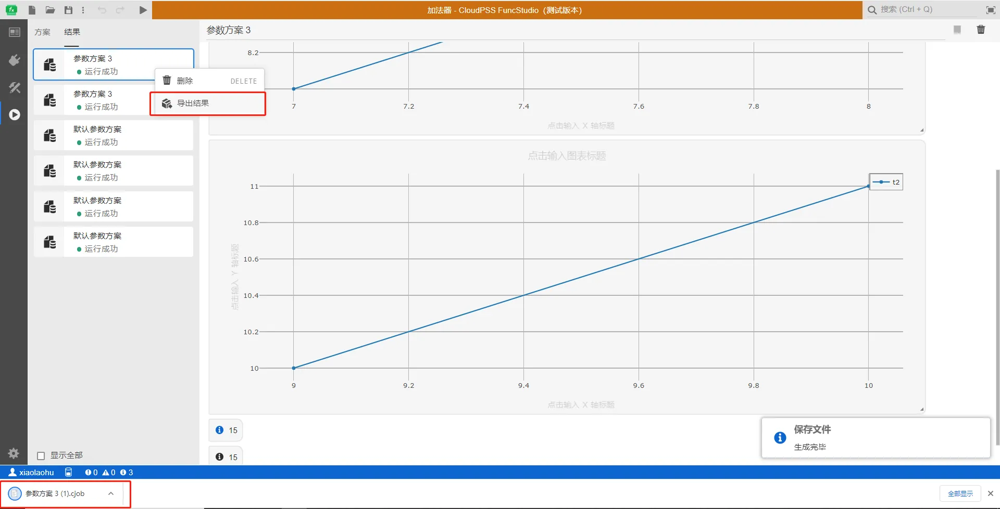

::: info

**当函数实现构建完毕之后，可在`运行`标签页对参数方案进行配置，并开始运行生成执行结果。**

:::

## 参数方案配置

系统默认会添加一组参数方案，如下图所示。

对于同一个项目，CloudPSS FuncStudio 支持配置不同的参数运行方案，便于用户快速对比不同参数条件下的函数执行结果。在`接口`标签页可以给当前项目添加参数，参数列表将会显示于项目参数的列表内。例如对加法器函数添加一系列参数，并添加不同的加法参数方案，如下图所示。

参数方案配置的具体使用方法和 CloudPSS SimStudio 一致，详见[参数方案配置](../../Basic/ParameterCal/index.md)功能帮助。

## 执行器管理

参数方案配置完成并保存之后，在启动任务之前需要对函数的执行器进行配置。右击系统状态栏中 FuncStudio 执行器的小图标，选择菜单中的「执行器管理」打开执行器管理界面。

执行器管理界面可以分为三个区域。区域一：执行器信息区域，可以修改执行器名称和查看执行器 ID。区域二：显示当前拥有的函数列表，可以查看当前函数的状态和函数的 RID。区域三：操作区域，对于本地执行的函数，可以将选中的函数设置为在当前机器上使用或取消使用当前函数。

:::tip

对于在云端执行的函数其当前状态会自动配置为`由云端执行`。

对于刚保存的在本地执行的函数当前状态为'未分配执行器'，需要手动选中后设置为`设为本机在线`来分配执行器。

对于已经在线的函数，可以手动选中后设置为`取消分配执行器`。

此外，还可以在 CloudPSS 执行器内对函数进行调试。如下图所示：
:::

## 执行结果页面：

### 1)结果显示：
选择想要执行的参数方案，点击右上角的`启动任务`，将会生成执行结果，如下图所示。CloudPSS FuncStudio 对用户的每一次执行结果都进行存储，用户可通过切换左侧的结果标签进行结果查看，结果标签可进行导出以及删除操作。执行结果由报错信息、数据结果图形、日志信息三部分组成。当函数出现错误情况时，报错信息将会给出相应的提示；数据结果图形支持缩放、平移、重命名坐标轴名称、重命名标题名称、波形数据下载、波形图像下载等操作；日志信息主要显示函数执行过程中输出的信息。

### 2)结果导出：

CloudPSS FuncStudio 支持仿真结果`导出`功能，将某个参数方案下的多个执行数据打包导出为 cjob 格式文件。用户通过右键点击结果标签，点击`导出结果`图标，导出该方案下的全部执行结果为 cjob 格式文件。

