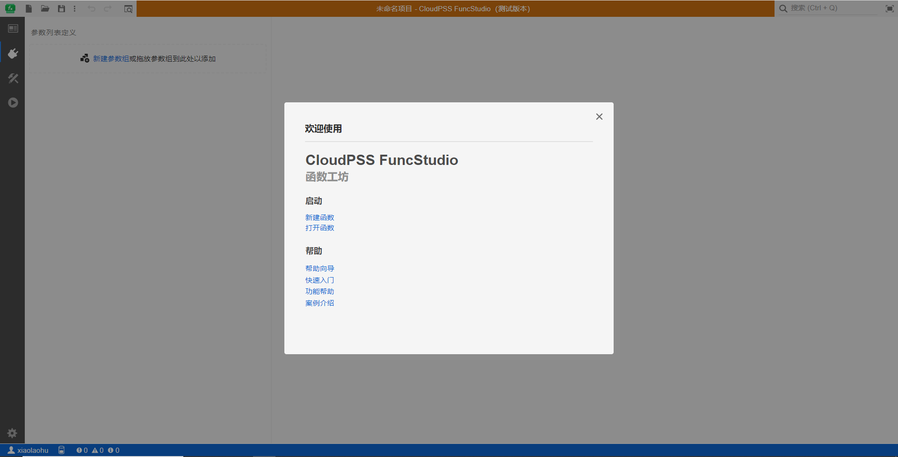
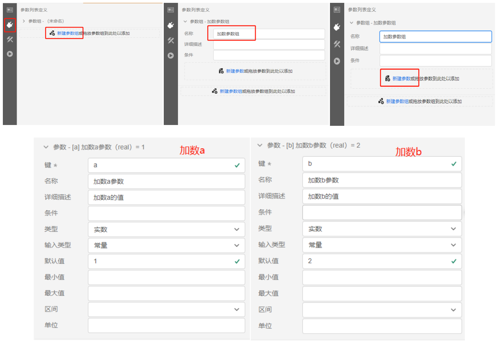
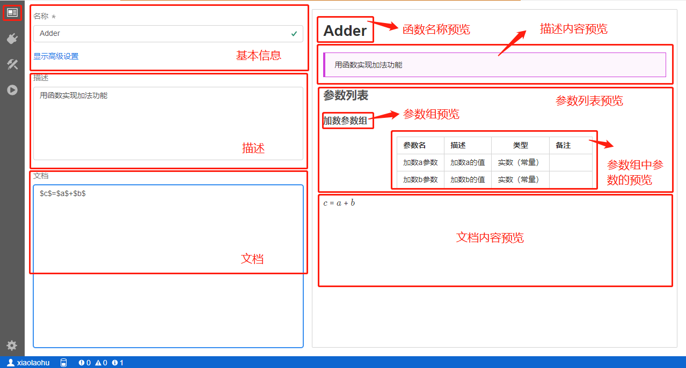
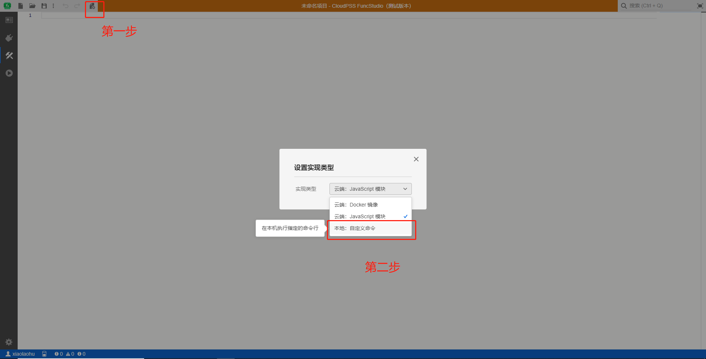
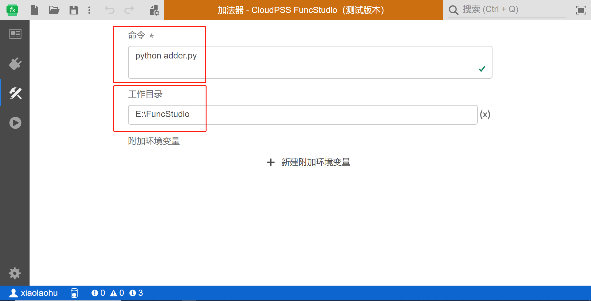
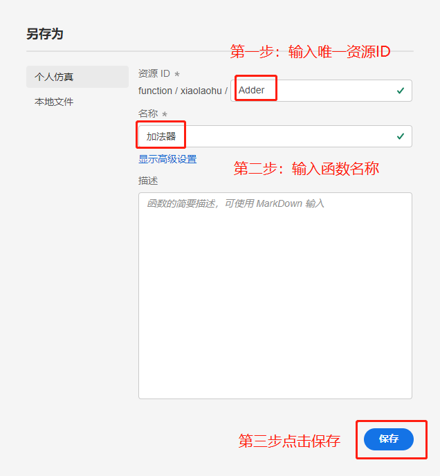
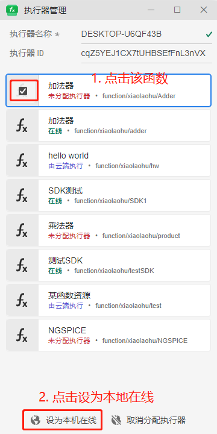
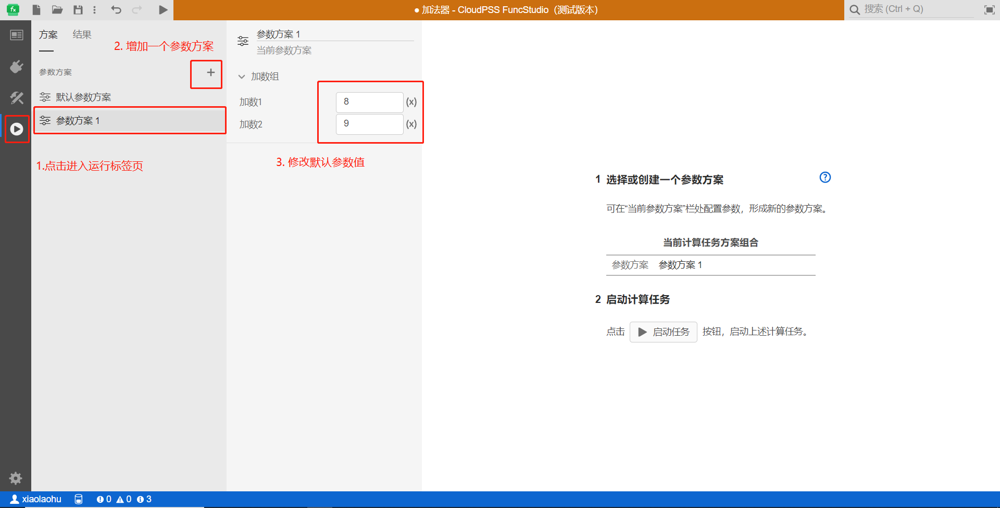
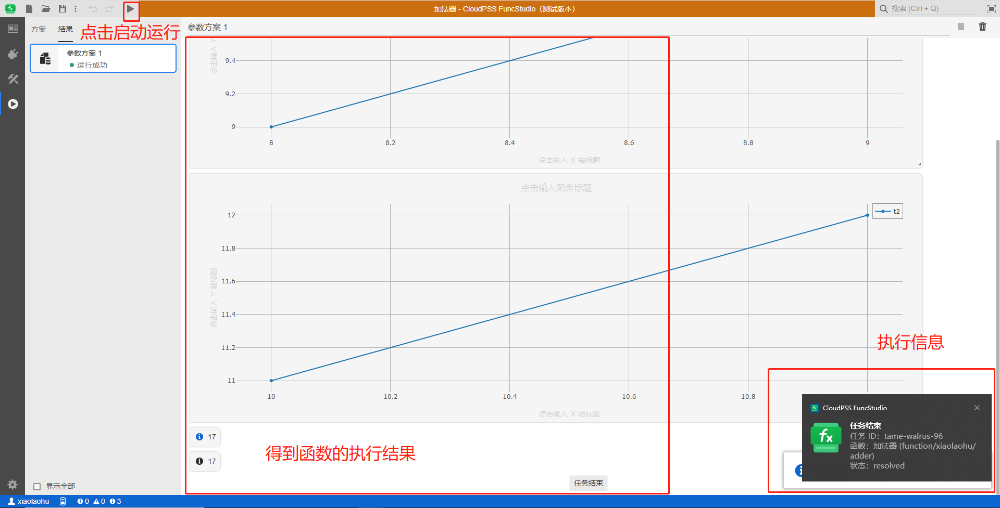

本节主要介绍简单函数在 FuncStudio 的实现过程。以一个加法器函数为例。

### 创建函数

首先登录到 CloudPSS 的主页，点击 FuncStudio 图标进入 FuncStudio 的个人中心，点击`新建空白项目`，即创建一个空白项目，并进入FuncStudio 工作台。



### 配置函数参数

进入 FuncStudio 工作台后，在当前`接口`标签页配置函数的外部接口，即定义加法函数的参数。点击`新建参数组`，在参数编辑栏内，添加名称为`加数参数组`的参数组；接着点击`新建参数`，在该参数组内添加对应`加数 a`、`加数 b`的参数，如下图所示。



### 设置参数

点击左侧的`总览`按钮，进入`总览`标签页，配置函数的基本信息(名称、类型、权限信息以及标签)、编写函数的描述以及详细的说明文档。



### 实现函数

在完成函数的参数配置后，紧接着需要实现函数的算法内核，即如何编写函数的算法内核、函数算法内核如何获取配置好的外部接口参数以及如何格式化输出函数的计算结果。

#### 选择实现方式

点击左侧的`实现`按钮，进入`实现`标签页，点击工具栏中的`更改实现类型`按钮，此处我们选择`本地：自定义命令`，进入本地页面，直接使用本地计算程序作为函数的算法内核。



#### 安装SDK

为了让函数的本地算法内核能够获取我们配置好的接口参数，并格式化输出函数的计算结果，CloudPSS 提供了 FuncStudio 的接口 SDK 和格式化输出的 SDK ，目前只支持 Python （ Python 推荐安装 3.8.5 以上），因此，首先需要 `pip install cloudpss` 来获取 CloudPSS  FuncStudio的 SDK 文件。

#### 编写本地Python代码

安装好 SDK 后，在本地编写一个 adder.py 的 Python 文件来作为加法器函数的算法内核，具体代码如下所示：

```python
# 导入安装好的Cloudpss package
import cloudpss 
if __name__ == '__main__': 
    #根据提供的SDK获取FuncStudio当前函数的任务信息
    job = cloudpss.function.currentJob() 
    #利用提供的args函数按照键名获取函数的参数
    a=int(job.args.a)
    b=int(job.args.b)
    #利用提供的plot函数绘图
    job.plot('plot-1',[{'name':'t1','type':'scatter','x':[a,a+1],'y':[b,b+1]}])
    job.plot('plot-2',[{'name':'t2','type':'scatter','x':[a+2,a+3],'y':[b+2,b+3]}])
    #利用提供的message函数输出信息
    job.message(a+b,key='c')
    print(a+b,flush=True)
```
以上两个准备工作完成后，在`本地：自定义命令`实现页面的命令窗口内输入执行 adder.py 文件的命令，在工作目录内指定 adder.py 文件所在的本地目录。

::: tip

若本地只有一个 Python 环境，确认安装好 SDK 后，在命令窗口内直接输入 python adder.py 即可执行该函数。如下图所示：



若本地有多个 Python 环境，则需要指定安装有 SDK 的 Python 环境来执行，如下图所示：


:::

### 保存函数

在运行函数之前需要保存函数，点击工具栏的「保存」按钮，输入唯一资源 ID 和函数名称将该函数保存到个人中心。如下图所示：



### 配置执行器

在启动任务之前需要对函数的执行器进行配置。首先打开在 FuncStudio 个人中心下载安装好的执行器，右击系统状态栏中 FuncStudio 执行器的小图标，选择菜单中的「执行器管理」打开执行器管理界面。


对于刚保存的在本地执行的函数当前状态为'未分配执行器'，需要手动选中后设置为`设为本机在线`来分配执行器。



### 运行函数

在配置好执行器后，点击左侧的`运行`按钮，进入`运行`标签页，对于同一个项目，CloudPSS FuncStudio 支持配置不同的参数运行方案，便于用户快速对比不同参数条件下的函数执行结果。



选择一个配置好参数方案，点击工具栏的`启动任务`快捷按钮，在该参数方案下执行函数，得到相应的输出结果。



