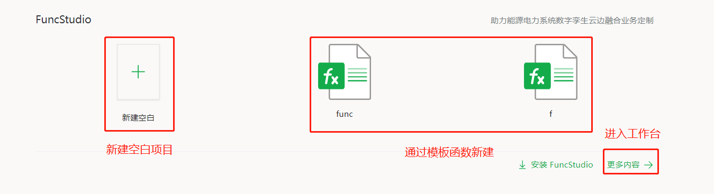
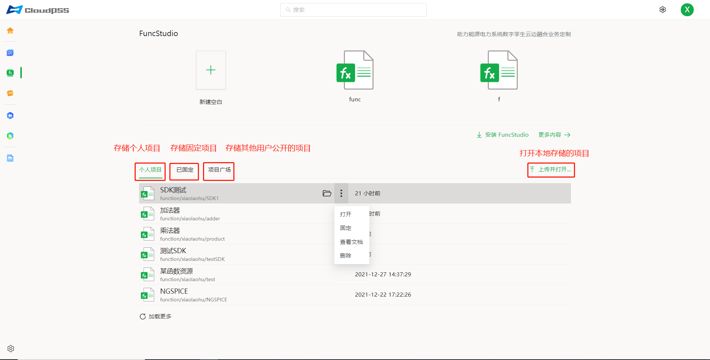
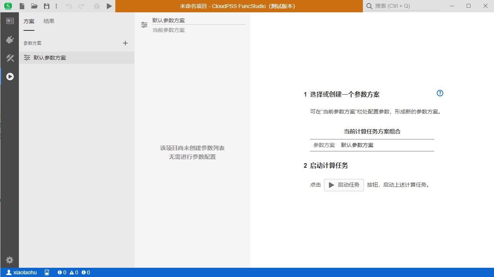
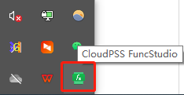
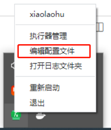

用户成功登录后，在 CloudPSS 主页点击 FuncStudio 的图标后，页面将跳转至 `FuncStudio 个人中心`，如图所示。该界面包含新建项目、项目管理、执行器下载等。

## 新建项目

点击`新建空白`，会打开一个新的页面并自动创建一个新的项目，也可以点击模板案例新建一个模板项目，或者点击`更多内容`，也会打开一个新的页面（进入工作台）并自动创建一个新的项目。

## 项目管理

该区域包含：

+ 个人项目：用于存储用户的函数项目文件。

+ 已固定：用于存储已固定的个人项目。

+ 项目广场：用于显示他人发布的函数项目文件。

+ 加载更多：加载没有显示全的其余项目。

+ 上传并打开：用于打开保存在本地的项目文件。  

鼠标移至任一个人项目文件，会显示`打开`和`更多选项`操作按钮，可对项目文件进行`打开`、`查看文档`(可以通过点击该项目快速查看)、`固定`(仅限个人项目)、`取消固定`(仅限已固定项目)、`删除`(仅限个人项目)等操作，如图所示。

在项目文件上点击`打开`按钮，会跳转到工作台页面并打开该函数项目。

在项目文件上点击`查看文档`按钮，页面右侧会出现该项目的文档描述。

## 执行器下载

执行一个构建好的函数项目，首先要给其分配执行器，因此，需要在本地安装 FuncStudio 的执行器，点击`安装 FuncStudio`按照引导逐步安装完成即可。执行器的工作页面和 FuncStudio 的工作台一致，也可以在执行器内实现函数，如下图所示：

打开并登录执行器后，系统状态栏中会出现一个 FuncStudio 执行器的小图标，如下图所示：

右击系统状态栏中 FuncStudio 执行器的小图标，有编辑配置文件的选项，安装时已默认完成配置，用户无需自行配置。

