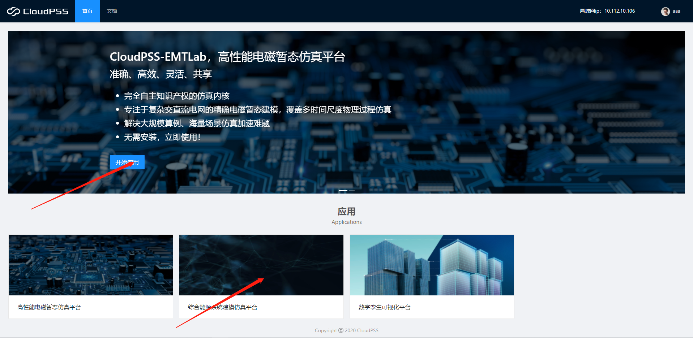
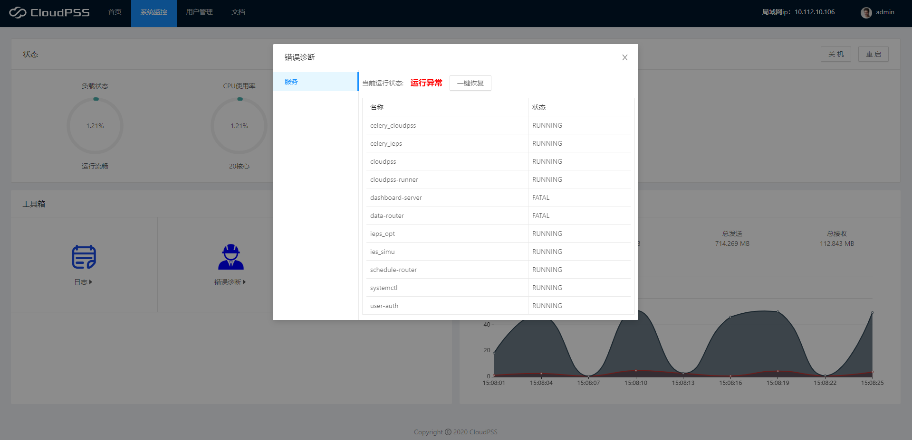
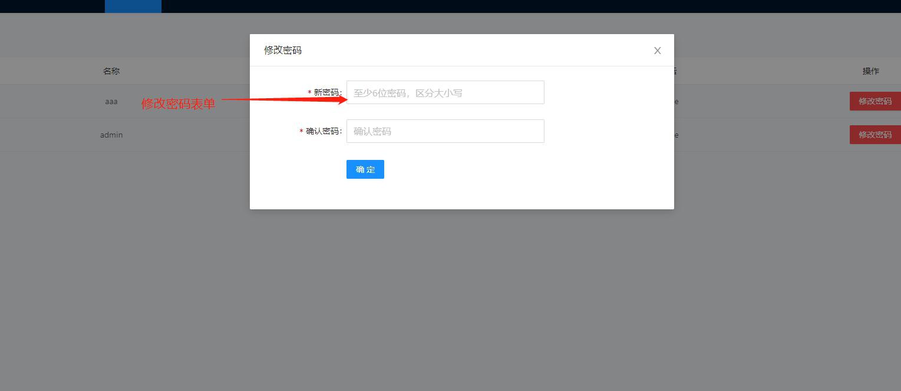

## 首页
1. 点击首页的应用栏卡片可以进入对应的应用。

2. 点击滚动图片栏上的开始使用按钮，也可以进入对应应用 `(无法进入可视化设计平台)`。

## 系统监控
1. 系统监控界面会监控以下状态:
+ 当前系统负载。
+ cpu 使用率。
+ 当前内存使用率。
+ 当前硬盘率使用。

2. 工具箱
    对当前系统进行综合管理，目前包含以下工：错误诊断、日志、任务管理器。
    + 错误诊断：服务栏会监控当前系统的运行状态。并列出当前所有服务，以及当前状态。如果状态信息显示服务异常则点击一键修复即可。`如果修复失败，请重启服务器，仍不能解决请联系供应商!`

3. 流量监控
    监控系统当前的流量上行，以及下行状况。同时显示发送和接收的数据总量。

4. 系统重启与关闭 
   右上角的按钮可以控制系统的关闭与重启。在系统出现问题时，可以快捷重启。

## 用户管理

用户中心的核心是对用户进行管理,主要能进行的操作包括：新建和修改密码  
* 新建用户
    点击用户管理界面左上角的新建用户按钮,在弹出的表单上填写表单信息，在通过校验后点击注册，即可创建一个新用户。`（注：创建上限为 5 个用户）`
* 修改密码
    点击 用户信息表中的修改密码按钮，就可以在弹出的表单上修改密码，点击确定，即可生效。

