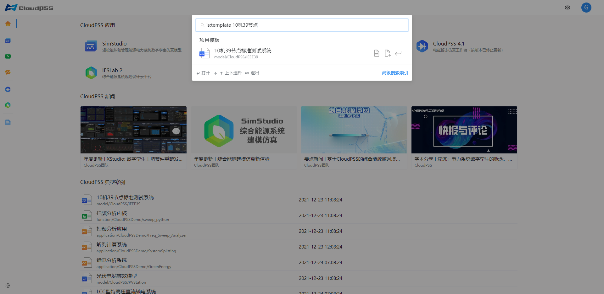
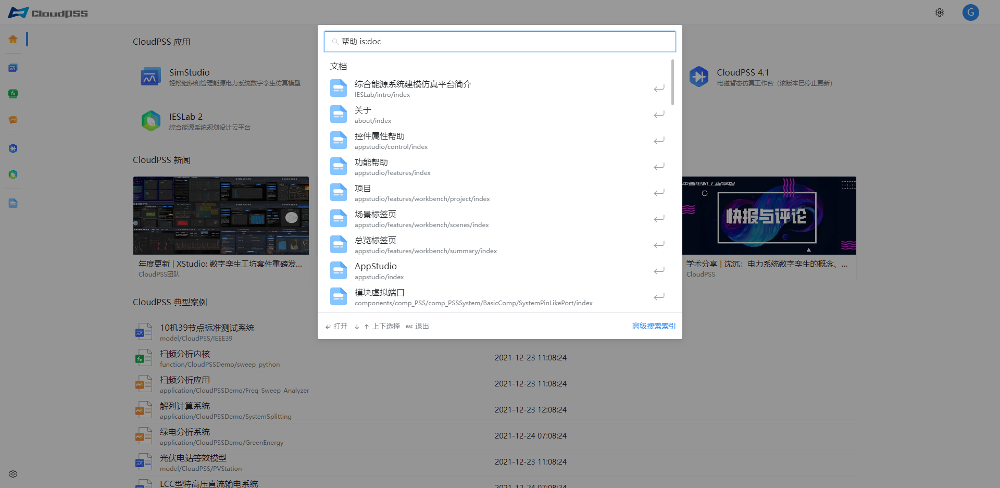

CloudPSS 支持高级搜索功能；高级搜索指定了一系列搜索条件过滤搜索结果。

### 简介

::: tip
关键字: is 和 type
:::

> is:public 搜索项目为公开项目
> 
> is:private 搜索项目为个人项目
> 
> is:pinned 搜索项目为固定项目
> 
> is:template 搜索项目为模板案例
> 
> is:app 搜索 CloudPSS 应用
> 
> is:doc 搜索文档
> 
> type:model 搜索项目类型为 SimStudio 项目
> 
> type:application 搜索项目类型为 AppStudio 项目
> 
> type:function 搜索项目类型为 FuncStudio 项目
>

### 示例

示例1: 搜索模板案例10机39节点标准测试系统，输入
```text
is:template 10机39节点
```



示例2: 搜索帮助文档，输入
```text
帮助 is:doc
```


::: tip
注意: 搜索内容和关键字没有顺序要求，但是需要以空格分隔；关键字可以互相组合
:::

::: tip
SimStudio、FuncStudio、AppStudio页面存在`搜索模板`，`搜索个人项目`，`搜索固定项目`，`搜索项目广场`按钮，点击自动填充关键字
:::

示例3: 点击搜索模板按钮，自动填充关键字
```text
type:model is:template
```


### 快捷操作

键盘输入 `Ctrl + Shift + F`，打开搜索框界面