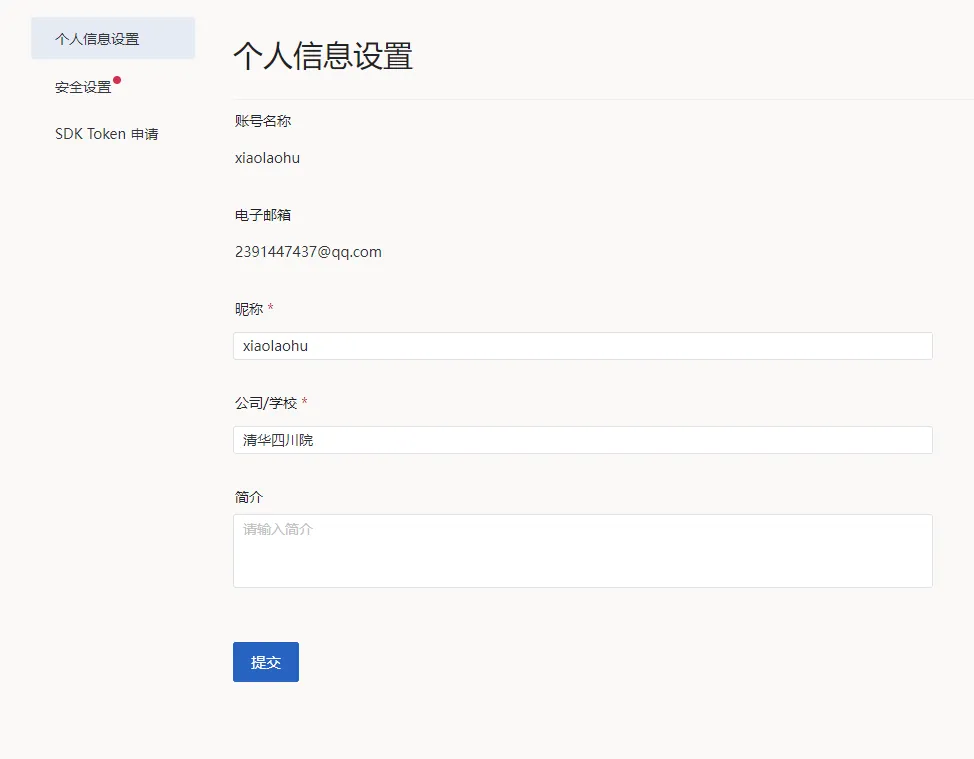
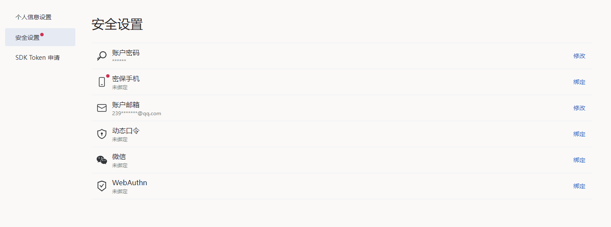
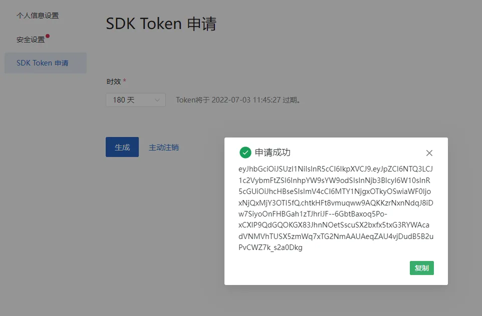
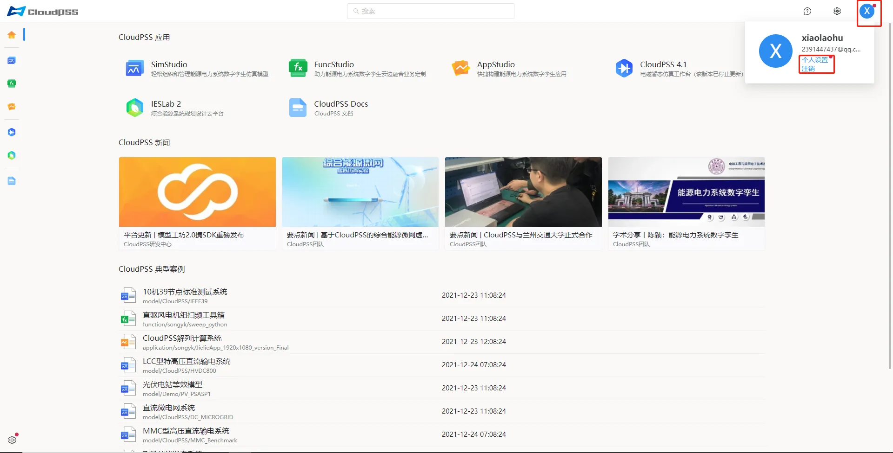
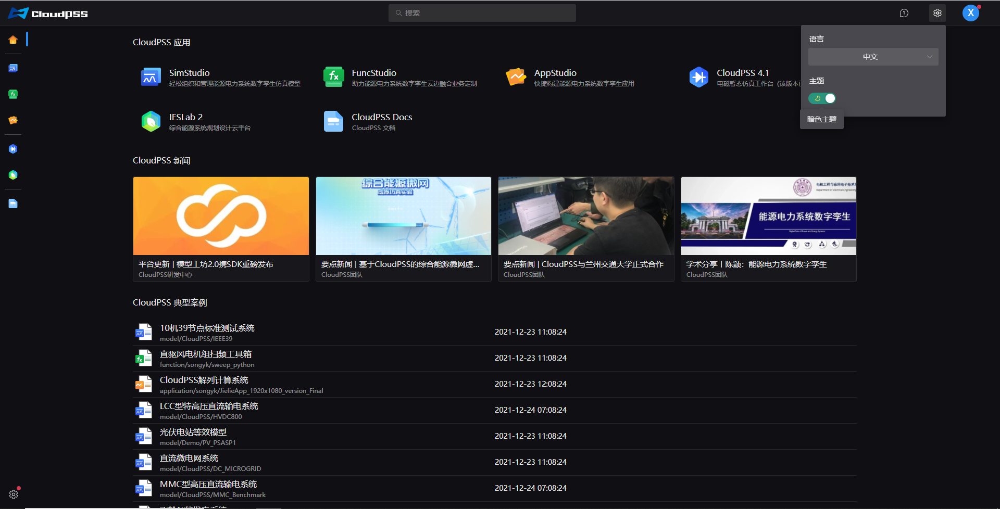

用户登录成功后，页面将跳转至 `CloudPSS 首页`，如图所示。该界面包含 CloudPSS 新闻、CloudPSS 应用、CloudPSS 典型案例、案例搜索、用户设置等。

## CloudPSS 新闻

新闻动态：显示由 CloudPSS 管理员发布的新闻信息。

## CloudPSS 应用

CloudPSS 应用包括 `SimStudio`、`FuncStudio`、`AppStudio`、`CloudPSS 4.1`、`IESLab 2`、`CloudPSS Docs`、点击应用标签或左侧的功能按钮进行页面跳转，进入相应的应用中心，如图所示。  

## CloudPSS 典型案例

提供 CloudPSS 功能应用的典型案例项目，点击后进入该项目的应用工作台。

## 案例搜索

可以在搜索栏内搜索 CloudPSS 应用包括典型案例项目和帮助文档，支持[高级搜索功能](../advanced-search.md "高级搜索功能")

## 用户设置
	
点击页面左下角`用户设置`按钮，可以更改当前用户的个人信息、安全设置与 SDK Token 申请。

点击页面右上角用户头像，可以退出当前登录的用户账号，也可以进行个人设置，如下图所示。

点击右上角用户头像左侧的设置按钮，可以进行语言和主题的切换，用户首次登录时默认为亮色主题，可以在此切换，且切换后在下次登录时页面会保留该主题设置。

