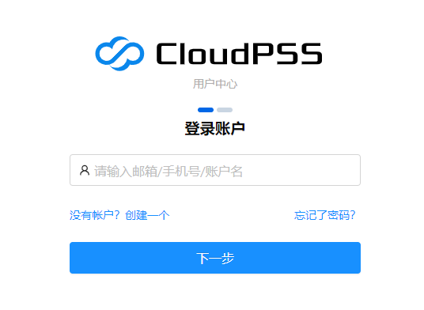

CloudPSS是一款基于网页的在线仿真软件，用户注册账号即可免费试用。打开浏览器(为保证最好显示效果，建议使用Chrome浏览器)，在浏览器地址栏输入[www.cloudpss.net](https://www.cloudpss.net)，进入CloudPSS的网页主页。点击主页右上角的`登录`按钮，进入登录页面，如图所示。如用户已经建有账号，在登录页面的相应位置填写用户邮箱,点击`下一步`输入登录密码，点击`登录`即可实现用户的登录。

若用户没有账号，点击`注册账户`进入注册页面，如图所示。用户按照提示填写相应信息，点击`下一步`按钮输入创建密码。再次点击`下一步`按钮进入身份验证界面，点击`获取验证码`对注册所用邮箱进行验证。此时，打开注册邮箱获取注册码，并将其填入注册页面相应位置，点击`提交`，即可完成对新用户的注册。注册成功后，页面将自动跳转至登录界面。

::: question
**忘记密码怎么办，如何找回？**

如果不小心忘记密码可以通过注册邮箱验证的方式，按照步骤重新设置新的密码。
:::

::: question
**接收不到验证码怎么办？**

如果使用QQ邮箱、126等网易邮箱进行注册，若无法接收到验证码，请用注册邮箱向<noreply@cloudpss.net>邮箱发送一封任意内容邮件，之后再尝试发送验证码。
:::

