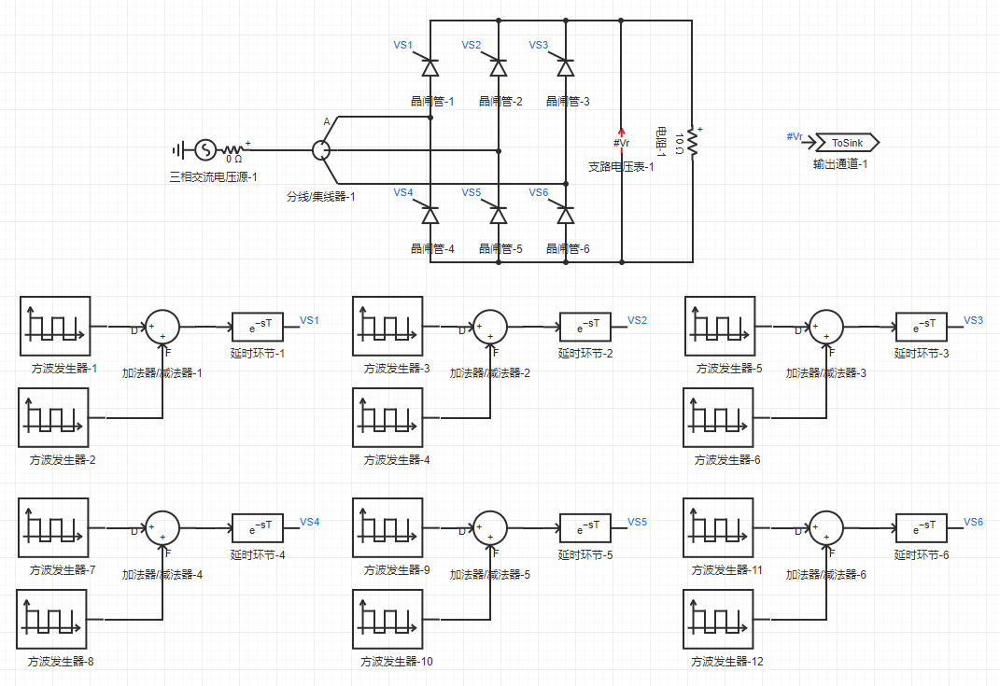
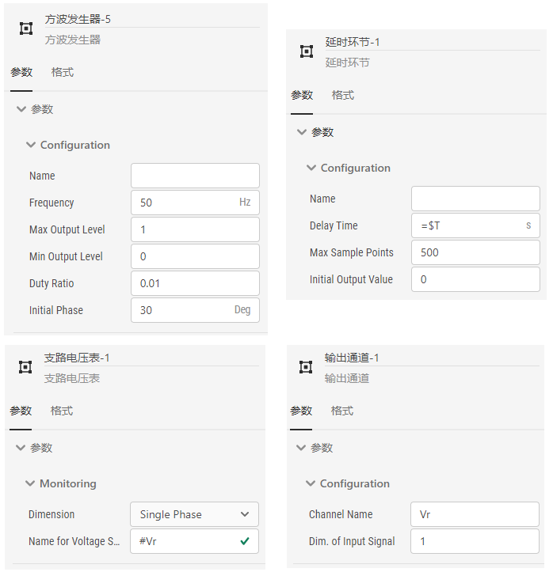
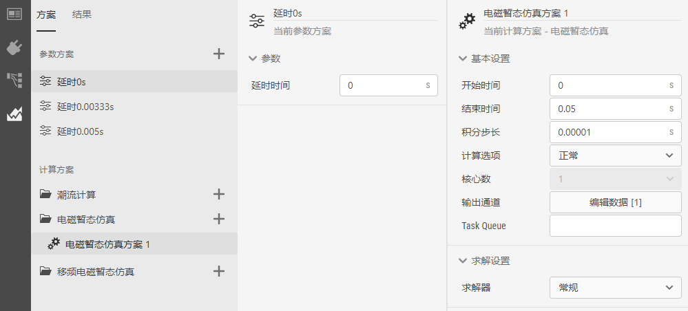
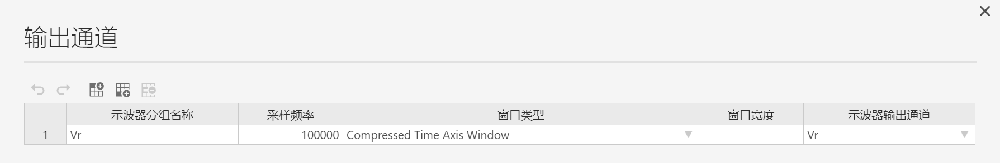
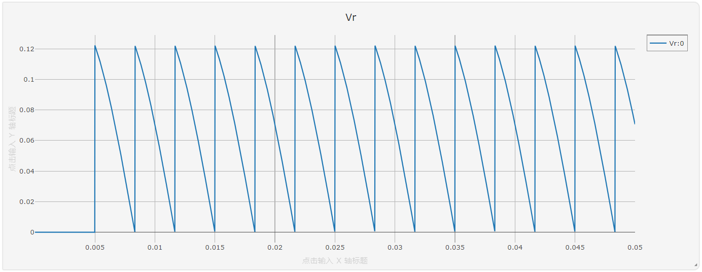
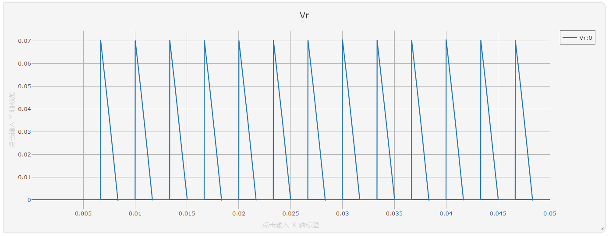

## 整流电路原理

三相桥式全控整流电路是工业中应用最为广泛的一种整流电路，其实质是一组共阴极与一组共阳极的三相半波可控整流电路的串联，如图所示。图中,晶闸管VS1、VS2、VS3、为共阴极组，晶闸管VS4、VS5、VS6为共阳极组。

在交流电源的一个周期内，晶闸管在正向阳极电压作用下不导通的电角度称为控制角或移相角，用α表示。在三相可控整流电路中，控制角的起点，不是在交流电压过零点处，而是在自然换流点(又称自然换相点)，即三相相电压的交点。采用双窄脉冲触发时，触发电路每隔60°依次同时给两个晶闸管施加触发脉冲，每周期的触发顺序为1/5-1/6-2/6-2/4-3/4-3/5。

下图示出了α角分别为0°、60°以及90°时的理论开关及输出波形。

## 仿真分析

由CloudPSS搭建的带纯电阻负载的三相整流桥如下图所示。

在`实现`页面，拖拽模型库中的三相交流电压源、分线器、晶闸管、电阻、支路电压表、方波发生器、加法器、延时环节以及输出通道至拓扑编辑界面的图纸上。设置三相电压源线电压0.1kV、频率50Hz、电压上升时间0s；晶闸管参数保持为默认值；方波发生器分别设置为间隔60°、占空比0.01、频率50Hz的方波；加法器用于形成双窄脉冲波形；延时环节的延时时间设置为全局参数$T，最大采样点数设置为500；支路电压表用于测量负载电压，名称标号为#Vr；输出通道的输入引脚设置为#Vr。

主要元件的参数设置如下图所示。

在`接口`页面，新建参数组，添加延时时间的全局参数，键值设为T，名称为延时时间，类型为实数，输入类型为常量，默认值设为0，单位为s。具体设置如下图：

在`运行`页面，将默认参数方案的名称改为“延时0s”，延时时间值设为0s；新增参数方案，将名称改为“延时0.00333s”，延时时间值设为0.00333s；新增参数方案，将名称改为“延时0.005s”，延时时间值设为0.005s。
选择电磁暂态仿真方案1，设置开始时间为0s，结束时间为0.05s，积分步长为0.00001s。点击输出通道的`编辑数据`按钮打开示波器分组配置窗口，示波器分组名称命名为Vr，采样频率设为100000，窗口类型和窗口宽度默认，示波器输出通道点选Vr。

分别点选参数方案“延时0s”、“延时0.00333s”、“延时0.005s”设置不同的延时时间进行仿真，三次仿真结果会保留在结果标签页，分别如下图所示。

