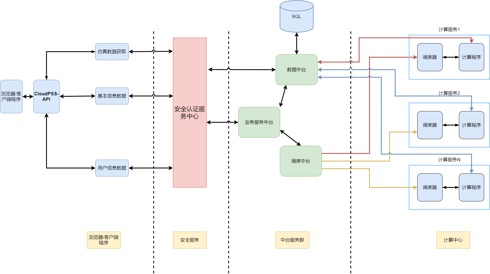

## 系统结构

## 浏览器/客户端程序

**用户侧服务结构**，一种是通过CloudPSS网站查询到用户的具体信息，并提供网站对用户的资源进行访问，和执行对应权限下的操作。 另一种是提供CloudPSS开放的api自己开放应用程序，从CloudPSS中心获取资源，和使用CloudPSS服务下的计算资源。

### 浏览器/客户端程序

**浏览器：** 指使用浏览器访问到的CloudPSS网站的各个页面。
   
**客户端程序：** 指用户通过CloudPSS开放的api自己开发的应用程序

**CloudPSS-API:** 指用户通过CloudPSS开放的api

**仿真数据获取:** 指用户通过api从CloudPSS平台获取的仿真数据

**基本信息数据:** 指用户通过api从CloudPSS平台获取的基本信息数据

**用户信息数据:** 指用户通过api从CloudPSS平台获取的用户信息数据

### 安全服务

CloudPSS的用户**安全校验机制**，用于校验当前用户的操作权限
安全日志服务中心 用于校验当前用户的操作权限

### 中台服务群

CloudPSS后台服务器群，用于处理各个项业务逻辑

 **业务中台:**  所有中台的统称

**数据中台:** 数据中台用于融合整个**数字孪生体**与**物理实体**的全部数据，打通应用之间的数据隔阂，消除数据标准和口径不一致的问题。数据中台通过对来自多方面的基础数据进行清洗，按照特定主题域的概念建立多个以事务为主的主题域。本项目数据中台遵循三个一的概念，即One ID（一个用户账号）、One Data（一个数据平台）、One Service（一个业务平台）。数据中台不仅仅是汇聚多元数据，而且让这些数据遵循相同的标准和口径，对事物的标识能统一或者相互关联，并且提供统一的数据服务接口。

 **调度中台:** 调度中台是业务中台中比较特殊的一种服务，其用于快速响应和调
用各种业务功能，并根据计算量，基于现有计算资源做负载均衡

### 计算中心

由CloudPSS和用户通过调度中心共同组成的一个**计算服务群**，用户可以通过调度器将自己的算法程序注册到CloudPSS平台中，供其他用户调用调度器。CloudPSS平台提供的一个程序调用服务，可以调用用户本地的计算程序计算程序、CloudPSS提供的计算服务或是用户提供的计算服务。
