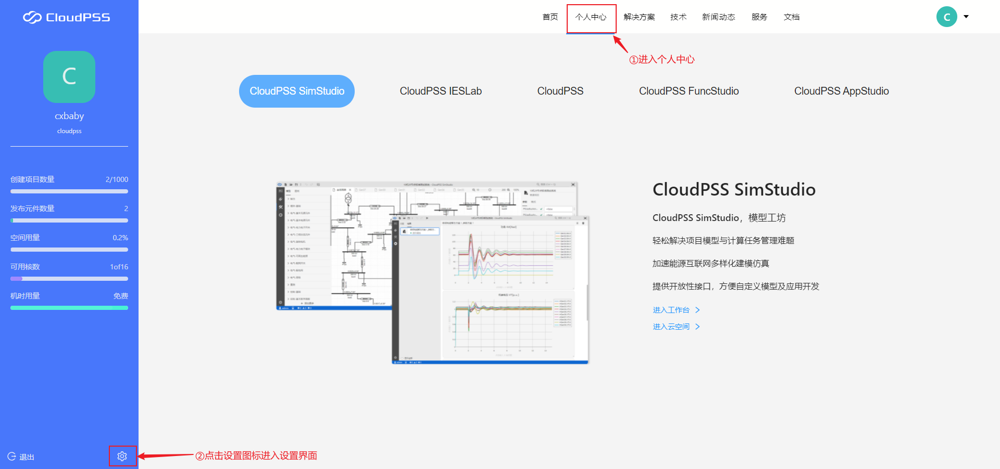
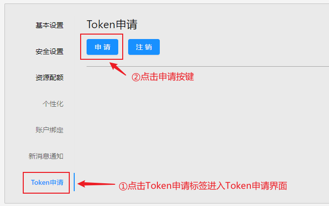
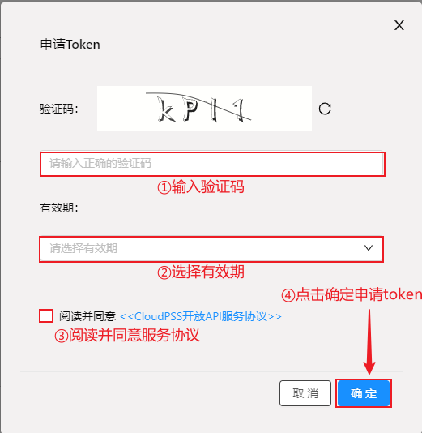
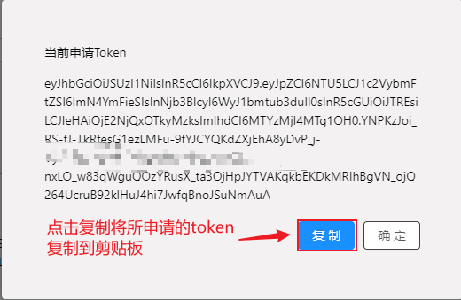

## 申请token

首先点击`个人中心`标签页进入个人中心，然后点击`设置`图标进入基本设置。



点击`Token申请`标签进入Token申请界面，然后点击`申请`按键进行Token申请。



在验证码栏输入`验证码`，并选择`Token有效期`，可选择一个月、三个月、半年或一年。然后点击`同意`服务协议与`确定`按钮申请Token。



点击`复制`按钮将所申请的Token复制到剪贴板，也可至`设置/Token申请`界面查看已申请的Token。




## 设置token

**params:**  token token

```[pyhton][setToken]
cloudpss.setToken(token)
```