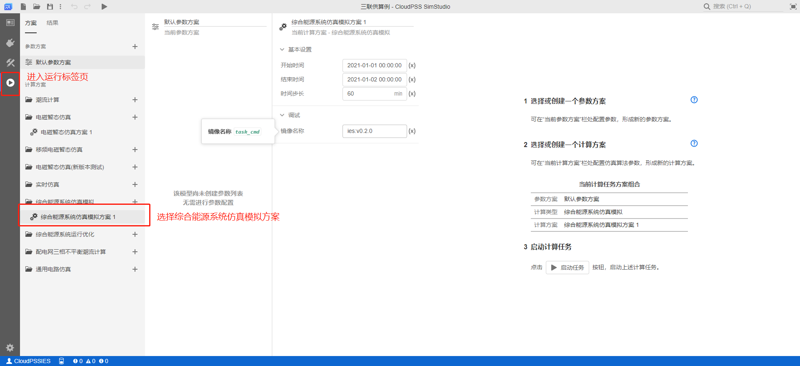
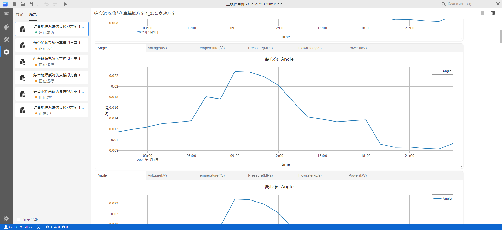
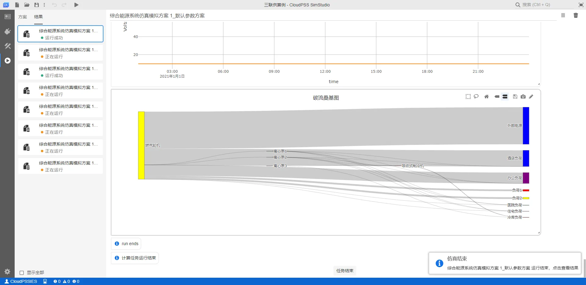
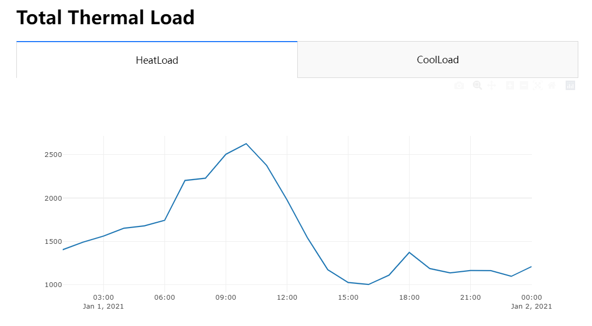
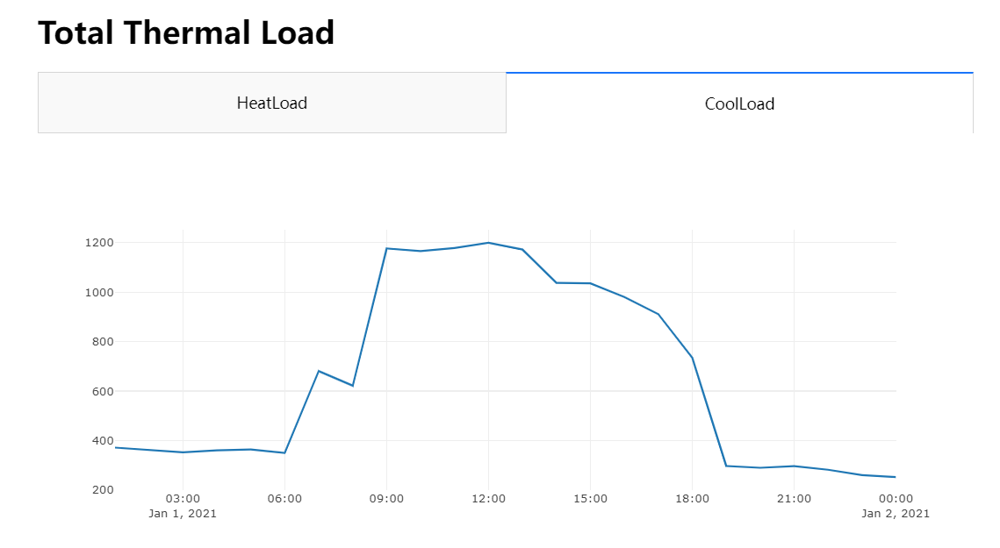

:::info
**本例以通过 Python 脚本获取三联供算例计算结果为例，帮助用户快速入门综合能源 CloudPSS SDK 的使用。**
:::

## 算例创建和使用

首先，在 CloudPSS Simstudio 中打开[三联供算例](https://cloudpss.net/model/CloudPSS/CHPCase)，该算例也可以通过模板算例进行创建。


点击`运行`标签页，在计算方案中选择默认的**综合能源系统仿真模拟方案1**。



点击`启动任务`运行仿真，在`结果`页面会生成综合能源仿真计算结果。




:::tip
若要批量处理综合能源的计算结果，比如将所有负荷的用能量相加来计算分时总负荷，常规的方法是在计算结果列表中找到所有的负荷元件，然后手动提取他们的负荷数据再进行相加，但由于通常综合能源系统中元件数量众多，对应的结果图表数量也非常可观，这样处理的效率十分低下。借助CloudPSS SDK，利用Python脚本获取结果数据，然后进行批量处理，可快速完成上述功能。
:::

## 示例代码

配置好 **Python** 开发环境，这里主要用到了第三方绘图库`Dash`和`JupyterDash`，用户可以使用`pip install dash`和`pip install jupyter-dash`指令进行安装。接下来执行以下脚本：
```python
import time
import cloudpss
import os
import sys
from jupyter_dash import JupyterDash
from dash.dependencies import Input, Output
from dash import html,dcc
from functools import reduce

app =JupyterDash(__name__)

def init_html():
    tabs=[]
    for val in tabData:
        tabs.append(dcc.Tab(label=val['name'], value=val['id']),)
#     tabs.append(dcc.Tab(label='Tab Two', value='tab-2-example-graph'))
    app.layout = html.Div([
        html.H1('Total Thermal Load'),
        dcc.Tabs(id="tabs-example-graph", value=tabData[0]['id'], children=tabs),
        html.Div(id='tabs-content-example-graph')
    ])

@app.callback(Output('tabs-content-example-graph', 'children'),
              Input('tabs-example-graph', 'value'))
def render_content(tab):
    for data in tabData:
        if data["id"]==tab:
          return html.Div([
            dcc.Graph(
              id=data["id"],
              figure={
                'data': [{
                  'x': data['x'],
                  'y': data['y'],
                }]
              }
            )
          ])

if __name__ == '__main__':
    cloudpss.setToken('{token}')

    ### 获取指定 rid 的项目
    project = cloudpss.Model.fetch('model/CloudPSS/CHPCase')

    ### 通过采暖制冷负荷的rid获取所有的采暖制冷负荷元件信息
    loadComponents = project.getComponentsByRid('model/CloudPSS/IES-HeatColdLoad')

    try:
        # 运行仿真
        runner = project.run()
        while not runner.status():
            print('running', flush=True)
            logs = runner.result.getLogs()
            for log in logs:
                print(log)
            time.sleep(1)

        '''
          getPlotData获取key对应的采暖负荷元件的时序负荷结果，
          将每个采暖制冷负荷元件的时序负荷结果组成List
        '''
        loadList = [
          runner.result.getPlotData('/' + key, 'Power(kW)', 'Thermal Load')['Thermal Load']['y'] 
          for key in loadComponents.keys()
        ]
        timeSerial = runner.result.getPlotData('/' + list(loadComponents.keys())[0], 'Power(kW)', 'Thermal Load')['Thermal Load']['x']

        # 分别统计分时热负荷和分时冷负荷，热负荷在LoadList中的数值为正，冷负荷为负
        totalHeatLoad = [0.0]*len(loadList[0])
        totalCoolLoad = [0.0]*len(loadList[0])
        totalHeatLoad = reduce(lambda x, y: 
                                  [x[i] + (y[i] if y[i] > 0 else 0) for i in range(len(x))], 
                              loadList, 
                              totalHeatLoad)
        totalCoolLoad = reduce(lambda x, y: 
                                  [x[i] + (-y[i] if y[i] < 0 else 0) for i in range(len(x))], 
                              loadList, 
                              totalCoolLoad)

        tabData =[]
        tabData.append({"name":"HeatLoad","x":timeSerial,"y":totalHeatLoad,"id":"HeatLoad"})
        tabData.append({"name":"CoolLoad","x":timeSerial,"y":totalCoolLoad,"id":"CoolLoad"})
        init_html()
        app.run_server(mode='inline')
    except Exception as e:
        print('error', e)
```
上述代码运行后，将在python终端输出如下图的结果曲线。



## 获取结果

综合能源仿真计算结果均保存在 `runner.result` 中。用户可查看 result 类的接口说明文档获取更多帮助。
```python
print(runner.result.getPlotData('/component_ies_heat_cold_load_8', 'Power(kW)', 'Thermal Load'))
print(runner.result.getPlotData('/component_ies_heat_cold_load_8', 'Power(kW)', 'Thermal Load', 0))
```
通过上述两条语句可分别获得元件`component_ies_heat_cold_load_8`整个仿真周期内的负荷时序结果和首个时刻的负荷结果。返回结果以字典对象的格式进行存储，如下：

```python
 {
   'Thermal Load': {
     'x': ['2021-01-01 01:00:00'], 
     'y': [439.3155554349029]
    }
  }
```

如果想整个取出目标key的数值结果，可直接访问该key下的`y`成员。例如：
```python
loadValue = runner.result.getPlotData('/component_ies_heat_cold_load_8', 'Power(kW)', 'Thermal Load')['Thermal Load']['y']
print(loadValue)
```
此时输出的数值即为此算例的 **component_ies_heat_cold_load_8** 采暖制冷负荷（冷库负荷）的时序结果。
