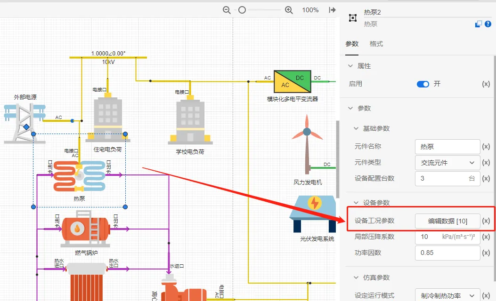
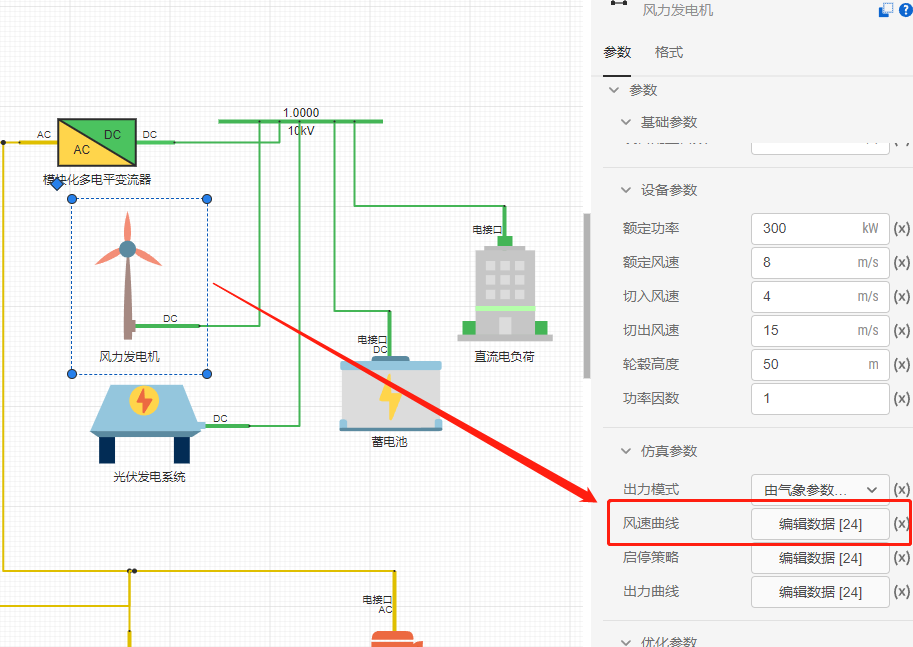
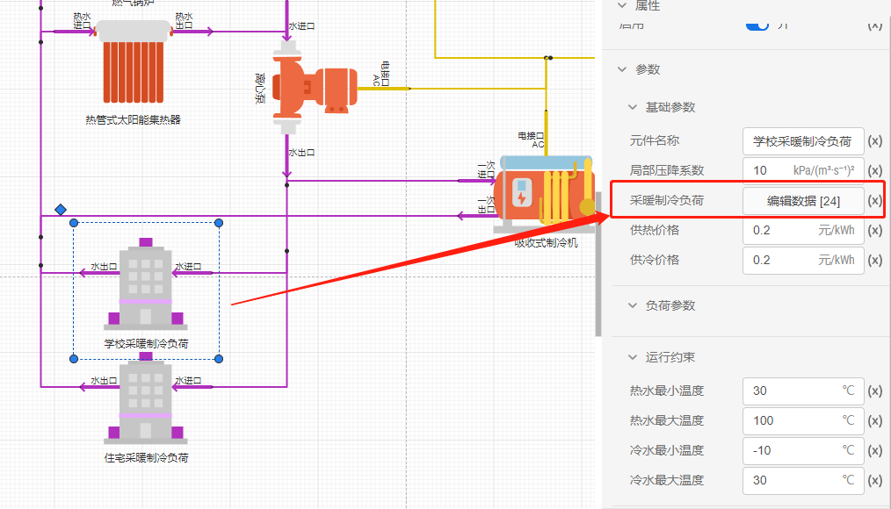
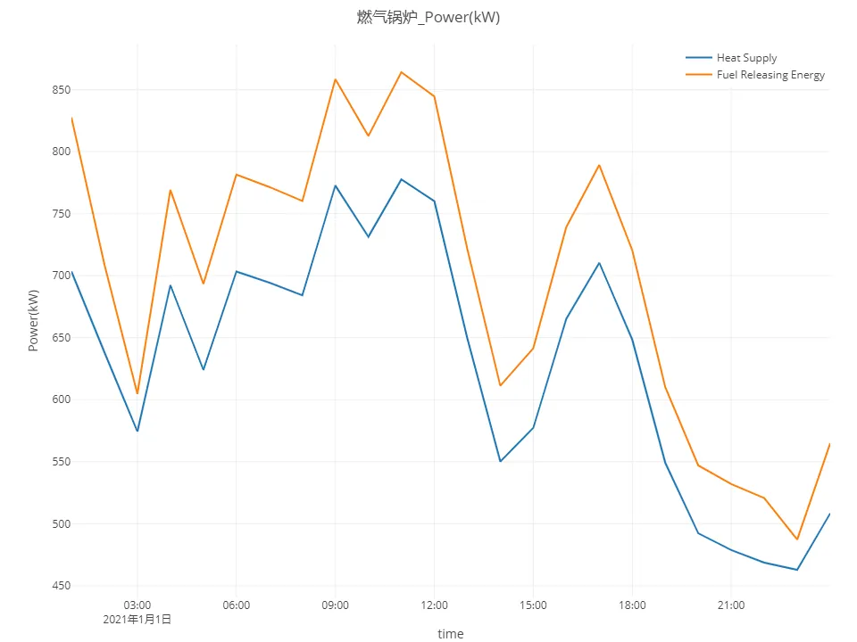
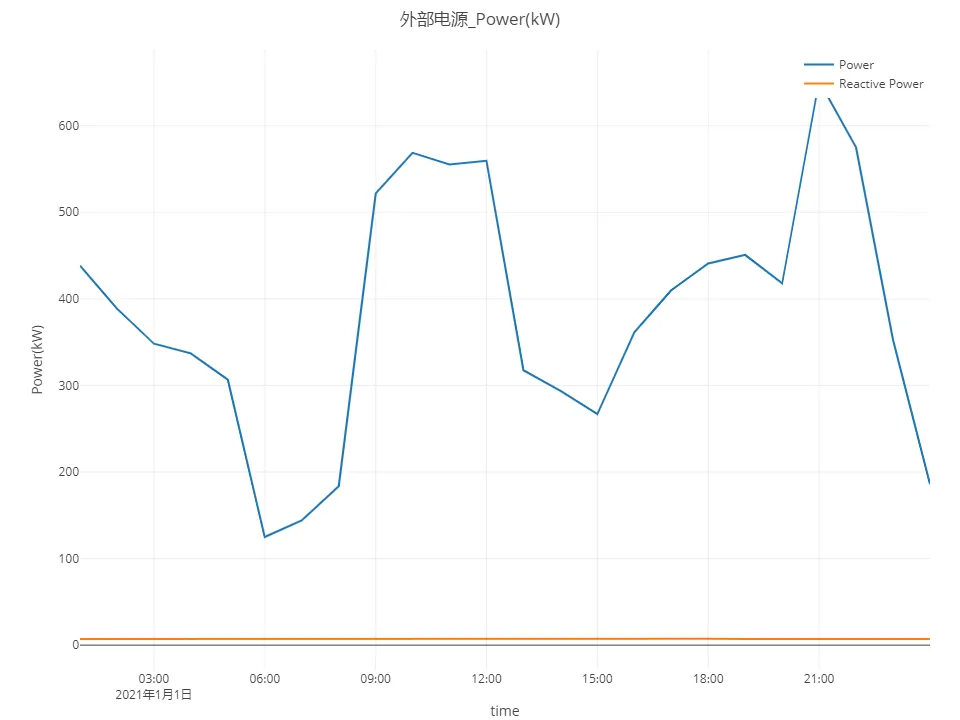
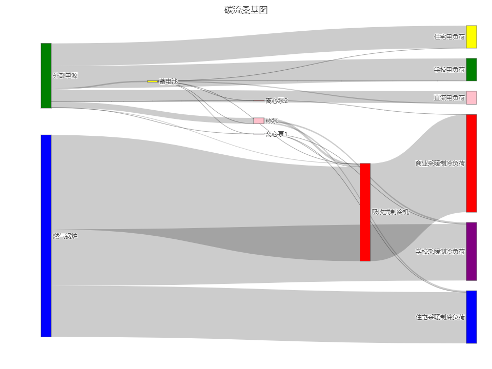

## 模型描述

多能耦合、协同互补的综合能源系统是未来多能源利用的方向，涵盖了各种形式和特点的多能源，目前将供气系统、供热系统与电力系统等集成的综合能源园区因应用广泛发展迅速，既实现电力、燃气、供热等一体化多能互补，又实现源网荷储全环节高度协调与灵活互动、集中化与分布式相互结合。下面以某典型综合光储能源园区微电网系统为例，搭建开展综合能源系统模型并仿真：

该园区主要包含电源、储能、冷热源、能量传输、负荷等五大类元件，下表是详细的元件构成。

| 元件分类 | 元件组成                         |
| -------- | ------------------------------ |
| 电源设备 | 光伏组件、风机                   |
| 储能设备 | 蓄电池                          |
| 冷热源设备 | 热泵、锅炉、光热、吸收式制冷机   |
| 能量传输 | 离心泵、MMC                     |
| 负荷     | 电负荷、采暖制冷负荷            |

仿真算例的拓扑结构图如下：

## 模型参数及边界条件

1. 输入园区设备额定参数和运行参数，如下图的热泵变工况信息。
   
2. 输入园区的气象参数如风速曲线参数、辐照度曲线参数等，如下图风机的风速曲线录入。
   
3. 输入园区的逐时电、热、冷负荷参数，如下图学校采暖制冷负荷的数据录入。
   
4. 输入园区综合能源系统中各设备的运行策略，包括各电热冷源设备以及离心泵等传输设备在不同时刻的工况，如下图设定离心泵的工作转速时序曲线。
   

## 开始仿真

正确设置完所有元件参数后，点击`运行`标签页，在计算方案中选择默认的**综合能源系统仿真模拟方案1**，点击`启动任务`运行仿真，在`结果`页面会生成综合能源仿真计算结果。

## 仿真结果分析

*燃气锅炉出力曲线*

*外部电源上网及购电功率曲线：*

*碳流桑基图结果*

