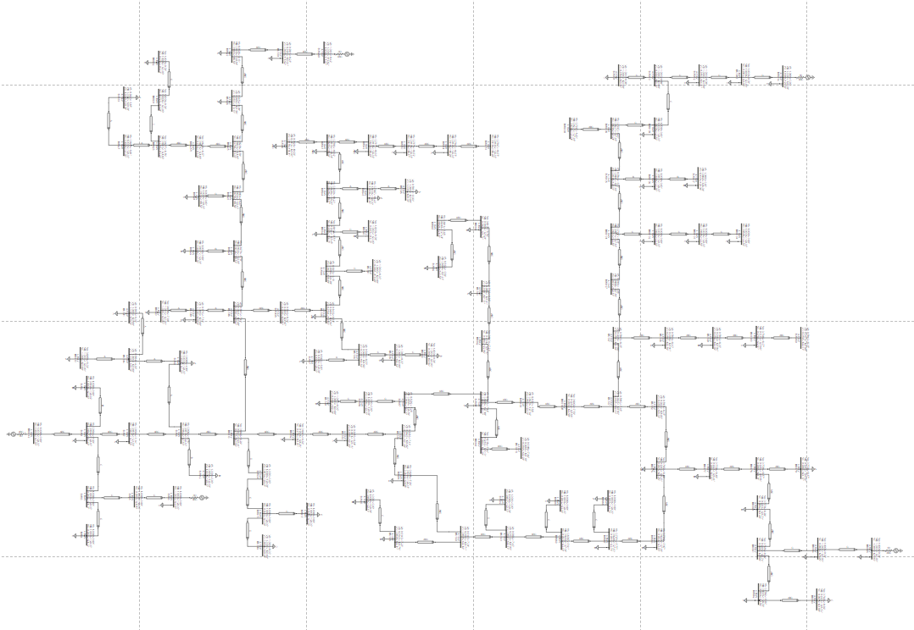
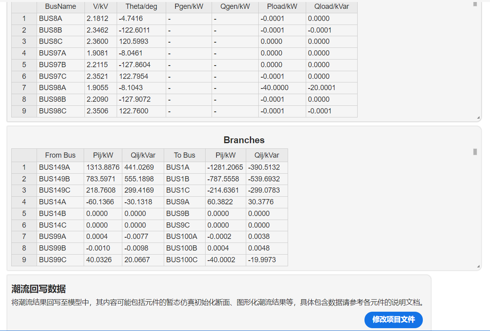

## 描述

IEEE-123 测试系统的介绍见`http://svn.code.sf.net/p/electricdss/code/trunk/Distrib/IEEETestCases/123Bus/`。

## 仿真流程

在CloudPSS平台中选择相应配电网元件， 并根据系统拓扑连接各元件，并修改各元件仿真参数，该测试系统的拓扑图如下所示：

在左侧选择`运行`标签页，在配电网三相不平衡潮流计算方案配置中，使用默认仿真参数，点击上方`启动任务`按钮或者按下[[ctrl]]+[[R]]进行潮流计算流程。

得到的潮流计算结果如下图所示。

在结果页面，潮流的计算结果分为母线、支路 2 个表格显示。

母线页面中，$V$为母线相电压有效值；$Theta$为母线各相相角；$Pgen$和$Qgen$为发电机各相发出有功功率和无功功率；$Pload$和$Qload$为负荷各相吸收的有功功率和无功功率。

支路页面中，$P_{ij}, Q_{ij}, $ 表示 from bus 和 to bus 流出的功率；

在结果页面中，点击`潮流初始化断面`下的`修改项目文件`按钮，可以将潮流计算得到的结果作为元件启动参数填入各元件。

点击`潮流回写数据`下的`修改项目文件`按钮，可以在图纸上展示此潮流结果，例如母线电压数据等将在接线图中展示出来。

结果页面中的表格均可以自由复制，用户可将结果直接复制到excel表格等工具中进行进一步处理。

