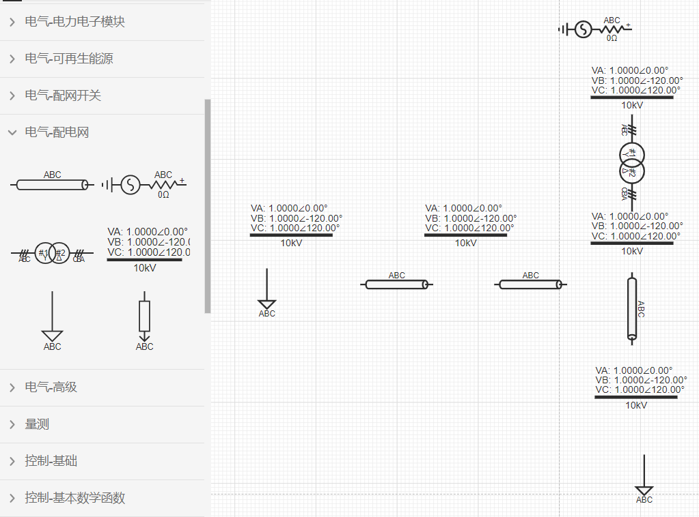
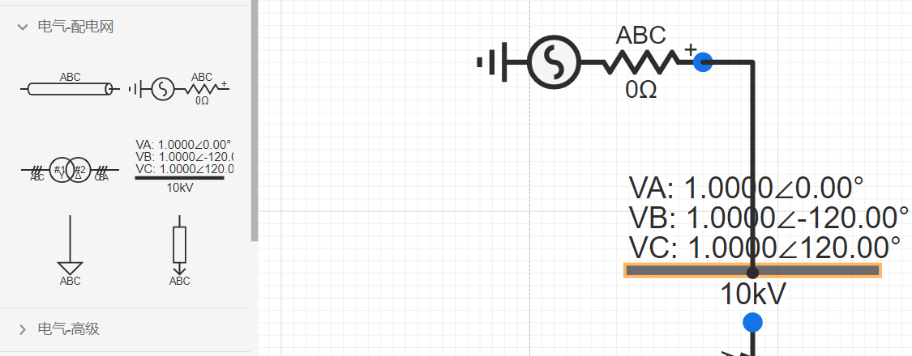
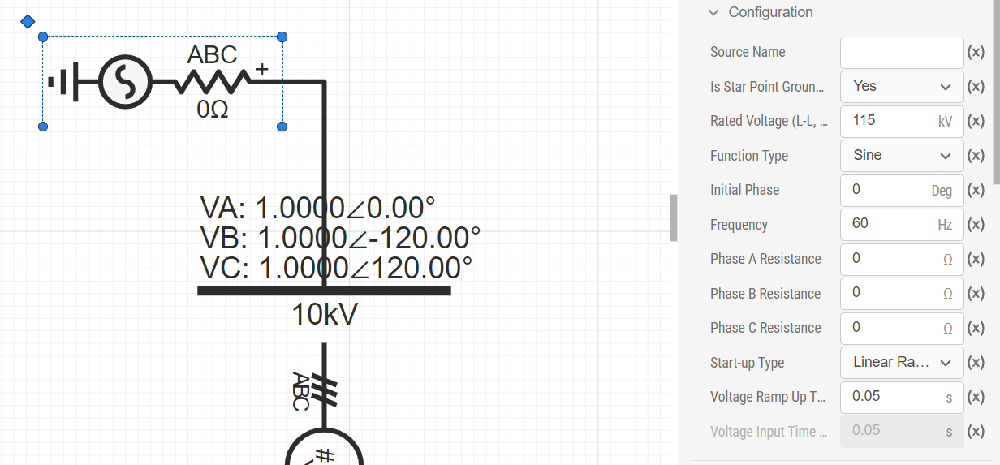
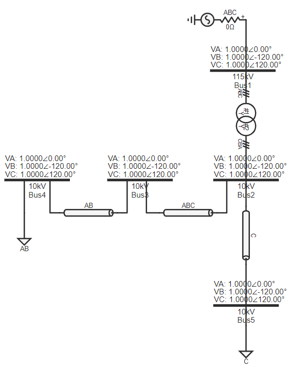
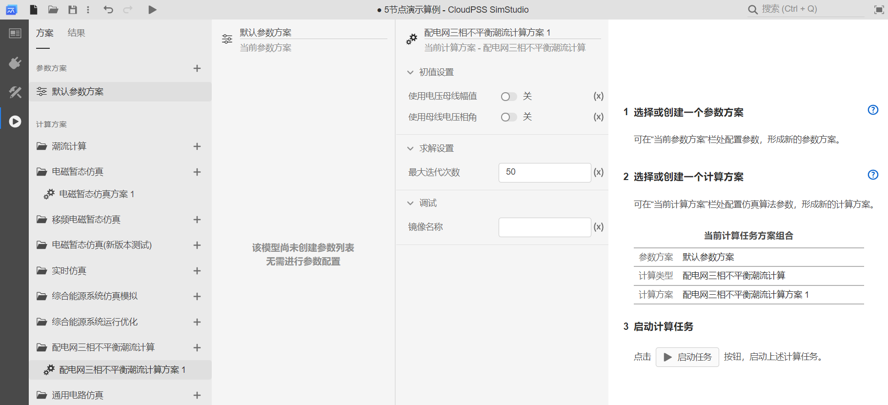

本节主要介绍简单配电网系统搭建及仿真过程。该简单配电网系统由配电网交流电压源，配电网传输线，配电网双绕组变压器，配电网母线和配电网静态负载组成。

### 放置元件

首先点击`进入工作台`，即创建一个空白项目。进入工作台后，在左侧`模型`栏中点击`电气-配电网`分别选择`配电网交流电压源`、`配电网传输线`、`配电网双绕组变压器`、`配电网母线`、`配电网静态负载`元件拖拽至工作空间，即可完成对相应元件的放置。可利用鼠标长按元件进行拖动或选中元件后用[[键盘方向键]]改变元件位置。可以[[鼠标右键]]点击元件进行元件的剪切、复制、粘贴、创建副本、删除、隐藏元件名称等操作，或者通过快捷键快速实现上述操作。点击元件上方的圆形箭头或利用[[Ctrl]]+[[R]]对元件进行旋转。元件放置结束后的工作空间如图所示。

### 连接元件

将鼠标光标移至元件引脚处，若该引脚出现蓝色圆形阴影，说明该引脚可用。此时单击该引脚，按住[[鼠标左键]]并移动光标至需要被连线的引脚处，当该引脚处出现橙色边框，松开[[鼠标左键]]即完成两个元件的连线。在连线后，选中连线并在连线路径上单击[[鼠标左键]]可以在该处设置拐点，拐点可以被拖动调整位置。元件连接示例如图所示。

### 设置参数

在完成对元件的连接后，需对各个元件的参数进行设置。点击任一元件(以配电网交流电压源为例)，工作空间右侧将出现如图所示的`参数`面板，编辑完成后，系统自动保存相关参数。`参数`面板右侧为`格式`面板，用于设置元件的图标特性，如样式、文本以及排列。

各元件参数设置：
+ 配电网母线1的名称可以任取，此处命名为“Bus1”。修改“母线电压基值”参数为115，与电源保持一致；
+ 配电网母线2的名称可以取为“Bus2”,其余母线以此类推；
+ 配电网传输线2的“线路类型”设置为“Phase AB Line”;
+ 配电网传输线3的“线路类型”设置为“Phase C Line”;
+ 配电网静态负载1的“负荷类型”设置为“Phase AB Load”;
+ 配电网静态负载2的“负荷类型”设置为“Phase C Load”;
+ 其它参数为默认值。

至此工作空间的仿真内容全部搭建完毕，总的仿真图如下图所示。

### 仿真运行方法

搭建完算例拓扑并设置好参数后，点击左侧`运行`，进入运行标签页，配置`计算方案`。在计算方案中选择`配电网三相不平衡潮流计算`，其中`使用母线电压幅值`、`使用母线电压相角`开关按钮均为关，`最大迭代次数`设置为50。

点击`启动任务`开始仿真，然后自动显示仿真结果窗口，仿真结果如下图所示。

