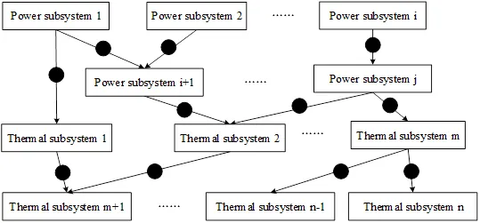

CloudPSS SimStudio提供了综合能源仿真功能，下面对**综合能源建模仿真的原理**进行介绍。

## 综合能源系统建模

****

为实现对电、热（冷）两种能源形式相互耦合系统的仿真模拟，首先需要分别对热、电系统进行建模，并对系统间能量转换的各种设备（包括蓄能设备）进行建模，主要包括设备建模和网络建模。设备模型指设备处**能流的变化和转换模型**，难点在于建立详细精准的变工况设备模型；网络模型指能量流动输运过程中需要满足的规律，包含电力网络和流体输运管网模型：电力网络模型主要满足**基尔霍夫定律**，流体输运管网则指气、水等流体在输运过程中所遵守的物理模型，包含**质量方程、动量方程和能量方程**。

这里以**热泵**为例，说明设备建模过程。热泵是一种将低温热源的热能转移到高温热源的装置，从而达到制热和制冷的目的。其典型的能量转换模型如下：
$$ Q=COP(d)P $$
其中$Q$代表热泵的制热/制冷量(kW)，$P$代表热泵消耗的电功率(kW)，$COP(d)$代表热泵处于档位d时对应的COP数值。

将$Q$用流体的水热力状态进行表示，上述方程可以转换为：
$$ m(h_{out}(p_{out},T_{out})-h_{in}(p_{in},T_{in}))=COP(d)P $$
其中$m$表示流经热泵的水的质量流量，$h(p,T)$表示当压力为$p$温度为$T$时水的比焓，下标$in$和$out$分别代表热泵的进出口。

对网络方程，这里以**流体网络**网络为例说明其建模原理和过程。对流体网络而言，在各节点处所满足的物理方程包括质量守恒方程、压力平衡方程以及能量守恒方程，具体模型如下：

$$ \left\{ \begin{array}{l}
\sum\limits_{i = 1}^{{n_{in}}} {{m_i}}  = \sum\limits_{i = 1}^{{n_{out}}} {{m_i}} \\
{p_1} = {p_2} =  \cdots  = {p_n}\\
\sum\limits_{i = 1}^{{n_{in}}} {{m_i}h\left( {{p_i},{T_i}} \right)}  = h\left( {{p_{out}},{T_{out}}} \right)\sum\limits_{i = 1}^{{n_{out}}} {{m_i}} 
\end{array} \right. $$

式中$n_{in}$和$n_{out}$代表流入和流出该节点支路的数量，$n=n_{in}+n_{out}$。

## 综合能源系统仿真

综合能源系统仿真主要分为两个步骤，首先是系统的解耦并确定求解顺序，然后是调用对应类型子系统的仿真计算方法按顺序进行求解。接下来分别介绍上述两个环节。

### 综合能源系统的解耦

首先定义综合能源系统中的子系统：对于每一个能流子系统，只存在一种能量在子系统中流动。基于该定义，可以将综合能源系统解耦成多个相互耦合的能流子系统，子系统的结构可以用**层次的有向无环图**表示各子系统之间的耦合与上下游关系。如下图所示，黑色实心点表示该结构中分离子系统的能量转换装置。每个顶点表示子系统（一种类型的能量流），从顶点$u$到顶点$v$的每个边$(u,v)$方向表示从子系统$u$到子系统$v$的能量转换。

基于DAG结构，综合能源系统的能流子系统的求解顺序问题可以通过对DAG中的顶点排序得到。

### 综合能源子系统的求解

在完成子系统的解耦以及确定求解顺序以后，可以分别针对不同类型的子系统采用不同的求解算法，对电力子系统，可以利用针对三相对称配网系统的潮流计算方法，具体求解方法可以参考[潮流计算原理](../../Powerflow/PowerFlowIntro/index.md)。

对热力子系统，采用一种通用的水力热分解算法。首先，基于水力控制装置（如泵和阀门）的控制条件计算水力模型，获得流量、压力等相关信息；然后，将水力模型的参数代入热力模型进行热力计算，获得系统内的温度及功率分布信息；最后将热力信息回代于水力模型执行计算获取新的水力参数，如果不满足收敛条件则继续迭代。对不可压缩以及近似常物性流体而言（如水），通常只需要进行一轮迭代。

::: info

水热力系统求解的基本步骤可以总结如下：

（1） 初始化温度参数$T_0$；

（2） 将$T_0$代入水力方程进行求解，计算压力$p_0$和质量流量$m_0$；

（3） 将$p_0$和$m_0$代入热力模型，求解更新温度$T_0$：

（4） 再次将$T_1$代入水力方程，获得更新的$p_1$和$m_1$；

（5） 计算$Δp$, $Δm$和$ΔT$，判断是否收敛，如果没有收敛则重复执行（2）~（5），否则退出计算

:::
