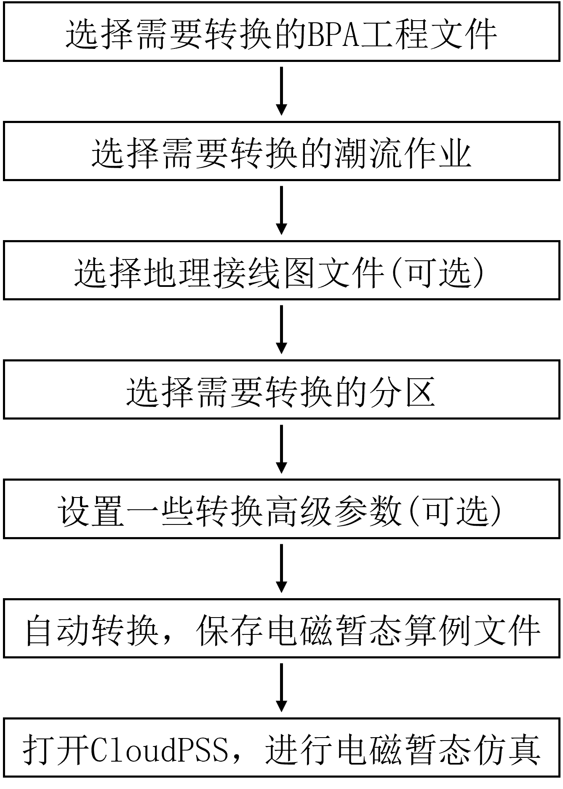
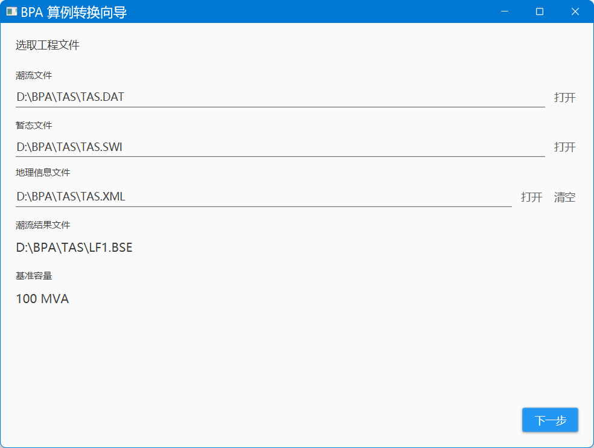
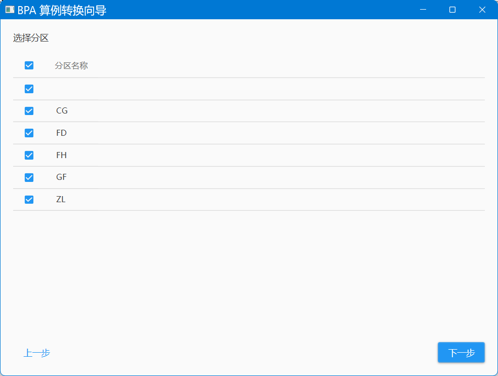
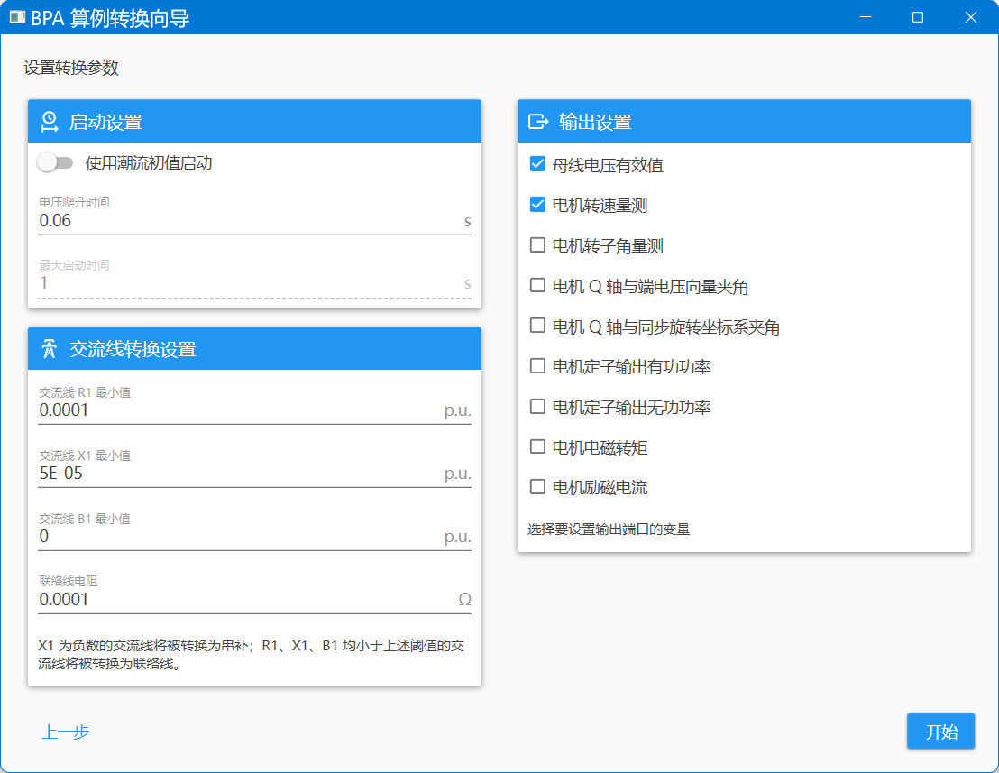
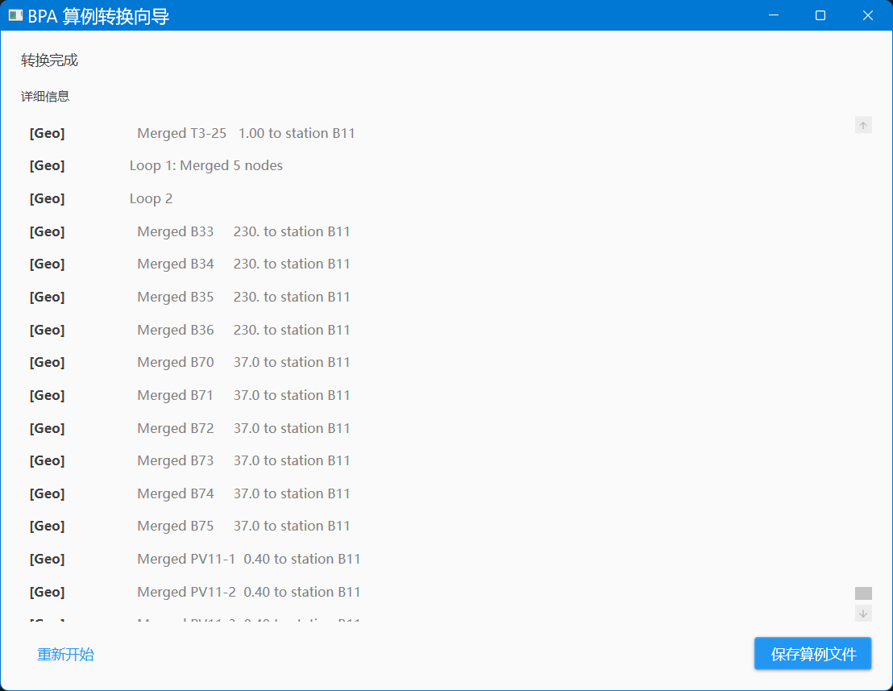
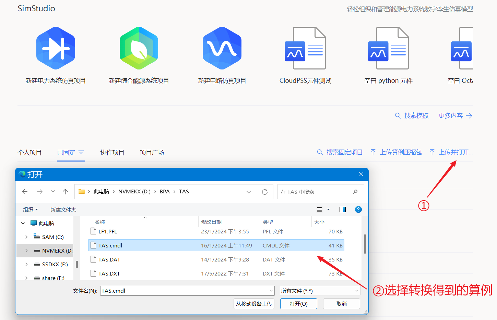
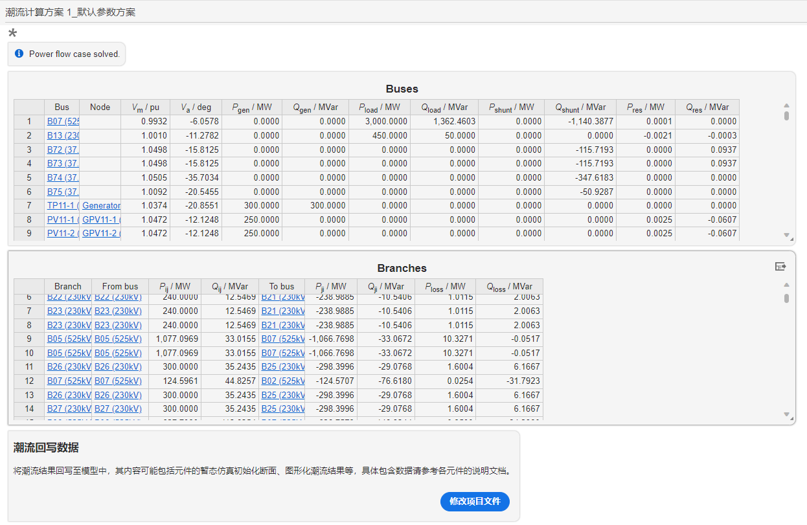
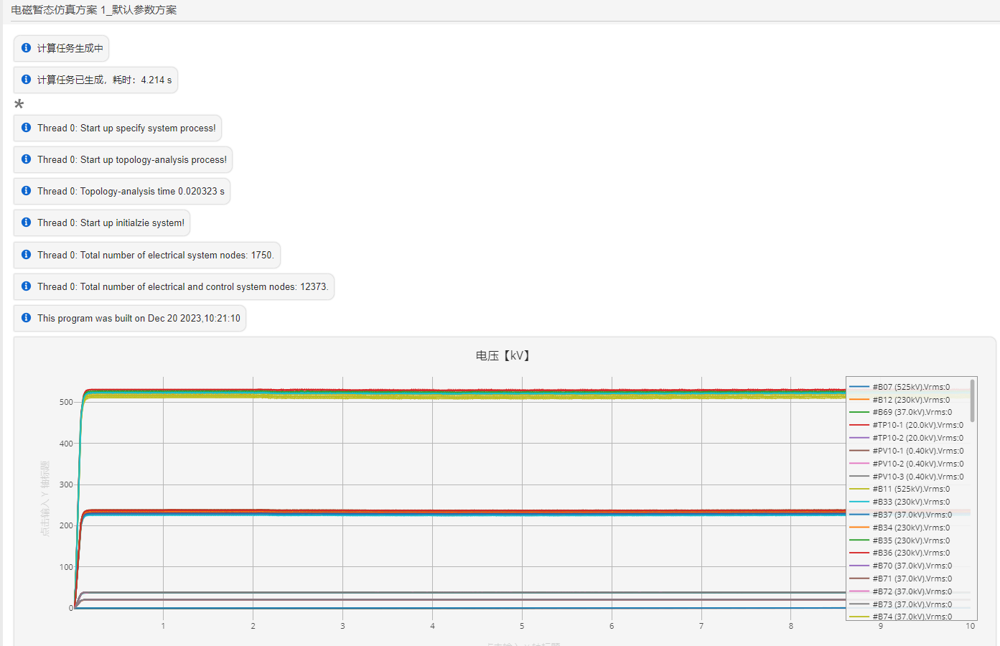

:::info
**本例以某BPA标准小算例为例，帮助用户快速入门BPA-CloudPSS 算例转换工具的使用。**
:::

## BPA-CloudPSS 算例转换流程

算例转换工具的转换方法工作流程如下图所示。首先,选择所使用需要转换的**BPA工程文件**、**潮流任务**、**地理信息图**、**所选区域**等;其次，需要**配置转换参数**，包括输出通道选择等，通过以上步骤，BPA项目即可被转换为电磁暂态仿真项目；最后，通过将转换后的电磁暂态仿真项目上传到CloudPSS电磁暂态仿真平台，即可开展潮流与电磁暂态仿真。

### 1、选择算例、潮流任务与地理信息接线图文件

### 2、选择分区

### 3、设置转换参数

### 4、转换过程

### 5、算例上传

### 6、潮流计算结果

### 7、电磁暂态仿真结果

