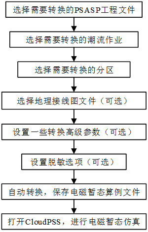
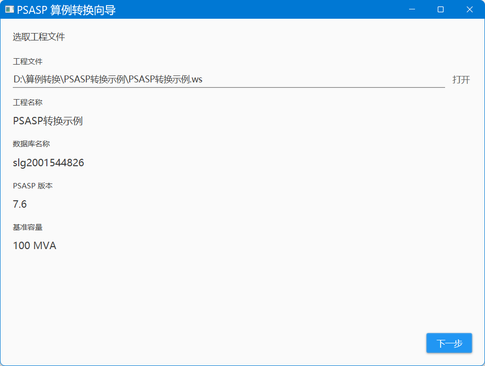
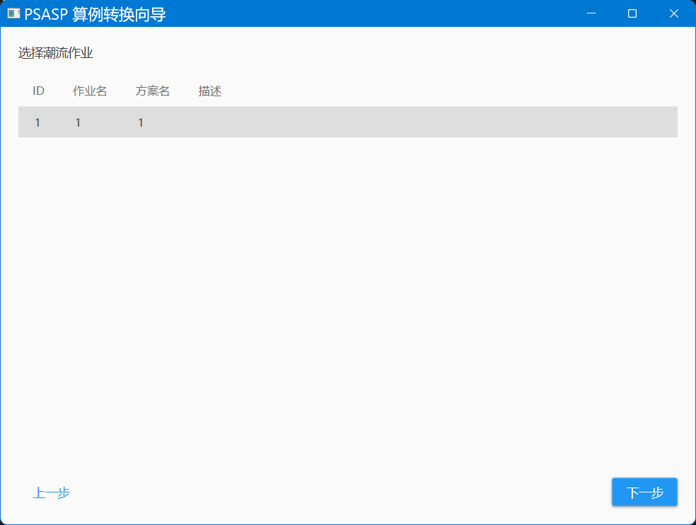
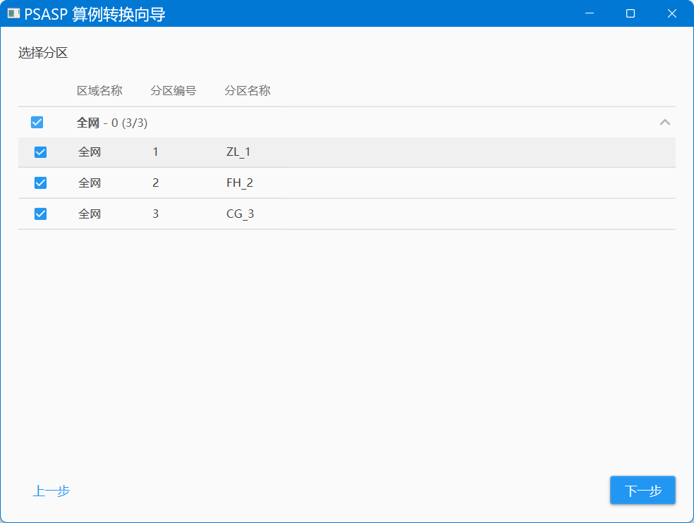
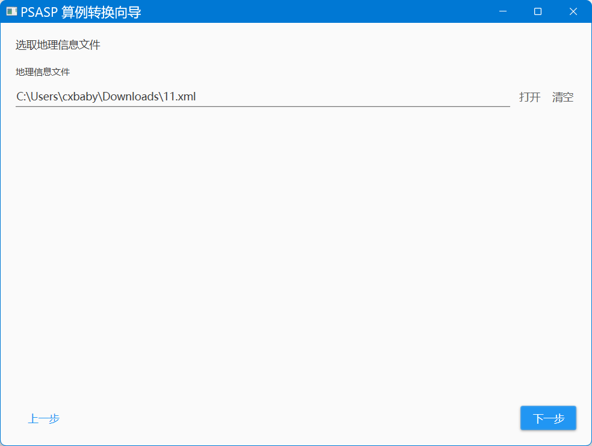
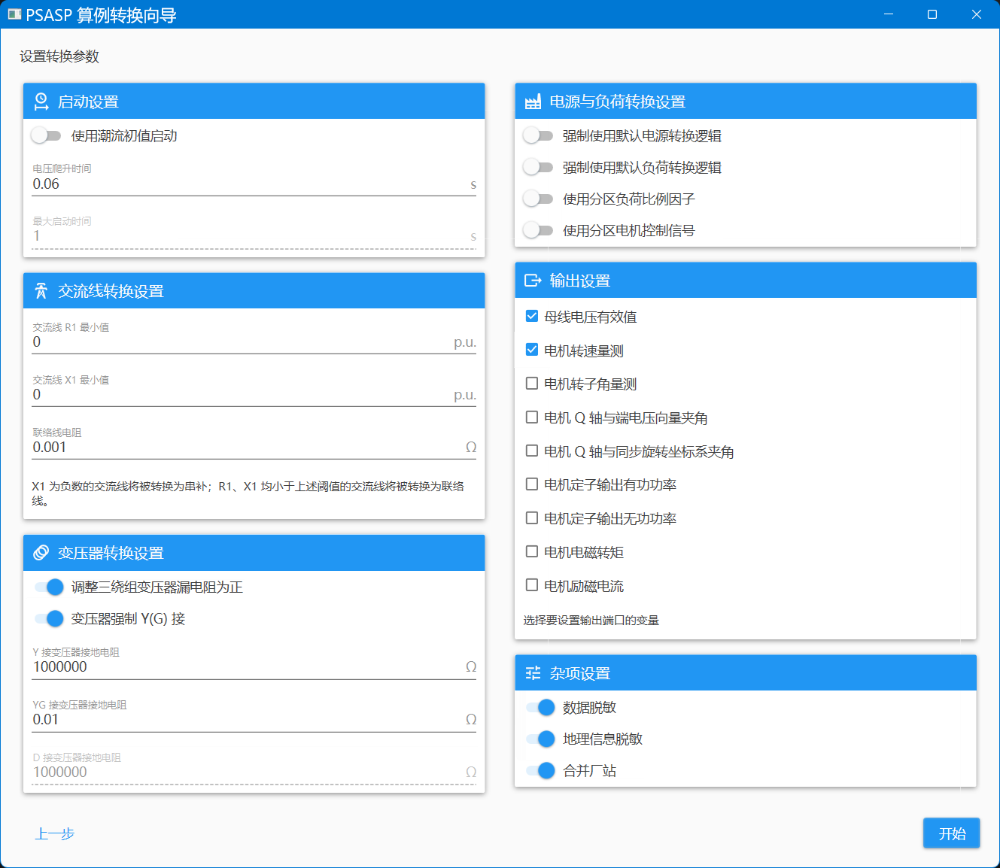
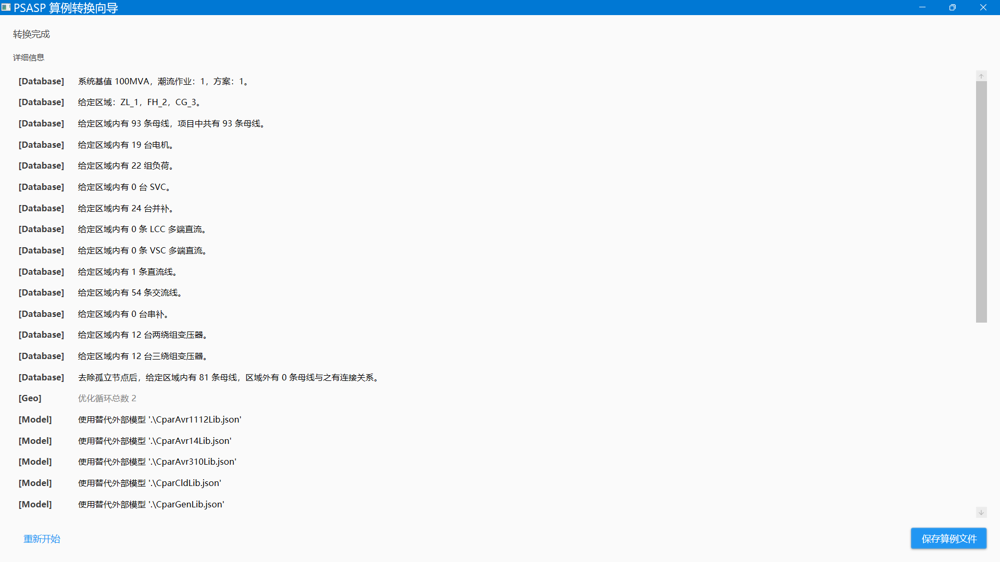
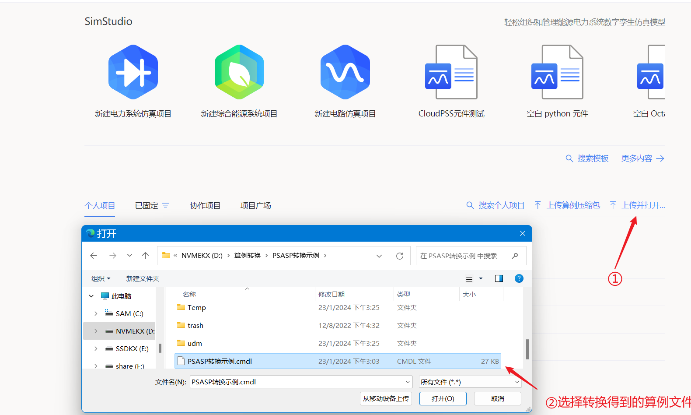
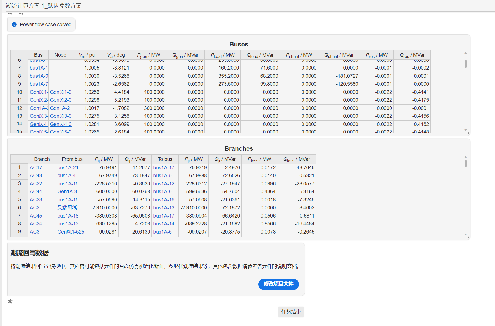
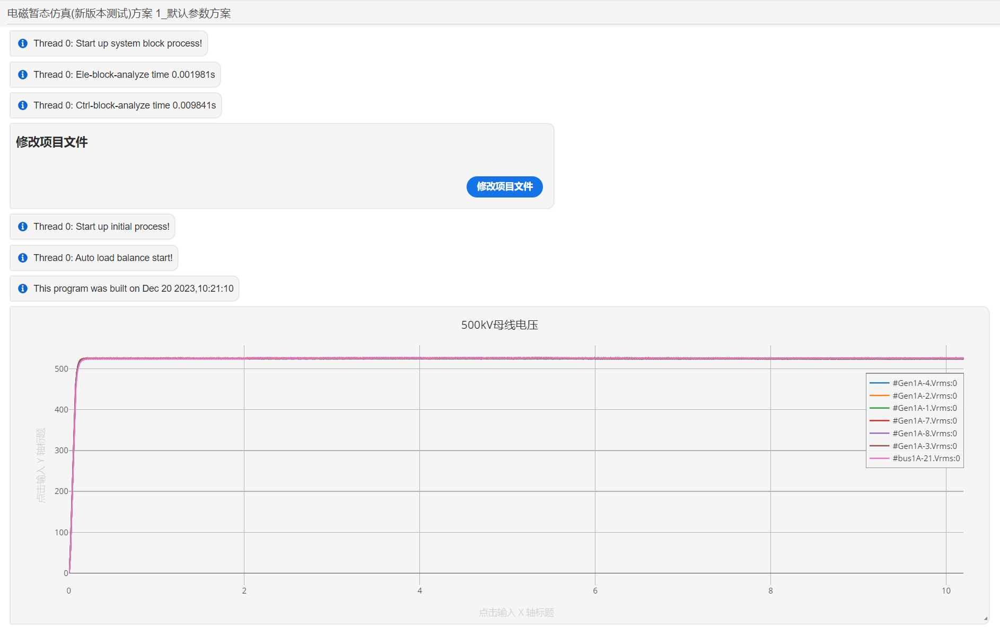

:::info
**本例以某PSASP标准小算例为例，帮助用户快速入门PSASP-CloudPSS 算例转换工具的使用。**
:::

## PSASP-CloudPSS 算例转换流程

算例转换工具的转换方法工作流程如下图所示。首先,选择所使用需要转换的**PSASP工程文件**、**潮流任务**、**所选区域**、**地理信息图**等;其次，需要**配置转换参数**，包括是否删除敏感信息等，通过以上步骤，PSASP项目即可被转换为电磁暂态仿真项目；最后，通过将转换后的电磁暂态仿真项目上传到CloudPSS电磁暂态仿真平台，即可开展潮流与电磁暂态仿真。

### 1、选择算例

### 2、选择潮流任务

### 3、选择分区

### 4、选择地理信息接线图文件

### 5、设置转换参数，选择输出信号类型，以及是否脱敏

### 6、转换过程

### 7、算例上传

### 8、潮流计算结果

### 9、电磁暂态仿真结果

