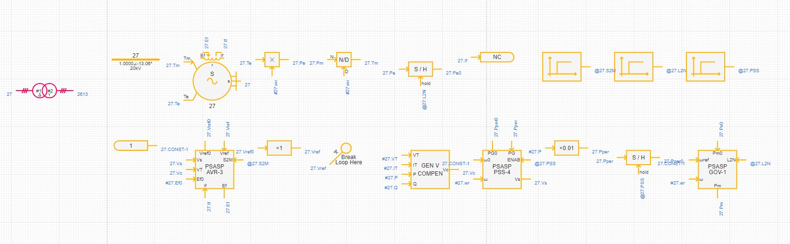
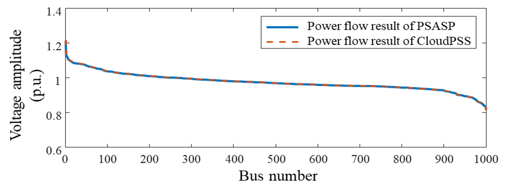
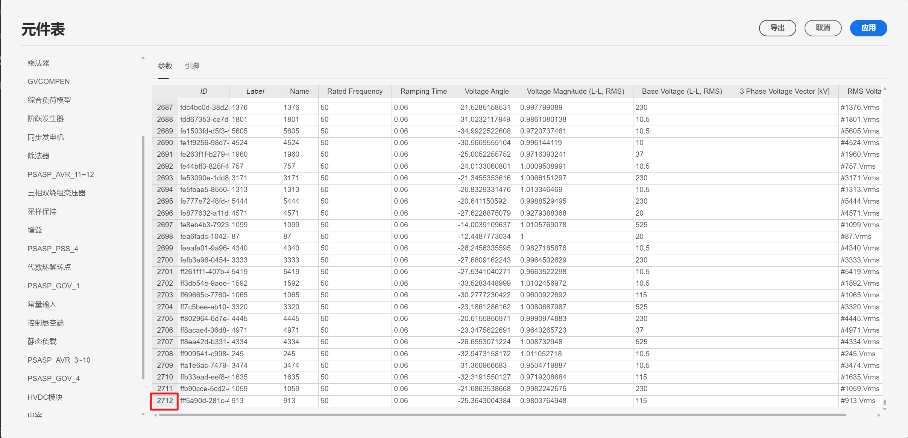
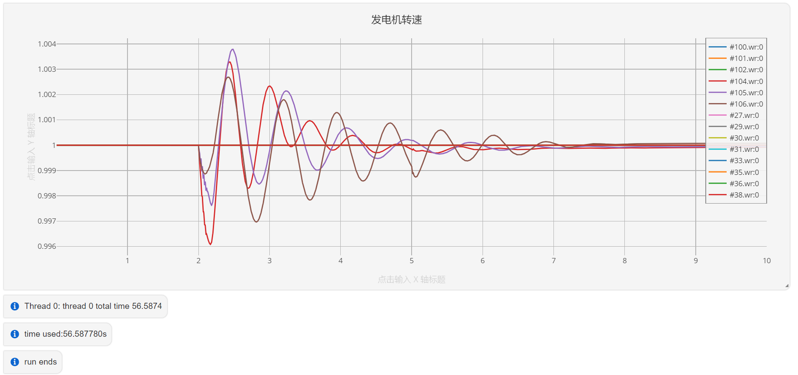
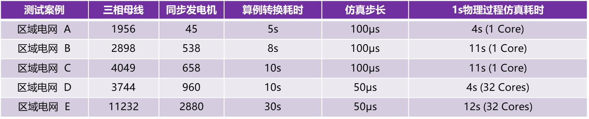
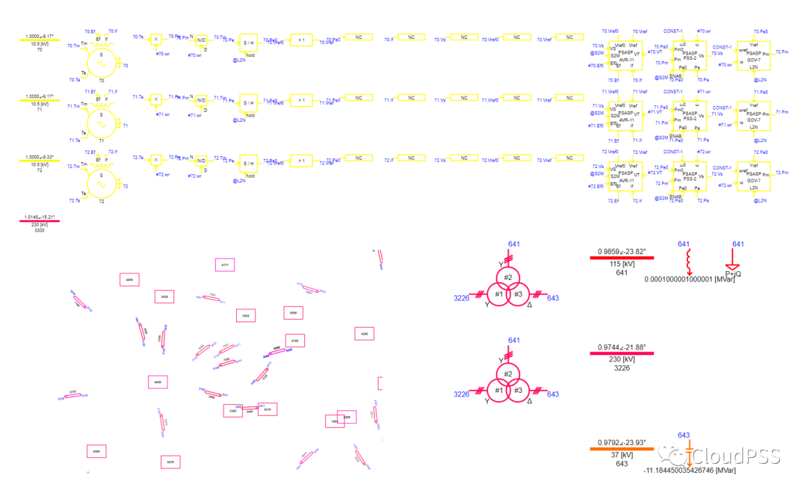
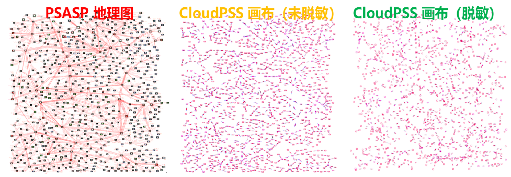

:::info
针对电磁暂态仿真中工作量最繁重且易出错的**大规模复杂算例构建**这一环节，**CloudPSS**推出了**BPA/PSASP→CloudPSS算例自动转换工具**，可基于中国电力科学研究院电力系统分析软件（**BPA/PSASP**）的算例工程，快速形成指定区域的全电磁暂态仿真算例。
:::

**该算例转换工具具备五大重要特性：**

**1. 模型丰富，覆盖百余种交直流系统设备**

**2. 基于潮流结果，快速初始化电磁暂态仿真**  

**3. 极速转换与高效仿真**

**4. 基于地理信息图，自动布局场站**

**5. 一键脱敏，保护电网敏感数据**

### 1、模型丰富，覆盖百余种交直流系统设备
针对BPA/PSASP软件中的每一种设备模型，CloudPSS均建立了一一对应的设备模型模板，并设计了参数转换及补全方法，实现了由潮流/机电暂态元件模型向全电磁暂态元件模型的映射。所建立的设备模板与BPA、PSASP进行了详细对比，保证了稳态和暂态计算精度。

目前，BPA/PSASP→CloudPSS算例转换工具已支持含同步发电机（包括励磁、调速和PSS）、负荷、传输线、变压器、串/并补、SVC、特高压直流输电系统，风机、光伏发电系统等多种设备元件的算例转换。

CloudPSS同步发电机设备模板，包含完整的电机、励磁、调速、PSS元件及连接关系

对于目前尚未支持的电气元件，CloudPSS提供了电压源/负荷等效的方法，保证任意算例转换后的大规模电磁暂态算例均可稳定仿真。

### 2、基于潮流结果，快速初始化电磁暂态仿真

为保证转换后的算例可直接从指定潮流断面启动，算例转换工具通过读取BPA/PSASP潮流作业文件和潮流结果数据，将潮流信息直接写入电磁暂态仿真算例中。

转换后的算例首先须通过CloudPSS的**潮流计算**功能对BPA/PSASP潮流结果进行调整，将变压器相移等因素考虑在内，生成适用于暂态仿真启动的潮流断面，进而可直接启动电磁暂态仿真，并迅速进入预定的潮流断面。

利用CloudPSS潮流计算功能校验后的潮流断面，其母线电压与BPA/PSASP潮流结果完全一致。

借助CloudPSS平台提供的**基于“分解-协调”的交直流系统稳态启动**功能，可实现大规模交直流系统指定断面电磁暂态仿真的极速启动，针对包含2712条三相电压母线、6回直流的的大规模交直流电网算例，采用CloudPSS仿真内核，仿真10s仅需57s！

### 3、极速转换与高效仿真

由于BPA/PSASP软件提供了分区管理功能，在算例转换时，用户可灵活选择一个或多个电网分区，生成省级、区域级甚至全网级电磁暂态算例。区域外的系统将在区域边界被自动等效为电源、负荷或戴维南等值元件。下表列举了相同测试环境下不同规模电网在CloudPSS上的算例转换及仿真效率对比。

### 4、基于地理信息图，自动布局场站

若BPA/PSASP算例工程提供了地理信息接线图文件，算例转换工具可根据地理信息图，按照场站信息对元件进行自动分组和布局，并将低压场站合并至相应高压母线的场站内，自动生成CloudPSS上的可视化算例。
### 5、一键脱敏，保护电网敏感数据**

考虑到电网数据信息的敏感性，算例转换工具提供了一键脱敏功能，提供对包括元件名称、场站名称、元件物理参数等在内的数据混淆和对地理信息图的拓扑混淆功能。在勾选“数据脱敏”和“拓扑脱敏”选项后，转换后的算例文件将采用随机的数字序列代替元件名和场站名，并通过随机非线性坐标变换对拓扑图进行加密。

