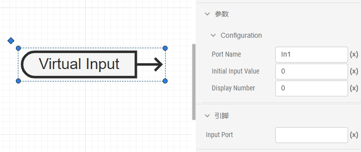
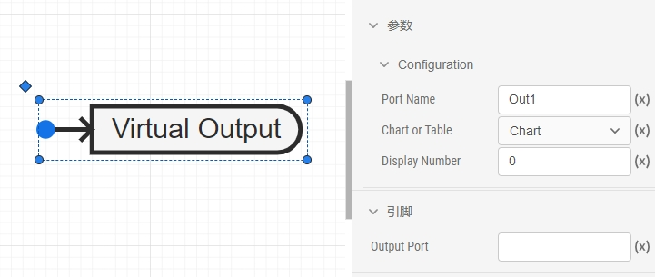
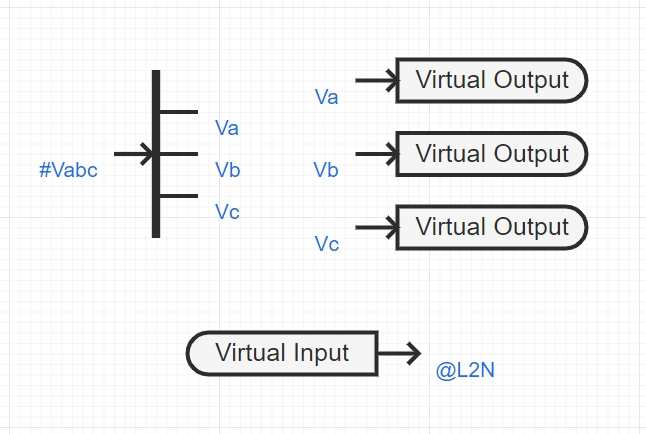
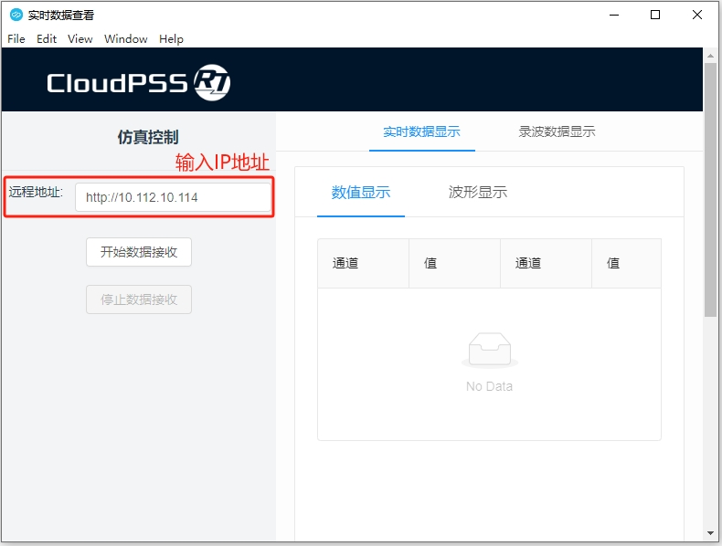
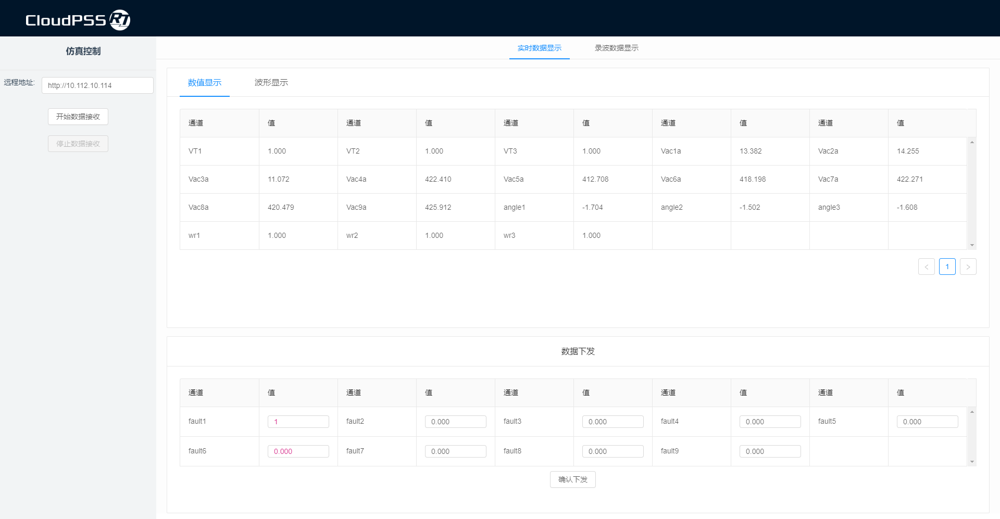
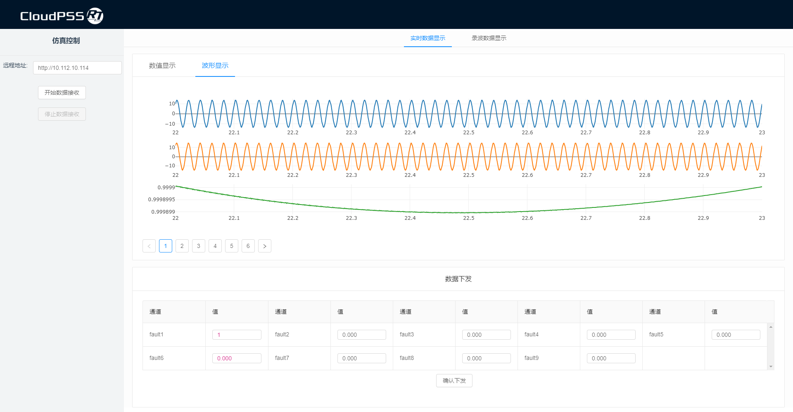
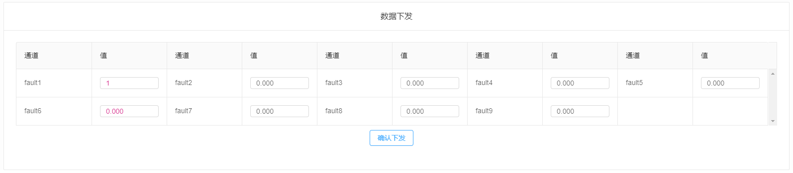
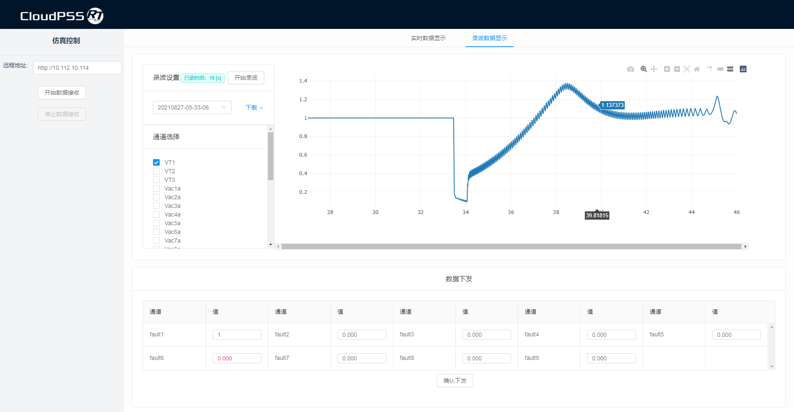

:::info
本工具配合 CloudPSS 实时仿真计算方案使用，用于观测实时仿真算例的实时输出数据，或在线实时下发控制指令。
:::

## 使用说明

### 相关元件  

CloudPSS Siganl Monitor 相关元件可在 **CloudPSS-实时仿真工具** 模型库中找到，使用时拖入图纸并进行参数设置。

#### 虚拟输入端口

   

`虚拟输入端口`可以将 Signal Monitor 中设定的值下发到实时算例中，可用于在线修改算例中的参数或改变算例中一些元件的状态，如脉冲使能、控制切换、故障触发等。需要设置的参数有：  

- Port Name：虚拟输入端口的名称，也是在 Signal Monitor 中显示的名称，不可重复。  

- Initial Input Value：虚拟输入端口的初始值。  
- Display Number：数据在 Signal Monitor 中显示的序号。  

#### 虚拟输出端口  

   

`虚拟输出端口`可以将算例中的数据传到 Signal Monitor 观测或录波，需要设置的参数有：  

- Port Name：虚拟输出端口的名称，也是在 Signal Monitor 中显示的名称，不可重复。  

- Chart or Table：选择数据类型是曲线或者表格。  
- Display Number：数据在 Signal Monitor 中显示的序号。  

### 操作步骤  

#### 1. 添加虚拟输入端口和虚拟输出端口  

`虚拟输入端口`用于控制，用法类似于离线仿真的`阶跃发生器`。虚拟输出端口`用于观测，用法类似于离线仿真的`输出通道`。  

   

#### 2. 设置实时仿真方案

在`运行标签页`，添加实时仿真方案。  

设置实时仿真的开始时间、结束时间和积分步长。`开始时间`默认为 `0`，`结束时间`可以设置为一个较大的值。  

当与外部设备（如 Signal Hub）通信时，模式选择为`从模式`。当仅用于观测数据或作为主机时，模式选择为`主模式`。  

#### 3. 启动任务运行仿真  

#### 4. 启动 Signal Monitor

输入实时仿真器的 IP 地址。  

   

#### 5. 点击开始接收数据  

#### 6. 数据显示  

实时数据显示有两种方式：一种是显示数值，一种是显示波形，如下图所示。  

   

   

#### 7. 数据下发  

修改要下发的数据数值，并点击确认下发。  

   

#### 8. 数据录波  

点击`开始录波`，所有通道的波形会进行录波，并通过点击相应通道名称查看。

   
