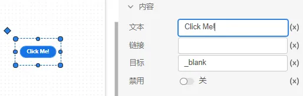

### 1. 按钮内容属性

文本：可以在按钮内输入一些提示文字，支持值模式和表达式模式输入。

链接：点击按钮后跳转的地址。

目标：鼠标悬浮在按钮上显示的目标地址。

禁用：用于控制按钮的可操作性。

### 2. 操作按钮内容属性

自动切换：选中后点击操作按钮可以在`选中`/`未选中`两种状态切换。

选中：切换操作按钮当前的状态。

链接：点击操作按钮后跳转的地址。

目标：鼠标悬浮在操作按钮上显示的目标地址。

禁用：用于控制操作按钮的可操作性。

### 3. 超链接内容属性

文本：可以在超链接内输入一些提示文字，支持值模式和表达式模式输入。

链接：点击超链接后跳转的地址。

目标：鼠标悬浮在超链接上显示的目标地址。

禁用：用于控制超链接的可操作性。