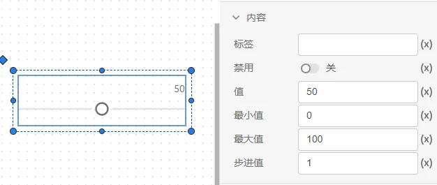
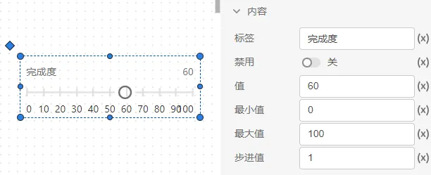
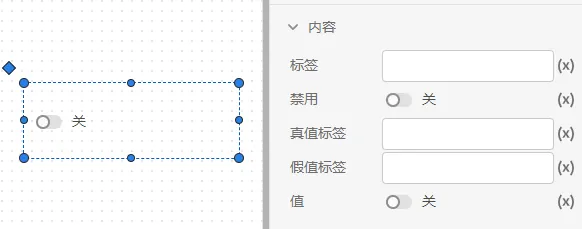
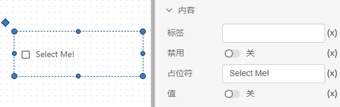

### 1. 输入框内容属性

标签：可以在输入框的前面输入一些提示文字，通常有两种实现形式。
在 `(x)` 值模式下，直接输入文本标签，如`输入框1`，点击值模式，切换到`f(x)`表达式模式，输入表达式，标签内容将和其他控件的值进行联动，例如输入`0 - x s:功率设定值`的标签内容，其中 `x` 是 `t` 输入框的值，便可以输入如下表达式来实现`print("0 - $x s:功率设定值",{x:t.value})`。

输入格式：可以设置实数、非负实数、整数来对输入值进行限制，输入格式以外的数据会自动报错。

禁用：启用后输入框不能输入值。

占位符：当输入框为空时显示的内容。

值：输入框中默认值。

后缀：在输入框值最右面显示的内容。

### 2. 滑块内容属性

标签：可以在滑块的前面输入一些提示文字。

禁用：用于控制滑块的可操作性。

值：显示滑块的当前值。

最小值、最大值、步进值：用于控制滑块的滑动范围和滑动步长。

### 3. 选择器内容属性

标签：可以在选择器的前面输入一些提示文字。

禁用：用于控制选择器的可操作性。

可选项、值：自定义添加/删减可选项和当前选项值。

在 `(x)` 值模式下，点击编辑数据，在表格内输入可选内容。

切换到`f(x)`表达式模式，输入可选项的表达式，格式为["item1","item2","item3"](其中item为文本，若为表达式则不用引号)，例如将输入框 `a` 的`占位符`(键名为 `placeholder` )、`值`(键名为 `value` )、`后缀`(键名为 `suffix` )这三个属性值引用为选择器的可选项，如图所示。

点击`预览`，在预览模式下操作选择器，如图所示。

### 4. 单选框内容属性

标签：可以在单选框的前面输入一些提示文字。

禁用：用于控制单项框的可操作性。

可选项、值：自定义添加/删减可选项和当前选项值，和选择器一致。

### 5. 开关内容属性

标签：可以在开关的前面输入一些提示文字。

禁用：用于控制开关的可操作性。

真/假值标签：值发生变化时标签也随之切换。

值：开/关。

### 复选框属性

标签：可以在复选框的前面输入一些提示文字。

禁用：用于控制复选框的可操作性。

占位符。

值：开/关。

