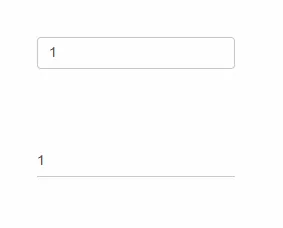
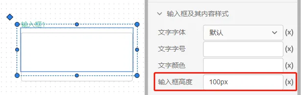
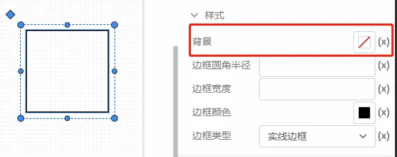
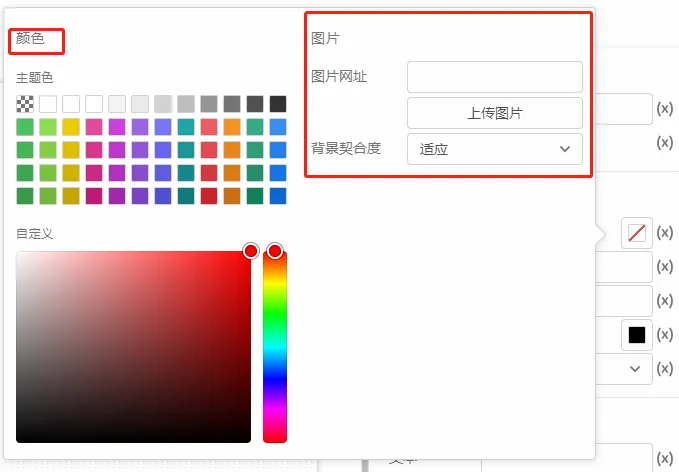
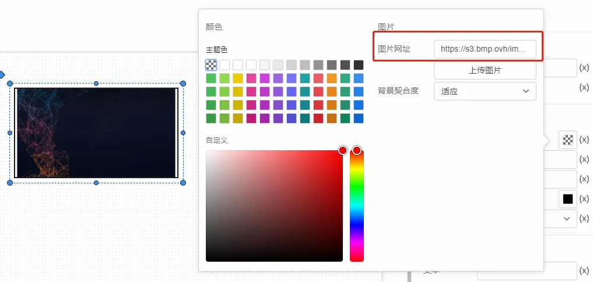
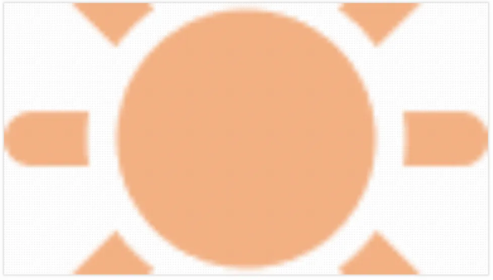
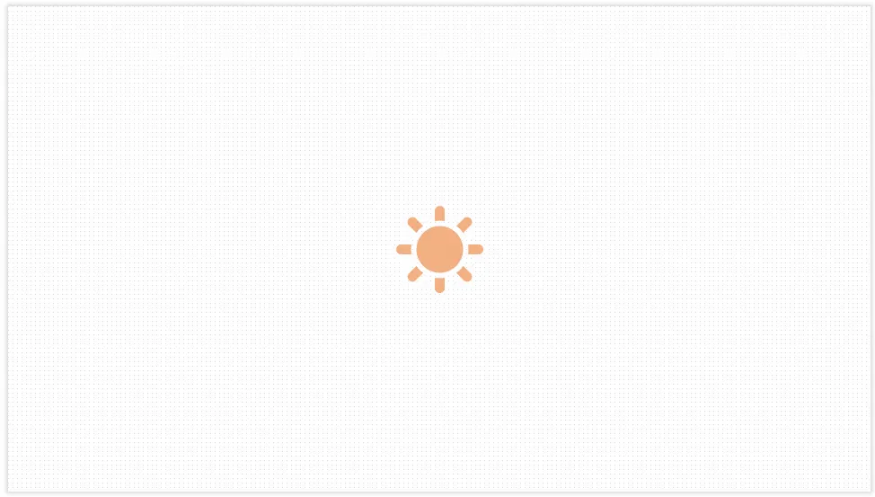

控件属性主要包括`通用样式`、`样式`、`标签样式`、`内容样式`四种，按照调整的格式类型又分为`布局样式`、`文字样式`、`颜色样式`三类，不同的控件之间的样式属性大同小异，以`输入框`控件的样式为例来介绍。

### 通用样式

缩放比例：用于调节输入框包括标签和内容文字大小的整体变化比例。

是否隐藏：选择默认正常显示，选择隐藏后，该输入框被隐藏。

### 样式

布局：可选择垂直和水平，指的是输入框的标签格式是垂直格式或者水平格式。

安静：可以调整输入框的显示格式。下图中靠上输入框是普通格式，靠下的输入框是安静格式。

### 标签样式

文字字体：可以选择不同类型的字体来调整标签文字。

文字字号：可以调整标签文字的大小，单位pt/cm。

文字颜色：支持通过颜色选择器来给标签文字着色

文字粗细：可以选择调整标签文字的粗细。

### 输入框及其内容样式

用于调整输入框内容的文本字体、文字字号、文字颜色和标签样式一致。

输入框高度：可以修改输入框的高度，单位px/cm。

### 盒子和MarkDown文本框的背景样式

对于盒子和MarkDown文本框控件的背景，一方面可以通过颜色选择器修改背景颜色，另一方面也可以自定义背景图片。

有两种自定义背景图片的方法，第一种，直接点击上传图片，上传本地图片

第二种方法是直接输入图片的网址，也就是图片的 URL 地址, 如果是本地图片，需要将其上传到图床（保存图片资源的服务器）

背景契合度：可以设置背景图片的摆放方式，有填充、适应、拉伸、平铺、居中5个可选项。

填充：图片等比缩放，按照最小边来适应屏幕的最大边，以达到填充屏幕的效果

适应：图片也是等比缩放，只不过图片的最大边放到屏幕的最小边时就不在放大

拉伸:  图片不按比例缩放，根据场景大小拉伸，让一张图片就占满场景

平铺：把图片铺满场景，图片小的话挨个排列，直到排满整个场景

居中：图片保留原大小处于水平线中间，也就是场景中间

