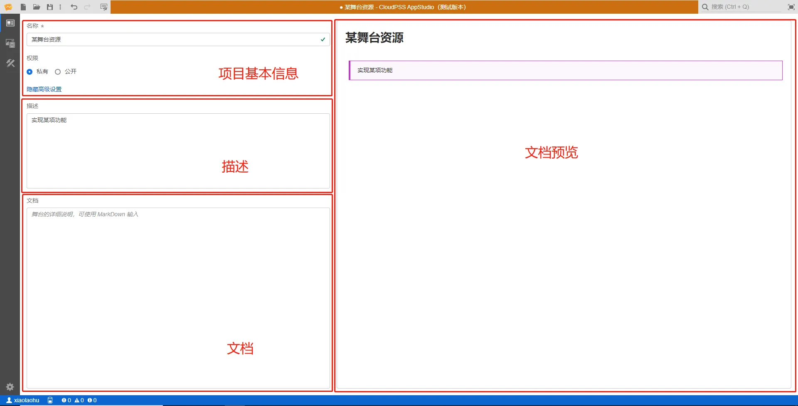

::: info

**`总览`标签页实现对当前项目信息的配置，包括配置项目基本信息(名称、类型、权限信息以及标签)、描述以及文档。**

:::

`总览`标签页共分为四个部分内容：**项目基本信息**、**描述**、**文档**以及**文档和参数列表预览**，如下图所示。

### 1)	项目基本信息

项目基本信息包含名称、权限两个内容。

项目名称为项目的名称，便于用户查找。

::: info
### **权限管理**

项目权限设置分为`私有`和`公开`，当项目权限选择`私有`时，该项目仅保存在`个人仿真`中，**仅用户自己可见**；当项目权限选择`公开`时，该项目同时保存在`个人仿真`和`仿真广场`中，**所有用户可见**。

:::

### 2)	描述
为该项目添加描述性文字，点击AppStudio主页的`个人项目`该文字将会显示出来，便于用户进行简要注释。

### 3)	文档
为该项目添加说明性文档，同样该文档可以在`个人项目`中点击查看。

### 4)  文档预览
在文档部分编辑的MarkDown语法将会实时进行预览显示在此处。

描述及文档内容的编写支持MarkDown语法，Markdown是一种轻量级标记语言，支持文字格式调整，图片、图表、数学公式等的输入。在进行编写时，输出结果将实时渲染至右侧的显示框中。MarkDown语法的介绍详见[MarkDown语法介绍](../../Other/Markdown/index.md)功能帮助。

