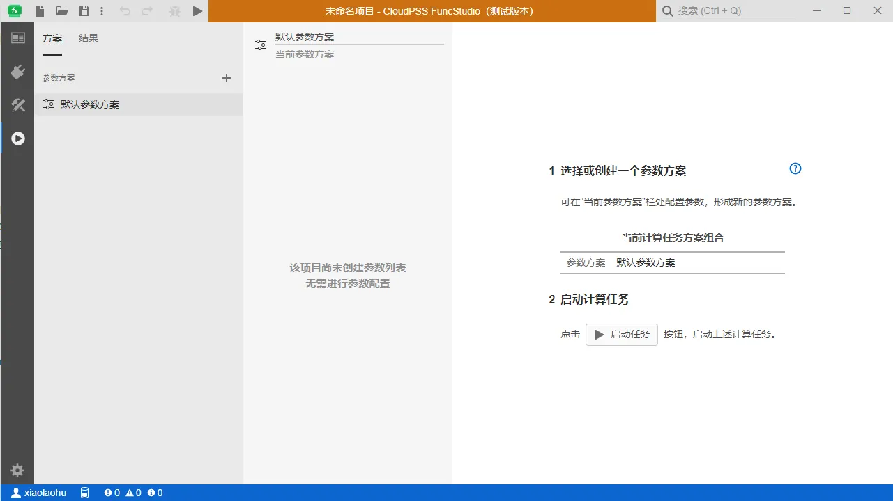
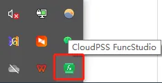
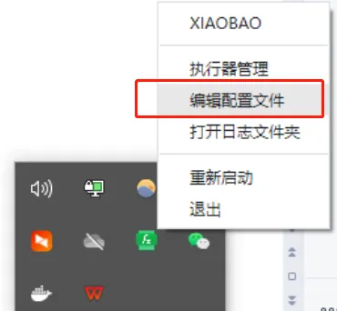
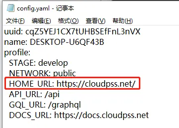
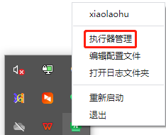
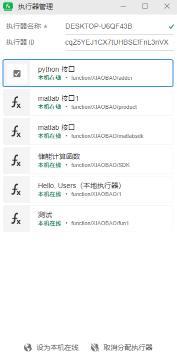

## 执行器安装

执行一个构建好的函数项目，首先要给其分配执行器，因此，需要在本地安装 FuncStudio 的执行器，点击`安装 FuncStudio`按照引导逐步安装完成即可。执行器的工作页面和 FuncStudio 的工作台一致，也可以在执行器内实现函数，如下图所示：

打开并登录执行器后，系统状态栏中会出现一个 FuncStudio 执行器的小图标，如下图所示：

## 执行器配置

右击系统状态栏中`FuncStudio`执行器的小图标，选择`编辑配置文件`的选项，点击后打开配置文件进行编辑，如下图所示：

对于公网平台用户，配置文件如下图所示，安装时已默认完成配置，用户无需自行更改。

## 执行器管理

右击系统状态栏中`FuncStudio`执行器的小图标，点击`执行器管理`进入执行器管理界面。

执行器管理页面用于显示当前用户在 FuncStudio 中接入的`全部函数`、`执行位置`和`在线状态`。

执行器管理界面有三部分，上方显示当前执行器的名称和ID，名称用户是可以修改的，ID是唯一的。

中间区域显示当前用户在 FuncStudio 中接入的全部函数，不光是这一台设备，一个账号可能在多台设备都接入了函数，全部会在这里面显示。

下面区域可以修改某个函数的执行位置，函数可能在除本机外的其他设备执行。

::: tip
如果要在多台设备上调试同一个函数，要保证这些设备上同时存在完整且相同的运行环境、运行目录
:::