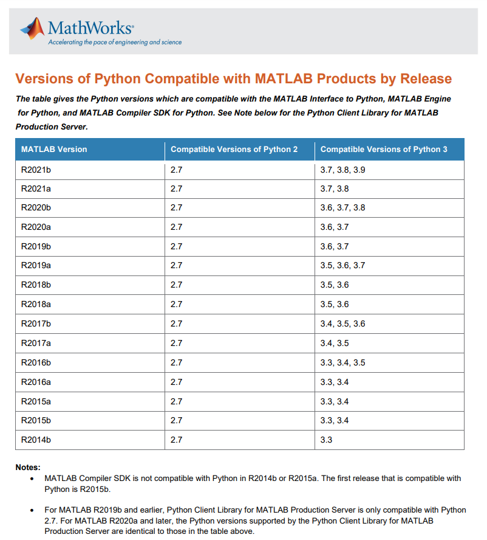
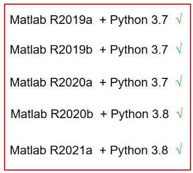
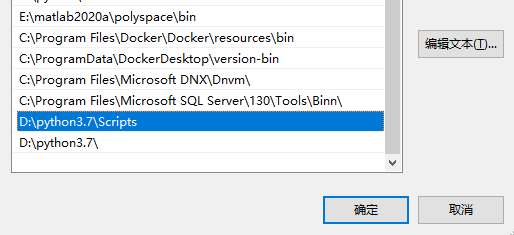
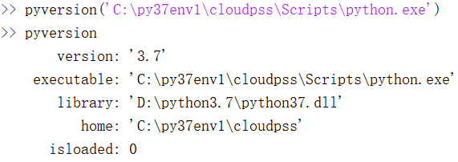
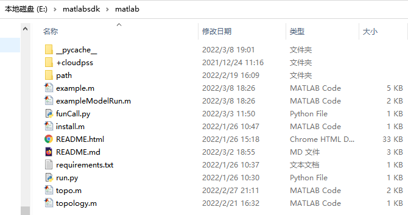

## 由于matlab sdk本质上是用Python实现的，因此需要根据已安装的Python版本，来选择与其兼容的Matlab版本

各版本Matlab支持的Python版本如下表所示。



由于 CloudPSS SDK 要求的 Python 版本为 3.7 及其以上，因此Matlab 版本需要选择 R2019a 及其以上的版本，目前建议使用的版本组合有以下五种：



例如， 支持 `Matlab R2020a  + Python 3.7` 的组合。

安装好与python版本匹配的matlab之后，需要配置Matlab的Python环境，具体操作如下。

### 1. 添加系统环境变量

首先要保证构建的`虚拟Python环境所依赖的基础版本Python添加到了系统环境变量`，如果没有，要手动添加。

例如，构建的虚拟环境依赖的基础是`Python3.7`, 因此需要把Python3.7添加到系统环境变量中。



### 2. 配置Matlab的Python环境

打开安装好正确版本的 Matlab 并在 命令行窗口中输入如下命令，括号里面的参数就是需要配置给Matlab的Python环境地址。

``` MATLAB
pyversion(‘C:\py37env1\cloudpss\Scripts\python.exe’)  
```
例如，这里将 Matlab 的 python 环境指定给刚才新建的虚拟环境。

然后在命令行窗口中输入`pyversion`来验证.



### 3. 安装 Matlab 的 SDK

配置好Matlab的Python环境后，需要安装 Matlab 的 SDK

直接访问[https://downloads.cloudpss.net/](https://downloads.cloudpss.net/)来下载matlab-sdk的压缩包。

::: tip
然后，关键在于需要将matlab-sdk的压缩包解压到自定义内核所在的目录，也就是后续需要接入FuncStudio的Matlab 脚本所在的位置。
:::


然后将打开的Matlab的工作目录切换到这个路径下，可以看到Matlab SDK 里有一个`install.m`的文件，

在 Matlab 中运行该文件来安装依赖库。

至此，FuncStuido、Python 和 Matlab的环境已经配置好了。


