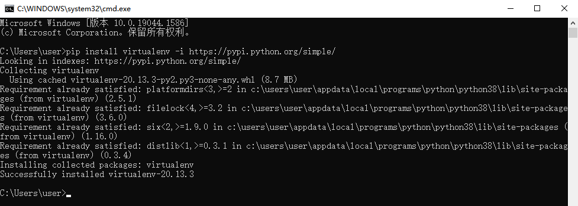
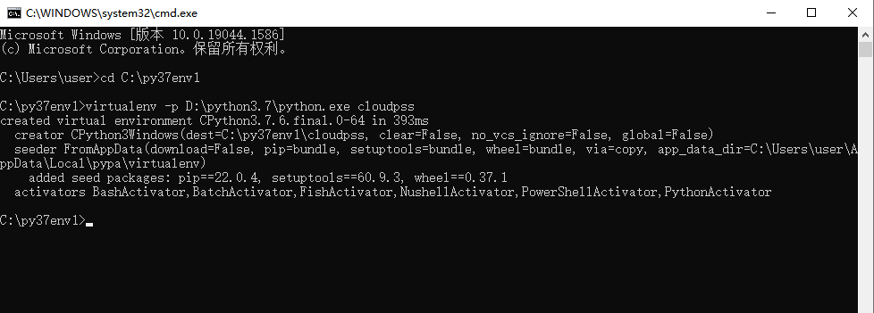
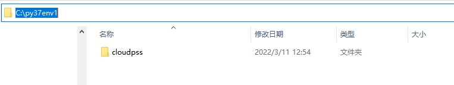
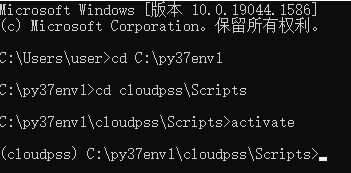
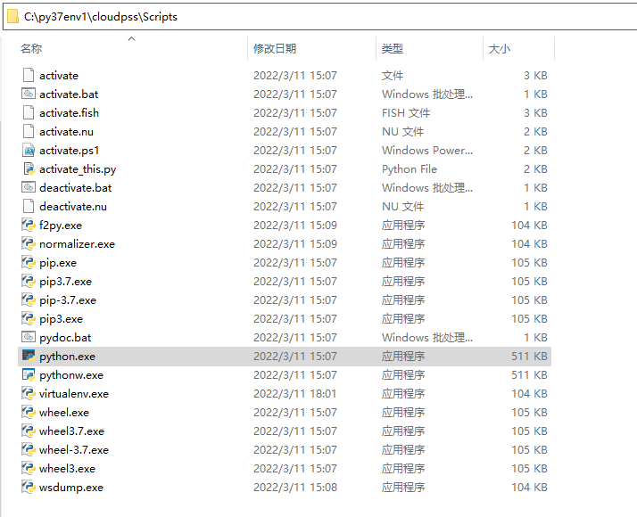
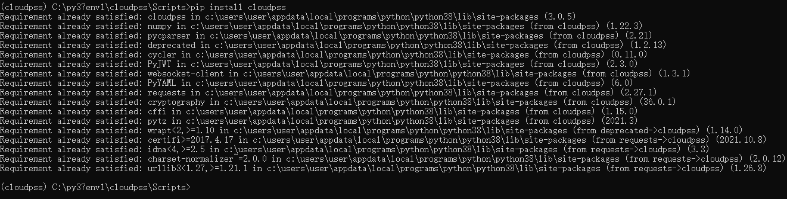
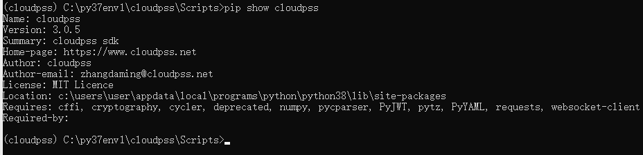

## 安装好FuncStudio执行器后，还需要在本地安装python，因为无论使用 Python 还是 Matlab 编写计算内核的用户都需要在本地安装3.7及以上版本的 Python。

::: tip
如果本地设备上安装了多个版本的python，建议使用虚拟Python环境来管理；
创建虚拟Python环境是为了让cloudpss项目运行在一个独立的环境中，使得不同环境下的项目互不干扰。
:::

Python环境配置的具体配置方法如下：

### 1. 安装virtualenv

打开一个命令窗口，在命令窗口中输入并执行如下命令来安装python 的 virtualenv 包。

```shell
pip install virtualenv 
```


::: tip
如果出现按照超时的问题，可以输入如下命令，使用清华源安装
```shell
pip install virtualenv  -i https://pypi.tuna.tsinghua.edu.cn/simple
```
:::
### 2. 新建虚拟环境地址

需要新建一个存放虚拟环境的地址，比如，新建一个`C:\py37env1`的目录。

并将命令窗口中输入并执行如下命令，将当前路径切换到该目录下。
```shell
cd C:\py37env1
```
### 3. 创建指定python版本的虚拟环境

在命令窗口中输入如下格式的命令行，创建指定python版本的虚拟环境。

::: tip
virtualenv -p [python所在的路径+python运行文件的名字（加后缀名）] + 虚拟环境名
:::

例如：
```shell
virtualenv -p D:\python3.7\python.exe cloudpss
```

其中 virtualenv 是创建虚拟环境的指令，后面用于指定当前虚拟环境所使用的python基础环境的位置，即当前设备上python3.7的安装位置,

最后一个参数是用户自己设定的虚拟环境名，这里取名`cloudpss`。

执行这个命令后，可以看到在存放虚拟环境的地址下创建了一个`cloudpss`的文件夹。






### 4. 激活虚拟环境

进入刚才虚拟环境所在的目录，找到scripts子目录，将命令窗口的当前目录定位到这个路径下，执行 `Activate` 命令，即可激活虚拟环境。

在命令行里，若左侧显示一个括号，里面写着虚拟环境名称，说明现在已进入到虚拟环境中。



至此python虚拟环境就建立好了，地址为：`C:\py37env1\cloudpss\Scripts\python.exe`。



::: tip
这个环境地址在后续配置`matlab的python环境`时以及在`funcstudio执行计算内核`时都会用到。
:::

### 5. 安装CloudPSS SDK

最后，为了实现后续的内核接入，还需要在命令窗口中执行如下命令，在虚拟环境中安装`CloudPSS SDK`。
```shell
pip install cloudpss -i https://pypi.tuna.tsinghua.edu.cn/simple
```


安装成功后在命令窗口中输入如下命令，来检验是否安装成功，可以看到当前安装版本。
```shell
pip show cloudpss 
```


::: tip
如果用户已利用Anaconda安装了python，可以按照Anaconda提供的方法新建虚拟环境，并在虚拟环境中安装cloudpss sdk即可。
:::


