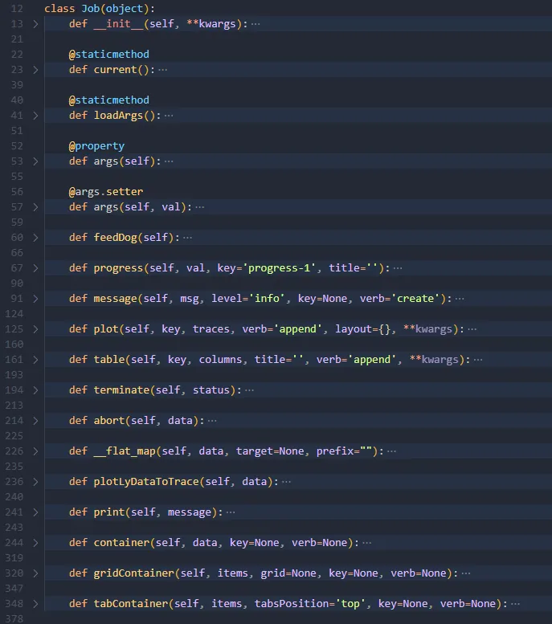

::: info

**本节主要介绍如何在本地实现函数的算法内核，即如何编写函数的算法内核、函数算法内核如何获取配置好的外部接口参数以及如何格式化输出函数的计算结果。**

:::

### 1）安装 SDK

为了让函数的本地算法内核能够获取我们配置好的接口参数，并格式化输出函数的计算结果， CloudPSS 提供 FuncStudio 的接口 SDK 和格式化输出的 SDK，目前只支持 Python（Python 推荐安装 3.8.5 以上），因此，首先需要 `pip install cloudpss` 来获取 CloudPSS FuncStudio的 SDK 文件。

### 2）利用Python编写函数的算法内核

安装好 SDK 后，在本地编写 Python 文件来作函数的算法内核。

####  获取接口参数

 导入安装好的Cloudpss package
 ```python
 import cloudpss 
 ```
 根据提供的SDK获取FuncStudio当前函数的任务信息
  ```python
 if __name__ == '__main__':
    job = cloudpss.function.currentJob()
 ```
 利用SDK提供的args函数按照键名获取函数的参数
```python
    a=int(job.args.a)
    b=int(job.args.b)
```
####  格式化输出

 利用 SDK 提供的 plot 函数绘图

 ```python
    job.plot('plot-1',[{'name':'t1','type':'scatter','x':[a,a+1],'y':[b,b+1]}])
    job.plot('plot-2',[{'name':'t2','type':'scatter','x':[a+2,a+3],'y':[b+2,b+3]}])
 ```
 利用SDK提供的message函数输出信息
 ```python
    job.message(a+b,key='c')
 ``` 

::: tip

目前 CloudPSS FuncStudio SDK 提供的函数有：

打开已有函数项目: job=cloudpss.function.currentJob()

获取函数的参数: job.args

发送进度信息: job.progress

发送日志: job.message

发送表格数据: job.table

发送绘图图消息: job.plot

发送结束信息: job.terminate

发送终止信息: job.abort

上述 CloudPSS FuncStudio SDK提供的函数的具体用法都可以在 Cloudpss package的 `Job` 类里面查看详细的定义。




:::

### 3）使用命令来执行 Python 文件

在`本地：自定义命令`实现页面的命令窗口内输入执行 python 文件的命令，在工作目录内指定 python 文件所在的本地目录。

::: tip

若本地只有一个 python 环境，确认安装好 SDK 后，在命令窗口内直接输入 python XXX.py 即可执行该函数。如下图所示：


若本地有多个 python 环境，则需要指定安装有 SDK 的 python 环境来执行，如下图所示：


:::