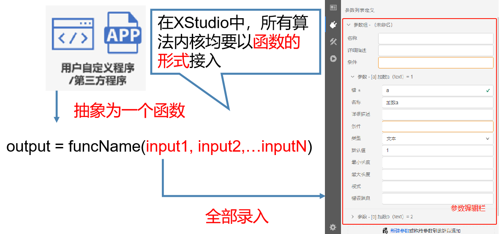
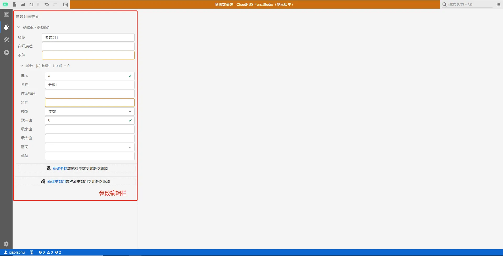
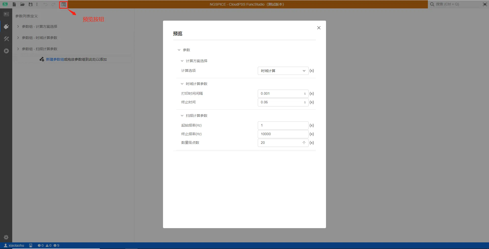

::: info
**为什么要设计`接口标签页`呢？**

**因为在XStudio中，所有算法内核均要求以函数的形式接入，因此需要把自定义计算内核抽象为一个具有多输入量的函数，也就是下面这种格式。**

**并整理出所有输入参数，把这些参数的详细信息全部录入FuncStudio。具体如何录入呢，就需要用到接口标签页。**
:::

::: info

**`接口`标签页主要是用于配置函数的外部接口，即函数的调用参数定义，用于给函数编辑参数，并在多参数方案运行时使用。**
:::

`接口`标签页仅由参数编辑栏组成，如下图所示。

介绍如下：

### 1)	参数编辑栏

参数编辑栏提供了当前函数的参数设计功能。参数编辑栏提供了实数、整数、文本、布尔、选择、多选、表格以及虚拟引脚类型的参数，提供了相关参数的名称、条件、默认值等配置选项。

参数编辑栏主用于给函数编辑参数，并在多参数方案运行时使用。操作方法与 SimStudio 一致。

详见[SimStudio 模型封装的参数编辑栏介绍](../../../../simstudio/basic/moduleEncapsulation/index.md)。

### 2)	参数预览

在进行`接口`标签页的配置过程中，可通过右击图标绘制窗口选择`预览`选项或点击`预览`快捷按钮，实现对参数列表的预览。用户可通过预览功能及时查看参数各部分联动是否正常。一个典型的预览界面如下图所示。

