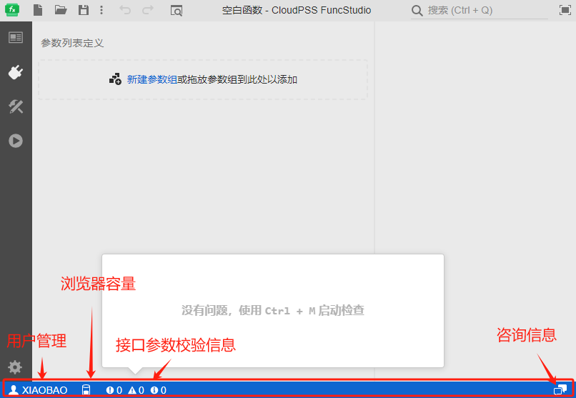
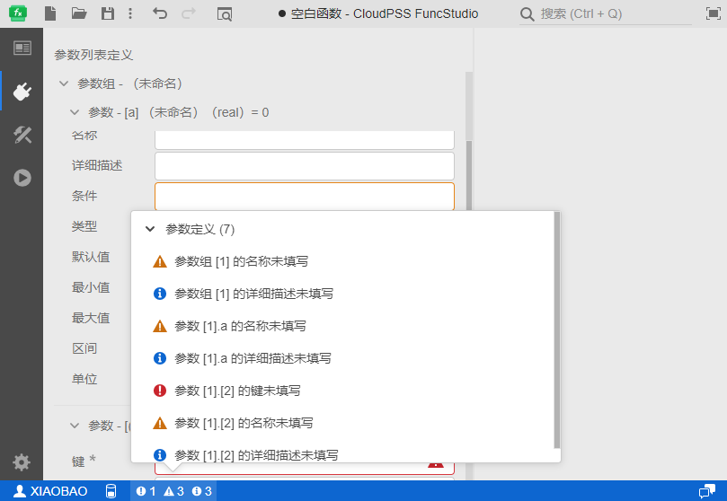

FuncStudio 最下端为状态栏，包含`用户管理`、`浏览器存储配额`、`接口参数校验信息`、`咨询信息`四种类型的信息图标。

## 用户管理
点击用户管理图标，可以选择进入`个人中心`或`退出登录`当前用户账号。

## 浏览器存储配额
公网界面会显示当前账号的浏览器存储配额。

## 接口参数校验信息

FuncStudio 内置了即时错误校验功能。用户在配置接口参数的同时，每一步操作完成的1s后，后台会同步对接口进行校验，并再状态栏的左下角实时指出错误和引导性文字，帮助用户修改参数。## 接口参数校验信息如下图所示。

## 咨询信息
公网界面可以通过`咨询信息`界面咨询技术人员有关CloudPSS相关问题。

## 函数执行进度

当开始调试或启动函数时，状态栏内会显示函数的当前执行进度。

