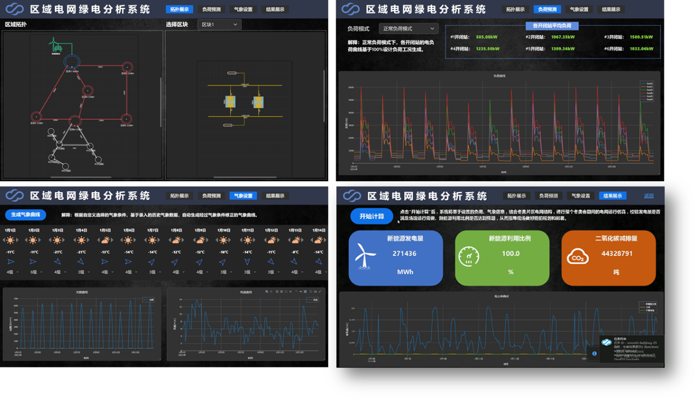

::: tip
**借助数字孪生工坊套件，我们快速构建了面向综合能源系统的数字孪生应用——XX园区绿电分析系统[https://greenenergy.pub.cloudpss.net/](https://greenenergy.pub.cloudpss.net/)。园区绿电分析系统基于SimStudio能量流计算内核和气象预测数据，分析某区域电网在一段时间内的发电及负荷利用情况。**
::: 

该系统主要包含1个500kV和5个220kV变电站，在其中1处220kV变电站下挂接了6处10kV开闭站及其负荷，另外4处220kV变电站下都接入了新能源电厂，主要新能源设备包括风机和光伏。现需通过仿真计算分析在未来2周内系统的负荷情况、气象条件以及新能源的发电利用情况。该系统主要包含`拓扑展示`、`负荷预测`、`气象设置`和`结果展示`4个模块。

## 1. 拓扑展示模块
拓扑展示模块的左半部分主要用于显示在SimStudio中构建的系统数字孪生模型整体拓扑。在这里可以清晰看到系统结构和各区块间的连接关系，而模块的右半部分主要用于显示各区块内部的详细拓扑，在这里可以查看每个区块内的新能源电厂内部的风机、光伏以及相互之间的连接方式。
## 2. 负荷预测模块
负荷预测模块包含一个函数（LoadPrediction），可以对不同负荷工况模式下区块4所挂接负荷的负荷曲线以及平均负荷进行预测，主要的负荷工况模式包括低负荷、正常负荷以及高负荷三种模式。
## 3. 气象设置模块
在气象设置模块包含3个函数（sunVarList，windVarList和WeatherPrediction），可对未来2周内每天的气象数据进行设置，从而预设每天的平均温度以及光照和风速曲线，其中可设置的气象参数包括天气条件（晴、多云、雨、雪）和风速等级。该部分数据也可通过接入气象预测数据自动配置。
## 4. 结果展示模块
结果展示模块包含1个函数（ResultView），其读取前面所设置的负荷以及气象条件，基于SimStudio能量流计算内核，对未来2周的系统运行情况进行仿真，并利用仿真结果计算新能源发电量、新能源利用率以及二氧化碳减排量等关键指标。

