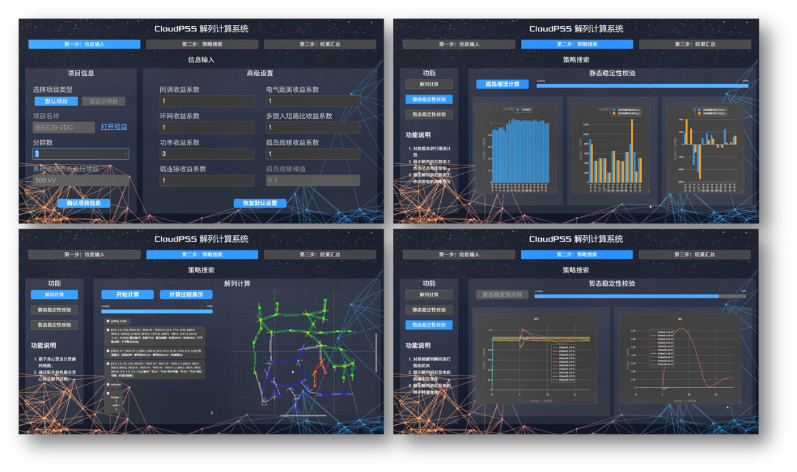

::: tip
**基于CloudPSS XStudio、潮流计算内核和电磁暂态仿真内核制作的电网解列计算系统[https://systemsplitting.pub.cloudpss.net/](https://systemsplitting.pub.cloudpss.net/)，用于生成安全、稳定的解列策略，并加以验证。**
:::
解列计算系统包含以下3项功能：

## 1. 参数输入

用于录入解列计算的对象和参数，即相关算例在SimStudio的工程名和解列算法参数。

## 2. 功能集合

### 1) 解列策略生成
基于贪心算法计算解列线路，生成解列策略；同时在SimStudio拓扑图上通过染色方式展示贪心算法解列过程。

### 2) 静态稳定校验
对解列后的各孤岛进行潮流计算；展示解列前后静态工作点节点电压的变化；最后展示解列前后静态工作点发电机功率的变化。

### 3) 暂态稳定校验

对系统解列瞬间进行电磁暂态仿真；展示解列前后发电机机端电压变化；最后展示解列前后发电机转子转速变化。

## 3. 结果汇总

展示解列计算系统的输出结果，包括开断线路表、多馈入短路比表、孤岛功率情况表和平衡节点信息表。

