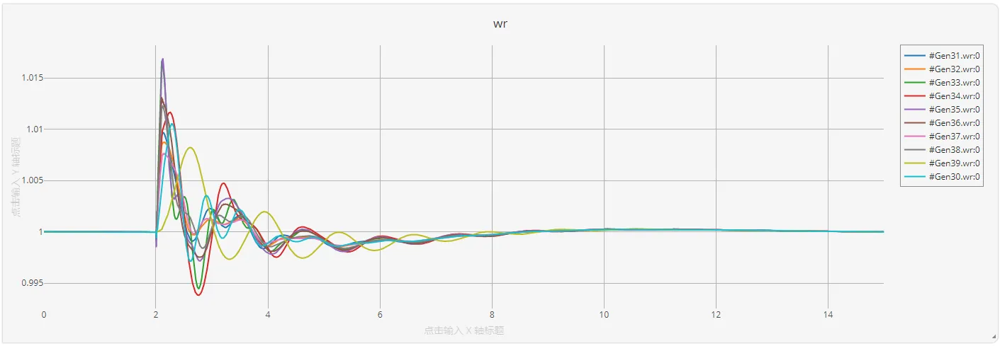
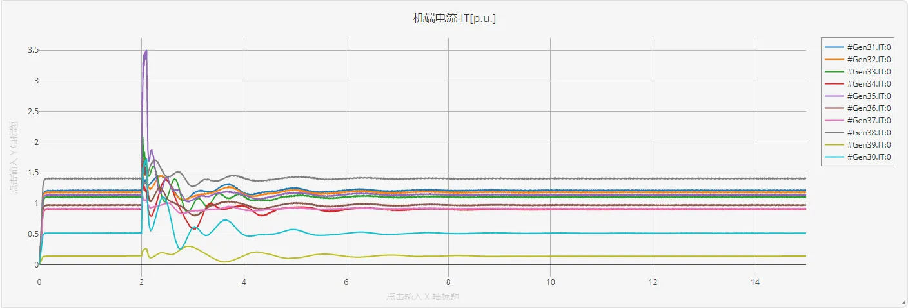

## 描述
在CloudPSS移频电磁暂态平台中的IEEE39节点算例与电磁暂态平台中基本一致，详见[IEEE标准系统](../../EMTP/IEEE39.md)。

对于移频电磁暂态仿真的基本原理，请参照[移频电磁暂态仿真介绍](../../../features/SFEMT/SFAIntro/index.md)页面。

这里仅展示某次仿真的结果。

## 仿真

作为演示，这里选择从零启动（即S2M启动）方式，在`运行`标签页下配置`移频电磁暂态仿真方案`，对本系统，设置`移频频率`为60Hz（与该系统工频一致）。

在仿真方案配置页面，可配置输出窗口，这里选择输出所有10台发电机的功角、转速、端电压标幺值、端电流标幺值，以及37号母线所连电机的三相瞬时电流曲线（包括移频复包络的模、实部、虚部，以及实际值曲线）。

点击`启动任务`或按下[[ctrl]]+[[R]]开始仿真。

下面展示某次仿真的运行结果，仿真步长为1ms，注意在2s-2.1s间，16号母线处发生了三相接地短路故障。

所有电机的功角波形如图所示：

所有电机的转速波形如图所示：

所有电机的端电压标幺值仿真结果如图所示：

所有电机的端电流标幺值仿真结果如图所示：

以37号节点为例，在故障前后处机端A相电压波形的仿真结果为（图中同时展示了解析包络信号的实部、虚部、模和原信号）：

