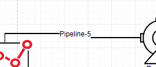

## 基本描述

> **管道元件是供热系统中输送热媒的主要设备，实现了系统中其它元件间的相互连接。**

## 参数列表
### 供水管道参数设置
| 参数名 | 单位 |备注 | 类型 | 描述 |
| :--- | :--- | :--- | :--: | :--- |
| 管道内径 | mm | Pipe Inter Diameter | 实数（常量） | 供水管道的内径大小 |
| 管道壁厚 | mm | Pipe Thickness | 实数（常量） | 供水管道的壁厚大小 |
| 管壁粗糙度 | mm | Pipe Roughness | 实数（常量） | 供水管道的管壁绝对粗糙度大小 |
| 管道周围温度 | ℃ | Environment Temperature| 实数（常量） | 供水管道周围的环境温度大小 |
| 管道总传热系数 | W/(m²·℃) | Total Heat Transfer Coefficient| 实数（常量） | 供水管道与环境间总传热系数的大小 |

### 回水管道参数设置
| 参数名 | 单位 |备注 | 类型 | 描述 |
| :--- | :--- | :--- | :--: | :--- |
| 从供水管道镜像 |  | Copy Supply Pipeline | 按钮 | 将供水管道的设备参数复制给回水管道 |
| 管道内径 | mm | Pipe Inter Diameter | 实数（常量） | 回水管道的内径大小 |
| 管道壁厚 | mm | Pipe Thickness | 实数（常量） | 回水管道的壁厚大小 |
| 管壁粗糙度 | mm | Pipe Roughness | 实数（常量） | 回水管道的管壁绝对粗糙度大小 |
| 管道周围温度 | ℃ | Environment Temperature| 实数（常量） | 回水管道周围的环境温度大小 |
| 管道总传热系数 | W/(m²·℃) | Total Heat Transfer Coefficient| 实数（常量） | 回水管道与环境间总传热系数的大小 |

### 管道剖面参数设置
| 参数名 | 单位 |备注 | 类型 | 描述 |
| :--- | :--- | :--- | :--: | :--- |
| 管道剖面设置 | m,m | Pipe Profile | 表格 | 设置管道的长度及高程数据 |

## 端口列表

| 端口名 | 数据维数 | 描述 |
| :--- | :--:  | :--- |
|  | 1×1 |  |                   
|  | 1×1 |  |                   

## 使用说明

> 目前默认供水管道和回水管道用相同的连线进行表示，即拥有同样的连接关系。

## 测试模型
[<test name>](<test link>)显示了管道的典型应用。

## 相关元件

