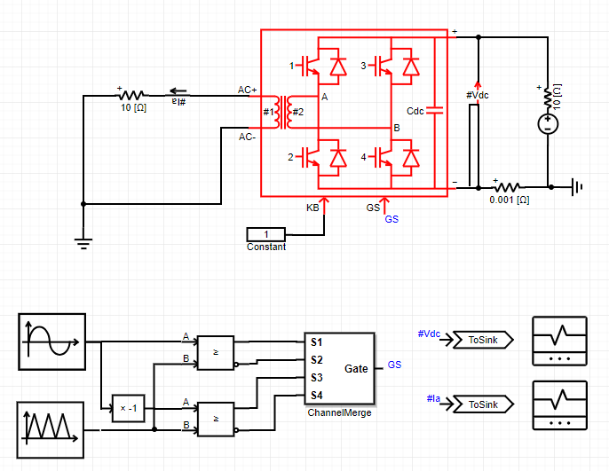

## 基本描述


> **该元件为带变压器单相H桥电路模块的快速化仿真模型，其与详细电磁暂态模型的精度相当。该元件可用于构建整流/逆变器拓扑，适用于大规模微电网仿真。**

## 参数列表
### Configuration
| 参数名 | 单位 | 备注 | 类型 | 描述 |
| :--- | :--- | :--- | :--: | :--- |
| Name |  | 元件名称 | 文本 |  |
| IGBT On Resistance | Ω | IGBT导通电阻 | 实数（常量） | IGBT导通电阻 |
| IGBT Off Resistance | Ω | IGBT关断电阻 | 实数（常量） | IGBT关断电阻 |
| Diode On Resistance | Ω | 二极管导通电阻 | 实数（常量） | 二极管导通电阻 |
| Diode Off Resistance | Ω | 二极管关断电阻 | 实数（常量） | 二极管关断电阻 |
| DC Side Capacitance | F | 直流侧电容值 | 实数（常量） | 直流侧电容值 |
| Initial Capacitor Voltage | kV | 初始电容电压 | 实数（常量） | 初始电容电压 |

### Transformer
| 参数名 | 单位 | 备注 | 类型 | 描述 |
| :--- | :--- | :--- | :--: | :--- |
| Rated Power | MVA | 额定容量 | 实数（常量） | 变压器每侧绕组的额定容量$S_N$（所填变压器参数的功率基值） |
| Winding #1 Rated Voltage (RMS) | kV | 绕组#1额定电压有效值 | 实数（常量） | 绕组1额定电压有效值$V_{1N}$（所填变压器参数的电压基值） |
| Winding #2 Rated Voltage (RMS) | kV | 绕组#2额定电压有效值 | 实数（常量） | 绕组2额定电压有效值$V_{2N}$（所填变压器参数的电压基值） |
| Base Operation Frequency | Hz | 额定频率 | 实数（常量） | 变压器的额定频率$f_n$ |
| Leakage Reactance | p.u. | 漏电抗 | 实数（常量） | 变压器的等值漏电抗$X_T$，可由变压器短路实验或变压器铭牌得出 |
| No Load Losses | p.u. | 空载损耗 | 实数（常量） | 变压器的空载损耗$P_0$，可由变压器空载实验或变压器铭牌得出 |
| Copper Losses | p.u. | 铜耗 | 实数（常量） | 变压器的铜耗$P_Cu$，可由变压器短路实验或变压器铭牌得出 |

### Monitoring
| 参数名 | 备注 | 类型 | 描述 |
| :--- | :--- | :--: | :--- |
| IGBT Voltage Vector \[kV\] | IGBT电压向量(4*1) | 文本 | 此处输入IBGT的电压向量量测信号的标签，以#号开头，如#Vt，其维数为4\*1 |
| IGBT Current Vector \[kA\] | IGBT电流向量(4*1) | 文本 | 此处输I入BGT的电流向量量测信号的标签，以#号开头，如#It，其维数为4\*1 |
| Diode Current Vector \[kA\] | 二极管电流向量(4*1) | 文本 | 此处输入二极管的电流向量量测信号的标签，以#号开头，如#Id，其维数为4\*1 |
| Voltage Between Port A and B \[kV\] | AB两点间的电压 | 文本 | 此处输入H桥AB端口电压量测信号的标签，以#号开头，如#Id，其维数为4\*1 |
| Winding #1 Current \[kA\] | 绕组1电流 | 文本 | 此处输入变压器绕组#1电流量测信号的标签，以#号开头，如#Ip |
| Winding #2 Current \[kA\] | 绕组2电流 | 文本 | 此处输入变压器绕组#2电流量测信号的标签，以#号开头，如#Is |

## 端口列表

| 端口名 | 数据维数 | 描述 |
| :--- | :--:  | :--- |
| AC + | 1×1 |交流侧接线端口的正端 |
| AC - | 1×1 |交流侧接线端口的负端 |
| DC + | 1×1 |直流侧接线端口的正端 |
| DC - | 1×1 |直流侧接线端口的负端 |
| GS | 4×1 |开关输入信号，按照开关1~4号依次排列 |
| KB | 1×1 |模块闭锁信号输入端，输入0则闭锁全部开关信号，输入非零则不闭锁 |

## 使用说明
下图示出了H桥变压器模块的单元测试算例，算例详见[Test_HTBridge](https://www.cloudpss.net/editor/?id=1185)。

该电路为工频逆变拓扑。开关S1\~S4的脉冲信号分别由正弦脉宽调制逻辑实现，开关频率为5KHz。脉宽调制器产生的4路PWM信号，经过**ChannelMerge**元件合成为一个4\*1维的输出信号，送至H桥模块的GS端。变压器按照系统理论功率及电压等级进行配置。由于变压器漏感的滤波作用，交流负载电流为准正弦波，直流电压为100Hz脉动直流。

## 相关元件
[背靠背H桥模块](/components/comp_BacktoBackModule.html)
[H桥模块](/components/comp_HBridgeModule.html)
[三相H桥模块](/components/comp_ThreePhaseHBridgeModule.html)
[H桥电感模块](/components/comp_HBridgeWithInductanceModule.html)
[半桥模块](/components/comp_HalfBridgeModule.html)
