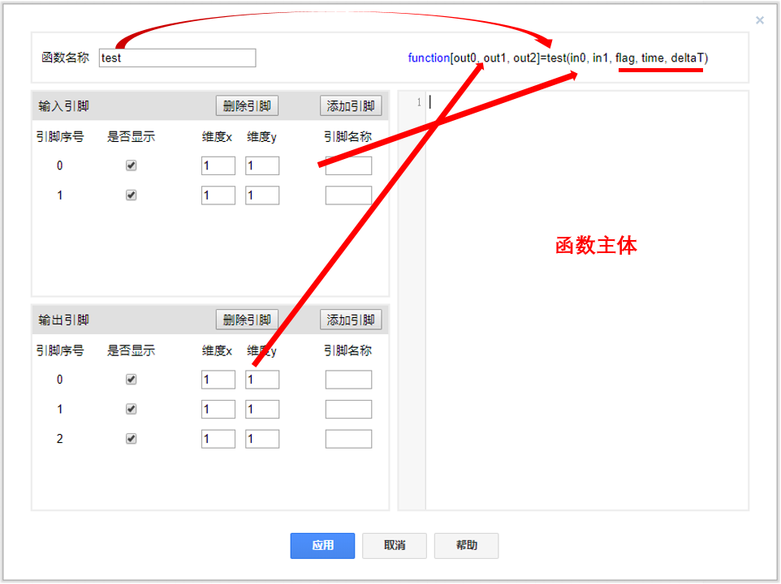

## 基本描述


> **OctaveCode是与MATLAB语法(M语言)兼容的科学计算及数值分析工具，用户可利用该元件实现MATLAB程序移植或实现复杂控制、计算、逻辑算法。**

## 使用说明

拖拽OctaveCode元件至工作空间，双击可弹出配置界面。该界面用户可操作的部分有：函数名称、输入引脚、输出引脚以及函数主体。

+ 在进行仿真编译时，后台处理OctaveCode元件将直接调用其对应函数名的函数(系统默认函数名为test)。因此不同功能OctaveCode元件的函数名称不能相同。
+ 输入/出引脚可以为任意维数，其引脚名称即为输入/输出变量名称，不填即默认为out0，ou1...或in0，in1...。
+ OctaveCode元件会根据用户配置，自动生成函数声明。例如配置输入引脚数为2，输出引脚数数为3，即可生成上图中的`function[out0, out1, out2]=test(in0, in1, flag, time, deltaT)`。其中out0，out1，out2为输出引脚对应的变量(默认)，in0, in1为输入引脚对应的变量(默认)，time为仿真进行时间，deltaT为仿真步长。函数声明内的变量可直接在函数主体中进行调用。输入引脚对应变量在调用时可采用`a=in0;`、`a=in0(1,1);`、`a=in0(1);`等表达式。输出引脚对应变量在调用时可采用`out0=a;`、`out0(1)=a;`、`out0(1,1)=a;`等表达式。注意变量调用时的维数应当与定义维数保持一致。
+ 函数主体的语法参照M语言。