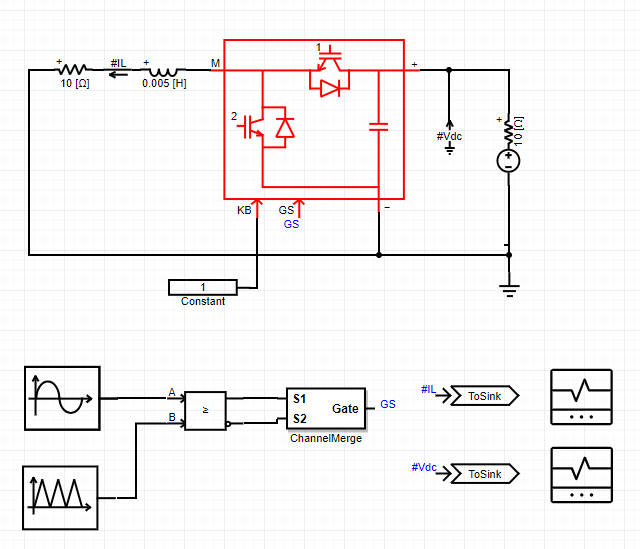

## 基本描述


> **该元件为半桥电路模块(双向DC/DC)的快速化仿真模型，其与详细电磁暂态模型的精度相当。通过对S1或S2的开关信号置零，可将其配置为BOOST或BUCK电路。**

## 参数列表
### Configuration
| 参数名 | 单位 | 备注 | 类型 | 描述 |
| :--- | :--- | :--- | :--: | :--- |
| Name |  | 元件名称 | 文本 |  |
| IGBT On Resistance | Ω | IGBT导通电阻 | 实数（常量） | IGBT导通电阻 |
| IGBT Off Resistance | Ω | IGBT关断电阻 | 实数（常量） | IGBT关断电阻 |
| Diode On Resistance | Ω | 二极管导通电阻 | 实数（常量） | 二极管导通电阻 |
| Diode Off Resistance | Ω | 二极管关断电阻 | 实数（常量） | 二极管关断电阻 |
| DC Side Capacitance | F | 直流侧电容值 | 实数（常量） | 直流侧电容值 |
| Initial Capacitor Voltage | kV | 初始电容电压 | 实数（常量） | 初始电容电压 |

### Monitoring
| 参数名 | 备注 | 类型 | 描述 |
| :--- | :--- | :--: | :--- |
| IGBT Voltage Vector \[kV\] | IGBT电压向量(2*1) | 文本 | 此处输入IBGT的电压向量量测信号的标签，以#号开头，如#Vt，其维数为2\*1 |
| IGBT Current Vector \[kA\] | IGBT电流向量(2*1) | 文本 | 此处输I入BGT的电流向量量测信号的标签，以#号开头，如#It，其维数为2\*1 |
| Diode Current Vector \[kA\] | 二极管电流向量(2*1) | 文本 | 此处输入二极管的电流向量量测信号的标签，以#号开头，如#Id，其维数为2\*1 |

## 端口列表

| 端口名 | 数据维数 | 描述 |
| :--- | :--:  | :--- |
| M | 1×1 | 模块的桥臂中点接线端 |
| DC- | 1×1 | 直流电容的负接线端 |
| DC+ | 1×1 | 直流电容的正接线端 |
| GS | 2×1 | 开关输入信号，按照开关1~2号依次排列 |
| KB | 1×1 | 模块闭锁信号输入端，输入0则闭锁全部开关信号，输入非零则不闭锁 |

## 使用说明
下图示出了半桥模块的单元测试算例，算例详见[Test_HalfBridge](https://www.cloudpss.net/editor/?id=1188)。

该算例从电源侧往输出RL负载看，为一个双向DC/DC电路(降压)。开关信号由50Hz正弦波与三角载波比较产生，经过**ChannelMerge**元件合成为一个2\*1维的输出信号，送至半桥模块的GS端。。由于PWM占空比信号按照正弦分布，因此负载电阻R上的电压为50Hz准正弦变化的直流。

## 相关元件
[背靠背H桥模块](comp_BacktoBackModule.html)
[H桥模块](comp_HBridgeModule.html)
[三相H桥模块](comp_ThreePhaseHBridgeModule.html)
[H桥电感模块](comp_HBridgeWithInductanceModule.html)
[H桥变压器模块](comp_HBridgeWithTransformerModule.html)
