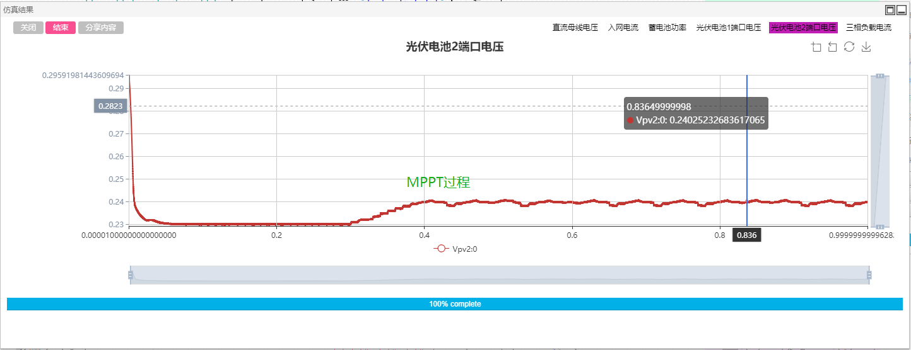

## Description
The DC Microgrid has been a promising solution for interfacing the solar/wind renewable energy source based distributed generation systems, energy storage systems, eletric vehicles and other DC loads, with less energy conversion efficiency, economy and reliability.This example case provides a simulation of a DC microgrid including an AC grid, solid-state transformer, photovoltaic inverter, energy storage converter, and three-phase AC load to simulate a smart building power system.

The switching modules (solid-state transformer, three-phase H-bridge converter, and half-bridge converter) in this example case use a fast switch search modeling method. Compared with the traditional switching algorithm based on interpolation iteration, this method greatly improves the simulation efficiency while retaining high accuracy. It is especially suitable for source converter to simulation analyze in the microgrids, modular multilevel converters, solid-state transformers, etc. 

## Model Introduction
The DC microgrid example case includes a 10-module solid-state transformer (120 IGBTs/diodes in total), an energy storage system (lead battery with half-bridge converter), and two photovoltaic systems (photovoltaic cells with half-bridge converter) ) And a three-phase inverter with a resistive load, each converter system corresponds to their own control system. The solid-state transformer adopts the DC bus voltage outer loop, the grid-connected current inner loop, and the capacitor voltage ratio closed-loop control. The energy storage system adopts power outer loop and output current inner loop control. The photovoltaic system uses the voltage control and the MPPT control, also, the MPPT control adopts the fixed-step perturbation observation method. The three-phase inverter uses off-grid VF control.

## Simulation
Click the `Global Parameters` column on the right side of the workspace to set the MPPT start time of the two sets of photovoltaic systems \$StartMPPT1\_time, \$StartMPPT2\_time; the time for the reference change of the energy storage system \$PrefChange\_time and three Load change time \$LoadChange\_time. It is worth noting that the load change is achieved by the fault resistor.

Click `Format Panel`->`Electromagnetic Transient`->`Simulation Control`->`Start` and select the corresponding calculation node to get the simulation result.

It can be found that when the load (PV, battery, three-phase load) changes, the DC bus is kept basically constant.

The current of AC side has a good sine waveform. When the load changes, the current follows the change and the response speed is fast.

The battery power changes according to a given reference, and the response speed is fast.

MPPT stabilizes the output power of photovoltaic cells at the maximum power point by disturbing the input voltage.

The change of load resistance causes the load current to change accordingly. It can be seen that the response speed of the current loop is fast and has a good sine waveform.
