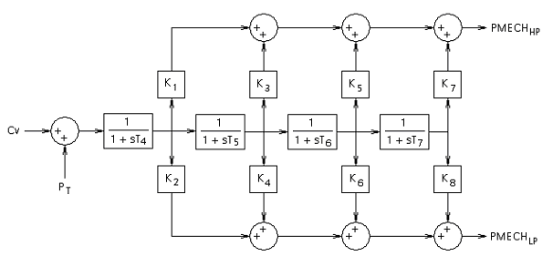
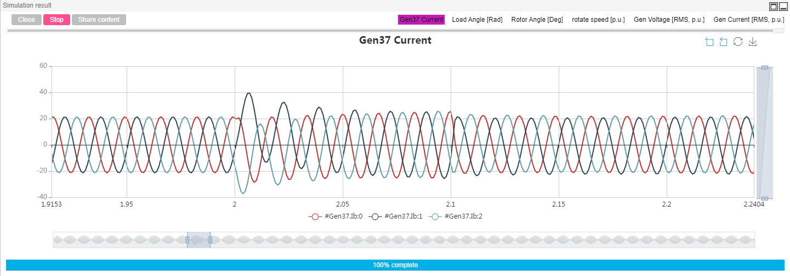

## Description
The IEEE 39-bus standard system is a power network in the New England area of the United States. The system consists of 10 generators, 39 busbars and 12 transformers.

In CloudPSS, a complete 39-bus system electromagnetic transient simulation example with power flow interface startup is provided. The power flow interface can be directly used to startup the system. All models do not go through the startup transition process and directly enter the steady state. This example can be used for traditional transient stability analysis, excitation, speed controller design, system frequency modulation and other characteristic analysis.

## Model Introduction

### Model Topology

The topology diagram of the IEEE 39-bus system is as follows, where bus 39 is a slack bus. Except for the slack bus, the buses (30-38) connected to each motor have a voltage level of 20kV, and the bus is 25kV, and all other buses voltages are 500kV.

In the Cloudpss, the example case is built using a single-line diagram with the following topology.

### Model Parameter

All motor parameters, transmission line parameters, transformer parameters are from reference^[Luc Gérin-Lajoie. IEEE PES Task Force on Benchmark Systems for Stability Controls[R]. EMTP-RV 39-bus system, Version 1.5 - Mars 04, 2015]。

#### Generator parameter

The original per-unit values of the generator parameters are as follows:

| UnitNo. | RatedPower | H | Ra | x'd | x'q | xd | xq | T'do | T'qo | xl |
| :--- | :--- | :--- | :--- | :--- | :--- | :--- | :--- | :--- | :--- | :--- |
| 1  | 10000  | 5.000  | 0.000 | 0.600  | 0.800  | 2.000  | 1.900  | 7.000  | 0.700  | 0.300  |
| 2  | 1000  | 3.030  | 0.000  | 0.697  | 1.700  | 2.950  | 2.820  | 6.560  | 1.500  | 0.350  |
| 3  | 1000  | 3.580  | 0.000  | 0.531  | 0.876  | 2.495  | 2.370  | 5.700  | 1.500  | 0.304  |
| 4  | 1000  | 2.860  | 0.000  | 0.436  | 1.660  | 2.620  | 2.580  | 5.690  | 1.500  | 0.295  |
| 5  | 600   | 4.333  | 0.000  | 0.792  | 0.996  | 4.020  | 3.720  | 5.400  | 0.440  | 0.324  |
| 6  | 1000  | 3.480  | 0.000  | 0.500  | 0.814  | 2.540  | 2.410  | 7.300  | 0.400  | 0.224  |
| 7  | 1000  | 2.640  | 0.000  | 0.490  | 1.860  | 2.950  | 2.920  | 5.660  | 1.500  | 0.322  |
| 8  | 1000  | 2.430  | 0.000  | 0.570  | 0.911  | 2.900  | 2.800  | 6.700  | 0.410  | 0.280  |
| 9  | 1000  | 3.450  | 0.000  | 0.570  | 0.587  | 2.106  | 2.050  | 4.790  | 1.960  | 0.298  |
| 10 | 1000  | 4.200  | 0.000  | 0.310  | 0.080  | 1.000  | 0.690  | 10.200  | 0.000  | 0.125  |

After the conversion (see 2.2.1 for the conversion method), the actual generator parameters are as follows:

| Bus No. | Rs | Xls | Xd | Xq | Rfd | Rkd | Rkq | Xlfd | Xlkd | Xlkq |
| :--- | :--- | :--- | :--- | :--- | :--- | :--- | :--- | :--- | :--- | :--- |
| 39 | 0.0002 | 0.3 | 2 | 1.9 | 0.00078  | 0.08842  | 0.07805  | 0.36429  | 0.30000  | 0.16552  |
| 31 | 0.0002 | 0.35 | 2.95 | 2.82 | 0.00121  | 0.08680  | 0.11626  | 0.40044  | 0.26421  | 0.15970  |
| 32 | 0.0002 | 0.304 | 2.495 | 2.37 | 0.00114  | 0.08339  | 0.09828  | 0.25324  | 0.40916  | 0.15710  |
| 33 | 0.0002 | 0.295 | 2.62 | 2.58 | 0.00115  | 0.22949  | 0.10351  | 0.15010  | 0.09017  | 0.05636  |
| 34 | 0.0002 | 0.324 | 4.02 | 3.72 | 0.00208  | 0.03440  | 0.17167  | 0.53585  | 1.07442  | 0.48710  |
| 35 | 0.0002 | 0.224 | 2.54 | 2.41 | 0.00096  | 0.06964  | 0.10510  | 0.31334  | 0.48576  | 0.19141  |
| 36 | 0.0002 | 0.322 | 2.95 | 2.92 | 0.00132  | 0.16917  | 0.11841  | 0.17947  | 0.14560  | 0.08041  |
| 37 | 0.0002 | 0.28 | 2.9 | 2.8 | 0.00117  | 0.07570  | 0.11947  | 0.32609  | 0.41083  | 0.18230  |
| 38 | 0.0002 | 0.298 | 2.106 | 2.05 | 0.00118  | 0.08605  | 0.08481  | 0.32017  | 0.34453  | 0.16644 |
| 30 | 0.0002 | 0.125 | 1 | 0.69 | 0.00029  | 0.09301  | 0.03207  | 0.23460  | 0.38542  | 0.16051  |

#### Transmission line parameter

The original parameters of the transmission line are as follows. Among them, the per-unit value parameter is the line full-length parameter (the parameter used in the power flow calculation), and the named value parameter is the unit length parameter (according to the per-unit value parameter and the base capacity, voltage, and line length). In the 39-bus standard system provided by CloudPSS, line parameters are entered using per-unit values.

The per-unit value of the line parameters of the following base values is selected: the voltage base value is 500 kV, and the power base value is 100 MW.

| | | R1(pu)  | X1(pu)  | B1(pu)  | km  | R1(ohm/km)  | X1(ohm/km)  | B1(uS/km)  | R0(ohm/km)  | X0(ohm/km)  | B0(uS/km) |
| :--- | :--- | :--- | :--- | :--- | :--- | :--- | :--- | :--- | :--- | :--- | :--- |
| 1   | 2   | 0.0035  | 0.0411  | 0.6987  | 275.5  | 0.032  | 0.373  | 1.015  | 0.318  | 1.119  | 0.609  |
| 1  | 39  | 0.001  | 0.025  | 0.75  | 167.6  | 0.015  | 0.373  | 1.790  | 0.149  | 1.119  | 1.074  |
| 2  | 3  | 0.0013  | 0.0151  | 0.2572  | 101.2  | 0.032  | 0.373  | 1.017  | 0.321  | 1.119  | 0.610  |
| 2  | 25  | 0.007  | 0.0086  | 0.146  | 57.6  | 0.304  | 0.373  | 1.013  | 3.036  | 1.119  | 0.608  |
| 3  | 4  | 0.0013  | 0.0213  | 0.2214  | 142.8  | 0.023  | 0.373  | 0.620  | 0.228  | 1.119  | 0.372  |
| 3  | 18  | 0.0011  | 0.0133  | 0.2138  | 89.1  | 0.031  | 0.373  | 0.959  | 0.308  | 1.119  | 0.576  |
| 4  | 5  | 0.0008  | 0.0128  | 0.1342  | 85.8  | 0.023  | 0.373  | 0.626  | 0.233  | 1.119  | 0.375  |
| 4  | 14  | 0.0008  | 0.0129  | 0.1382  | 86.5  | 0.023  | 0.373  | 0.639  | 0.231  | 1.119  | 0.384  |
| 5  | 6  | 0.0002  | 0.0026  | 0.0434  | 17.4  | 0.029  | 0.373  | 0.996  | 0.287  | 1.119  | 0.598  |
| 5  | 8  | 0.0008  | 0.0112  | 0.1476  | 75.1  | 0.027  | 0.373  | 0.786  | 0.266  | 1.119  | 0.472  |
| 6  | 7  | 0.0006  | 0.0092  | 0.113  | 61.7  | 0.024  | 0.373  | 0.733  | 0.243  | 1.119  | 0.440  |
| 6  | 11  | 0.0007  | 0.0082  | 0.1389  | 55.0  | 0.032  | 0.373  | 1.011  | 0.318  | 1.119  | 0.607  |
| 7  | 8  | 0.0004  | 0.0046  | 0.078  | 30.8  | 0.032  | 0.373  | 1.012  | 0.324  | 1.119  | 0.607  |
| 8  | 9  | 0.0023  | 0.0363  | 0.3804  | 243.3  | 0.024  | 0.373  | 0.625  | 0.236  | 1.119  | 0.375  |
| 9  | 39  | 0.001  | 0.025  | 1.2  | 167.6  | 0.015  | 0.373  | 2.865  | 0.149  | 1.119  | 1.719  |
| 10  | 11  | 0.0004  | 0.0043  | 0.0729  | 28.8  | 0.035  | 0.373  | 1.012  | 0.347  | 1.119  | 0.607  |
| 10  | 13  | 0.0004  | 0.0043  | 0.0729  | 28.8  | 0.035  | 0.373  | 1.012  | 0.347  | 1.119  | 0.607  |
| 13  | 14  | 0.0009  | 0.0101  | 0.1723  | 67.7  | 0.033  | 0.373  | 1.018  | 0.332  | 1.119  | 0.611  |
| 14  | 15  | 0.0018  | 0.0217  | 0.366  | 145.4  | 0.031  | 0.373  | 1.007  | 0.309  | 1.119  | 0.604  |
| 15  | 16  | 0.0009  | 0.0094  | 0.171  | 63.0  | 0.036  | 0.373  | 1.086  | 0.357  | 1.119  | 0.651  |
| 16  | 17  | 0.0007  | 0.0089  | 0.1342  | 59.7  | 0.029   | 0.373  | 0.9	  | 0.293  | 1.119  | 0.54  |
| 16  | 19  | 0.0016  | 0.0195  | 0.304   | 130.7  | 0.031  | 0.373  | 0.93	  | 0.306  | 1.119  | 0.558 |
| 16  | 21  | 0.0008  | 0.0135  | 0.2548  | 90.5  | 0.022  | 0.373  | 1.126	  | 0.221  | 1.119  | 0.676 |
| 16  | 24  | 0.0003  | 0.0059  | 0.068	  | 39.5  | 0.019  | 0.373  | 0.688	  | 0.19  | 1.119  | 0.413  |
| 17  | 18  | 0.0007  | 0.0082  | 0.1319  | 55    | 0.032  | 0.373  | 0.96	  | 0.318  | 1.119  | 0.576 |
| 17  | 27  | 0.0013  | 0.0173  | 0.3216  | 116	   | 0.028  | 0.373  | 1.109  | 0.28  | 1.119  | 0.666  |
| 21  | 22  | 0.0008  | 0.014   | 0.2565  | 93.8  | 0.021  | 0.373  | 1.093	  | 0.213  | 1.119  | 0.656 |
| 22  | 23  | 0.0006  | 0.0096  | 0.1846  | 64.3  | 0.023  | 0.373  | 1.148	  | 0.233  | 1.119  | 0.689 |
| 23  | 24  | 0.0022  | 0.035   | 0.361	  | 234.6  | 0.023  | 0.373  | 0.616  | 0.234  | 1.119  | 0.369 |
| 25  | 26  | 0.0032  | 0.0323  | 0.513	  | 216.5  | 0.037  | 0.373  | 0.948  | 0.37  | 1.119  | 0.569  |
| 26  | 27  | 0.0014  | 0.0147  | 0.2396  | 98.5  | 0.036  | 0.373  | 0.973	  | 0.355  | 1.119  | 0.584 |
| 26  | 28  | 0.0043  | 0.0474  | 0.7802  | 317.7  | 0.034  | 0.373  | 0.982  | 0.338  | 1.119  | 0.589 |
| 26  | 29  | 0.0057  | 0.0625  | 1.029	  | 418.9  | 0.034  | 0.373  | 0.983  | 0.34  | 1.119  | 0.59   |
| 28  | 29  | 0.0014  | 0.0151  | 0.249   | 101.2  | 0.035  | 0.373  | 0.984  | 0.346  | 1.119  | 0.59  |

#### Transformer parameter

|   |    | Rated power (MVA) | Primary voltage（kV） | Secondary voltage（kV） | R | X |
| :--- | :--- | :--- | :--- | :--- | :--- | :--- |
| 11  | 12  | 100 | 500 | 25 | 0.0016 | 0.0435 |
| 13  | 12  | 100 | 500 | 25 | 0.0016 | 0.0435 |
| 6  | 31  | 100 | 500 | 20 | 0 | 0.025 |
| 10  | 32  | 100 | 500 | 20 | 0 | 0.02 |
| 19  | 33  | 100 | 500 | 20 | 0.0007 | 0.0142 |
| 20  | 34  | 100 | 500 | 20 | 0.0009 | 0.018 |
| 22  | 35  | 100 | 500 | 20 | 0 | 0.0143 |
| 23  | 36  | 100 | 500 | 20 | 0.0005 | 0.0272 |
| 25  | 37  | 100 | 500 | 20 | 0.0006 | 0.0232 |
| 2  | 30  | 100 | 500 | 20 | 0 | 0.0181 |
| 29  | 38  | 100 | 500 | 20 | 0.0008 | 0.0156 |
| 19  | 20  | 100 | 500 | 500 | 0.0007 | 0.0138 |

#### Load parameter

| Bus No. | P (MW) | Q (MVar)|
| :--- | :--- | :--- |
| 1 | 97.6 | 44.2|
| 3 | 322 | 2.4|
| 4 | 500 | 184|
| 7 | 233.8 | 84|
| 8 | 522 | 176|
| 12 | 8.5 | 88|
| 15 | 320 | 153|
| 16 | 329 | 32.3|
| 18 | 158 | 30|
| 20 | 680 | 103|
| 21 | 274 | 115|
| 23 | 247.5 | 84.6|
| 24 | 308.6 | -92.2|
| 25 | 224 | 47.2|
| 26 | 139 | 17|
| 27 | 281 | 75.5|
| 28 | 206 | 27.6|
| 29 | 283.5 | 26.9|
| 31 | 9.2 | 4.6|
| 39 | 1104 | 250|

#### Excitation regulator parameter

In this example case, the IEEE standard EXST1(PTI) type excitation regulator is used. See the reference^[IEEE Std 421.5™-2005. IEEE Recommended Practice for Excitation System Models for Power System Stability Studies. New York, IEEE, 2005] for specific information. The module simulation diagram built in CloudPSS is as follows:

 
Among the various pins, Vref, Vs, VT, IT, Ef0, and S2M are input pins, among which:
+ The Ef0 pin should be connected to the motor internal measurement #Ef0, which is the initial value of Ef.
+ The Ef output pin is connected to the Ef port of the motor.
+ The If input pin is connected to the If output port of the motor.
+ Vs is connected to the output port of the PSS, and a constant 0 can be entered without PSS.
+ Vref (reference voltage) is obtained by sampling and holding the reference voltage initial value Vref0, and may be directly set to 1.
+ VT, IT is the per-unit value of the voltage and current of the motor.
+ S2M is the `Source to Machine Singal`. 

The parameters are set as follows:
||||||||
| :----: | :----: | :----: | :----: | :----: | :----: | :----: |
| **RC** | **Xc** | **TR** | **TC** | **TB** | **KF** | **TF** |
| 0 | 0 | 0.01 | 1 | 10 | 0 | 1 |
| **KA** | **TA** | **VRMAX** | **VRMIN** | **KC** | **VIMAX** | **VIMIN** |
| 200 | 0.015 | 5 | -5 | 0 | 0.1 | -0.1 |

The parameters introductions are as follows:
+ TA, TB, TC：Voltage regulator time constants [s]
+ VRMAX, VRMIN：Maximum and minimum regulator output limits [p.u.]
+ TF：Excitation control system stabilizer time constant [s] 
+ KF：Excitation control system stabilizer gain [p.u.]

#### Speed regulator and Prime mover parameter

In this example case, the IEEE standard STEAM_GOV_1 type speed regulator and STEAM_TUR_1 type prime mover are used. The STEAM_GOV_1 type speed regulator module simulation diagram built in CloudPSS is as follows:

The parameters are set as follows:
|||||||||
| :----: | :----: | :----: | :----: | :----: | :----: | :----: | :----: |
| **DB** | **Kg** | **TSR** | **TSM** | **P_up** | **P_donw** | **Cmax** | **Cmin** |
| 0 | 20 | 0 | 0.075 | 0.6786 | -1 | 0.9 | 0 |

The STEAM_TUR_1 type prime mover module simulation diagram built in CloudPSS is as follows:

The parameters are set as follows:
|||||||
| :----: | :----: | :----: | :----: | :----: | :----: |
| **K1** | **K2** | **K3** | **K4** | **K5** | **K6** |
| 0.2 | 0.4 | 0.4 | 0 | 0 | 0 |
| **K6** | **K8** | **T4** | **T5** | **T6** | **T7** |
| 0 | 0 | 0.3 | 10 | 0.6 | 0 |

## Simulation

In the CloudPSS, the startup of the electrical system in the electromagnetic transient simulation can be roughly divided into two types: starting from zero and starting directly from the power flow snapshot.

Starting from zero is the process from the state where the voltage and current are equal to 0 to the steady state. For synchronous motors, this type of start-up includes flat start, terminal voltage ramp start, excitation voltage ramp start, and voltage source to meachine. In these modes, the simulation does not require a pre-start process, and the simulation can be started directly from t=0.

Starting directly from the power flow snapshot method utilizes the flow flow data to start directly from steady state. There are several requirements for this type of startup:

+ The ports of all device components **must** be connected directly to the bus (or connected to the bus via a splitter).
+ The starting parameters of the motor and bus need to be consistent with the power flow results, otherwise the simulation cannot achieve stability or even error.
+ The pre-start function needs to be enabled, and it can be checked in the `Electromagnetic Transient->Start Parameter->Whether to start the pre-start process`. For a 60 Hz system, the voltage ramp time is 0.05 s; for a 50 Hz system, the ramp time is 0.06 s. The maximum startup time is the maximum time for pre-start, generally taking a number greater than 0.5s.

As a demonstration, here we choose to start from zero (that is, S2M startup), click `Simulation Control->Start` and select the computation node to get the transient results.

The following shows the results of the simulation results. Note that between 2s and 2.1s, a three-phase ground fault occurred at the bus 16.

The power angle waveforms of all motors are shown in the figure:

The speed waveforms of all motors are shown in the figure:

The voltage per-unit value of all motors are shown in the figure:

The instantaneous power waveform of all motors are shown in the figure:

Taking bus 37 as an example, the simulation results of the voltage waveform before and after the fault are:

