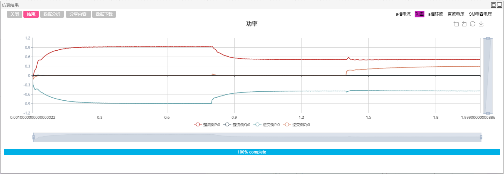
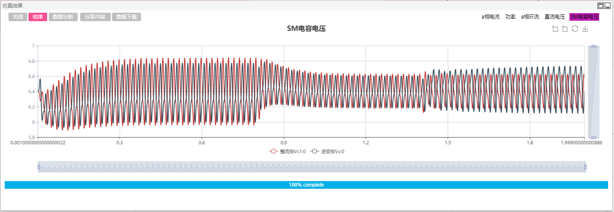

## Description
The Modular Multilevel Converter (MMC) is a new type of voltage source converter that superimposes output high voltage by cascading multiple submodules. With low output harmonics and high modularity, it has broad application prospects in power systems. 

This example is simplified by the two-terminal MMC-HVDC test system provided by the International Large Grid Organization MMC Working Group. The default is the 77-level 640kV two-terminal MMC-HVDC system. Users can modify the level (10-101) and system voltage and power parameters as needed. In order to ensure the simulation speed, the half-bridge sub-module (SM) in this model adopts the fast simulation model of the Thevenin equivalent, which has the same accuracy as the detailed electromagnetic transient simulation model, but the calculation efficiency is greatly improved.

## Model Introduction

The MMC-HVDC system is divided into two parts: the rectifier side (send terminal) and the inverter side (receiver terminal). The circuit topology and control on both sides are basically the same, with only minor differences. The control system on each side includes: standard value conversion, current and voltage measurement, current and voltage coordinate conversion, instantaneous power calculation, power control (DC voltage-reactive power control on the rectifier side, active-reactive power control on the inverter side), circulating current suppression, and modulation and ordering algorithms. The user can change the topology and operating parameters in the `Global Parameters` to achieve different simulation combinations and analysis and verification. The topology diagram is shown below.

## Simulation

Select the appropriate simulation step size according to the number of levels and the maximum switching frequency (the number of levels is below 101, and it is recommended to use 10μs or 20μs when using the nearest level modulation) to perform electromagnetic transient simulation on the MMC-HVDC system. If you want a more accurate switching process waveform, it is recommended to tick the `Switch/Discrete Event Processing Enhancement` option in the `Format Panel`->`Electromagnetic Transient`->`Solver Settings` to simulate with a smaller simulation step.

### Test1：Inverter side power control transient response

Click the `Global Parameters` column on the right side of the workspace to set the active power reference \$Pinv\_ref on the inverter side and the reactive power reference \$Qinv\_ref. The simulation defaults to \$Pinv\_ref=-0.9, \$Qinv\_ref=0. In the inverter side control, the reference value of the active/reactive power is given by two step generators. The initial output values are \$Pinv\_ref and \$Qinv\_ref. After 0.8s, the active power reference becomes -0.5. After 1.4s, the reactive power reference becomes 0.3. Click `Format Panel`->`Electromagnetic Transient`->`Simulation Control`->`Start` and select the corresponding calculation node to get the simulation result. It can be found that the active/reactive power on the inverter side, the rectifier side reactive power, and the DC voltage can be quickly adjusted to the set value when the reference changes.

### Test2：Circulation suppression comparison

Circulation suppression is one of the key aspects of MMC control. Click the global parameter bar on the right side of the workspace to set the rectifier side circulation suppression enable $CN_rec to 0, which disables the rectifier side circulation suppression. Click on the electromagnetic transient > simulation control > start, select the corresponding calculation node, you can get the simulation results. It can be found that the peak-to-peak value of the circulating current of the inverter side is much smaller than that of the rectifier side, and the circulation suppression effect is obvious.

### Test3：Different level/module number simulation

Click on the `Global Parameters` bar on the right side of the workspace to change the value of the module number $N to 76 and 100 respectively, and the corresponding output level is 77 and 101. Rerun, you can find that the module capacitor voltage values are 8.42kV (640/76), 6.4kV (640/100), and the capacitor voltage equalization effect is obvious.

