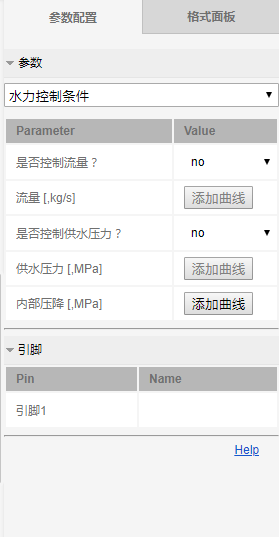
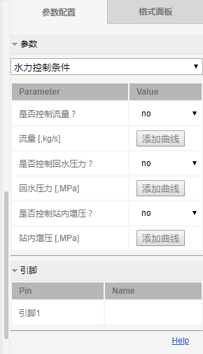
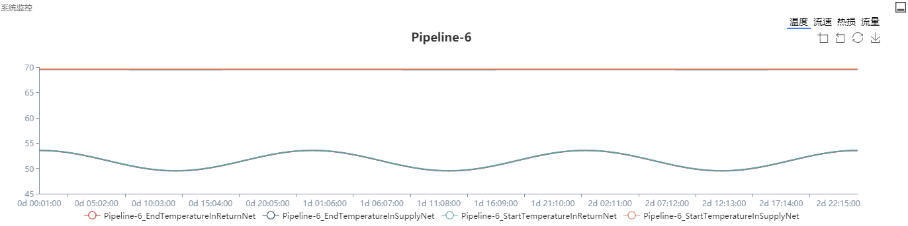

## Module Function

The regional central heating system operation simulation module was officially launched on December 25, 2018. The module was updated and expanded on the basis of the hot network power flow analysis module released on December 6, 2017, mainly for regional central heating system. Analyze its operating characteristics to help the system's operation adjustment and optimization. In this module, the user can set parameters such as network topology, meteorological conditions, equipment configuration, etc. according to actual needs. The system will calculate the steady-state operating conditions parameters of all valid objects in the heating system, and display the corresponding results in the form of charts and the like

Currently, this module supports the following functions and application scenarios:
1. Building heat load prediction
2. Indoor temperature change prediction
3. Heat source heating plan formulation

The above functions are intended to provide users with assistance in optimizing the operation scheme of the central heating system, saving energy and reducing consumption. In the future, this module will gradually add more functions to meet the diverse needs of users.

## Component Introduction

The components of this module are mainly located in the "Basic Components" module of the component panel on the left side of the page, including four components: building (load), heat source, connection point, and relay pump, and also pipeline components, which are connected by other components. It is now introduced in turn.

### Building (Load)

Building (load) component represents hot users in the regional central heating system a central heating system, such as residential buildings, schools, hospitals, etc., which can be represented by this component. The icon for the building (load) component is as follows:



The building (load) component has a total of 1 pin that can be connected to other components. The pin is located at the top of the vertical line above the icon. The pin only allows other components to connect in and not connect out.

### Heat Source

The heat source element represents a device that provides heat in the regional central heating system, such as thermal power plant, heating boiler, heat pump, and the like. The icon for the heat source component is as follows:

 

The heat source component has a total of 1 pin that can be connected to other components. The pin is located at the top of the vertical line above the icon. The pin is only allowed to connect out and no other components are allowed to connect in.

### Connection Point

The connection point component represents a device that achieves multiple heat medium convergence and shunting in the regional central heating system, such as manifolds, tee-junction, and the like. The icon for the connection point component is as follows:



The connection point component has a total of 1 pin that can be interconnected with other components. The pin is located at the center of the black circle. It should be noted that the pin should be connected to other components to ensure at least one connect in and one connect out.

### Relay Pump

The relay pump component represents a device that supplies power to the heat medium in the regional central heating system. In practice, there are many types of pumps, such as centrifugal pumps, screw pumps, and sliding-vane pumps. The icon for the relay pump component is as follows:

 

The relay pump component has two pins that can be connected to other components, namely the input pin and the output pin, and each can only be connected to at most one component. The input pin is located on the left side of the component icon. The pin can only be connected in and cannot be connected out. The output pin is located at the top of the component icon. The pin can only be connected out and cannot be connected in.

### Pipeline

The pipeline element is used for the transport of the heat medium. The pipeline component in this module is not located in the component panel, but need to be obtained by connecting other components. As shown in the figure below, a heat source is connected to a building (load) to obtain the corresponding pipeline component (pipeLine_7 in the figure). The pipeline connected in the diagram of the figure actually represents the water supply and return pipes at the same time:

Refer to the [Quick Start](../guide/index.html) for how to connect components.

## Parameter Input

### Example Template

In the new project, select the regional central heating system, and the input panel of the example template will appear, as shown in the following figure:

The options for the example template mainly include the project name, project description, number of nodes, heating duration, and heating scenario. Here we mainly introduce the number of nodes, heating duration and heating scenario.

+ Number of nodes

  The number of nodes contains two options, namely 1 heat source 3 loads system and 1 heat source 5 loads system, representing the number of the initial heat sources and buildings (loads) in the example template. The Users can also add (or delete) components based on these two studies based on their needs.

+ Heating duration
 
  The heating duration contains of three options, namely 3 days, 5 days and 7 days, which represent the running time of the simulation of the regional central heating system. Users can also increase or reduce the simulation time based on these two examples according to their needs.

+ Heating scenario

  The heating scenario contains two options, namely indoor temperature prediction and heating plan formulation. The meaning of each can be found in the example document of [the regional central heating system example case](../examples/HeatingSystem.html). In the example case, the users can also adjust the application scenario according to their needs.

### Global Parameter

In the work page of the regional central heating system, the global parameters are located in the simulation parameter panel on the right side of the page, which are mainly divided into four parts: basic settings, thermal media properties, meteorological parameters and simulation control, as shown below:

The following describes the parameters of the four parts:

+ Basic settings

  The basic settings include two options: total heating duration and simulation time step. The total heating duration is the "heating duration" in the example template. The simulation time step represents the interval between each two global steady-state simulations. The total number of steady-state simulations can be calculated by the heating duration and the simulation time step size. It is usually recommended that the number of simulations does not exceed 10,000 times. Otherwise, the webpage response will be too slow due to the large amount of data input.

+ Thermal media properties

  The thermal media properties indicate the physical properties of the hot fluid (or heat medium) in the regional central heating system, which mainly includes thermal capacity (i.e., specific heat capacity), density, and kinematic viscosity.
  
+ Meteorological parameters

  The meteorological parameters include three parameters: wind speed, outdoor temperature and solar radiation intensity. Users can click the "Add Curve" to input or modify the data. Taking the wind speed as an example, other parameters are similar. After clicking the "Add Curve", the table shown below will appear:
  
  
  
  The first column of data in the table represents the simulation time, the second column represents the value of wind speed, and the row i represents the value of the current outdoor wind speed at the corresponding time step. The number of rows in the table depends on the heating duration and the simulation time step size, and which cannot be added or deleted. In addition, users can also automatically import data by clicking "Please select folder" to upload an EXCEL file containing the corresponding number of rows and columns.
  
  Switch the option above the table to "Curve" to view the curve corresponding to the current data, as shown below. Users can also dynamically change data by dragging the scatters, but we don't recommend doing this when the amount of data is large.
  
  
  
+ Simulation control

  The simulation can be started by clicking the "Start" in the simulation control panel.

### Building (Load) Parameter

When the building (load) component is selected, the parameter panel of the building (load) component will appear on the right side of the page, including the parameter configuration and format panel. For the use of the format panel, refer to the [Quick Start快速入门](../guide/index.html). The parameter configuration has the following form:

The input parameters of the building (load) mainly include three parts: hydraulic control conditions, thermal control conditions and building attributes. The specific meaning of each part can be found in the [documentation](../components/compHeatLoad_Building.html) of the component. Some of the parameters need to add a curve, and the table form is the same as the table of the parameters such as the wind speed in the global parameters.

### Heat Source Parameter

When the heat source component is selected, the parameter panel of the heat source appears on the right side of the page, as shown below:

The input parameters of the heat source mainly include three parts:  hydraulic control conditions, thermal control conditions and building attributes. The specific meaning of each part can be found in the [documentation](../components/compHeatSource.html) of the component. Some of the parameters need to add a curve, and the table form is the same as the table of the parameters such as the wind speed in the global parameters.

### Connection Point Parameter

When the connection point component is selected, the parameter panel of the connection point appears on the right side of the page, as shown below: 

The current version of the connection point does not need to enter any parameters.

### Relay Pump Parameter

When the relay pump component is selected, the parameter panel of the relay pump will appear on the right side of the page, as shown below:

The input parameters of the relay pump mainly include two parts: device installation and parameter setting. The specific meaning of each parameter can be found in the [documentation](../components/compPump.html) of the component. Some of the parameters need to add a curve, and the table form is the same as the table of the parameters such as the wind speed in the global parameters.

### Pipeline Parameter

When the pipe component is selected, the parameter panel of the pipe will appear on the right side of the page, as shown below:

The input parameters of the pipeline mainly include three parts: water supply pipeline parameter setting, return water pipeline parameter setting, and pipeline profile parameter setting. The specific meaning of each parameter can be found in the [documentation](../components/compPipeline.html) of the component.

## Simulation

### Start Simulation

When all components parameters have been properly set, the simulation can begin. Click on any blank space in the workspace, the simulation parameter panel will be displayed on the right side of the page, and the simulation can be started by clicking the "Start" in the simulation control part.

### Simulation Information

If you want to monitor whether the simulation is running normally, you can view it in the system information bar on the lower left side of the page. The simulation information under normal operation of this module is as follows:


run ends
run start


At present, there are four kinds of abnormal alarm information in this example case, which are introduced separately below.

+ No pipeline alarm information

  When there is no pipeline in the network topology, the no pipeline alarm message will appear in the system information panel after the simulation starts, as follows: 
  
  
  There is no pipeline in network!
  
  
+ Topology multi-connected alarm information

  When the network topology is multi-connected, an alarm message will appear. The so-called multi-connection means that there are multiple connected sub-structures in the network topology. As shown in the following figure, there are two connected sub-structures.
  
  
  
  The alarm information is as follows:
  
  
  The original topological graph are multi-connected!
  
  
+ Unsolved system equations alarm information

  When the control conditions of the heat source and the building (load) are not set properly, the number of control conditions will not be equal to the required number of conditions, and the solution equation cannot be solved. The alarm information is as follows:
  
  
  The equation system can not be solved:  8 control conditions required, while 9 control conditions specified!
  
  
  For any thermal network topology, the number of required control conditions is equal to twice the number of heat sources plus the number of buildings (loads) plus one.
  
+ Solve system equations wrong alarm information

  The alarm information is as follows:
  
  
  The matrix is ill-conditioned or singular, might be caused by three reasons: 1. Incorrect connection pattern, see help for components. 2. No solution or more than one solutions existed for current control conditions. 3. Huge differences in magnitude for current control conditions.
  
  
  There are three possible reasons for solving system equations wrong:
  1. Incorrect connection method, such as not guaranteeing that at least one output pin is connected to the connection point component
  2. There is no solution or multiple solutions in the current boundary condition setting
  3. The difference in the order of magnitude of each parameter is large
  

## Results

When the simulation calculation is finished, you can click the components to view the simulation results of each component.

### Building (Load) and Heat Source

Take the building (load) as an example, click on the building (load) component, users can see the simulation results shown in the following figure in the system monitoring panel on the lower left side of the page:

For buildings (loads) or heat sources, there are mainly four sets of data, namely temperature, heat load (or heat supply), pressure and flow.

By switching the tabs above the graph, you can switch between the data sets. By clicking on the legend below, you can choose to hide or display the corresponding data. The following figure only shows the simulation results of the building's indoor temperature:

### Connection Point

The current version of the connection point has no data to display.

### Relay Pump

Click on the relay pump component to see the simulation results as shown below in the system monitoring panel on the lower left side of the page:

For the relay pump, it mainly includes three sets of data, namely pressure, temperature and flow.

### Pipeline

Click on the pipeline component to see the simulation results as shown in the following figure in the system monitor panel on the lower left side of the page: 

For the pipeline, there are mainly five sets of data, namely temperature, flow, flow rate, pressure and heat loss.