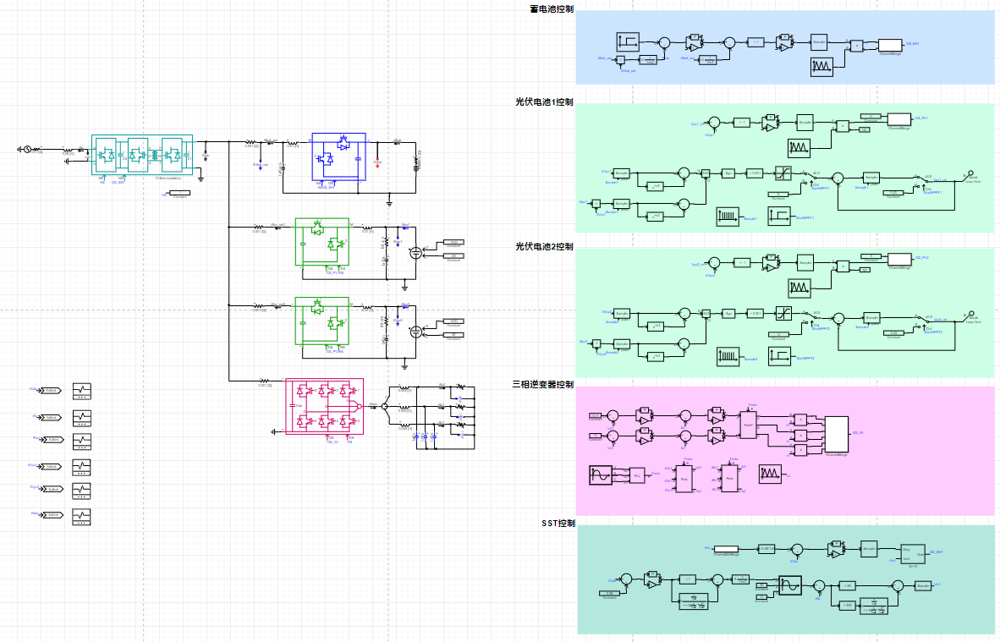

## 描述
直流微电网是由直流构成的微电网，可更高效可靠地接纳风、光等分布式可再生能源发电系统、储能单元、电动汽车及其他直流用电负荷。本算例提供了包含交流电网、固态变压器、光伏逆变器、储能变流器以及三相交流负载的直流微电网仿真，用以模拟智能楼宇供电系统。

本算例中的开关模块(固态变压器、三相H桥变流器、半桥变流器)采用快速开关搜索建模方法。该方法与传统基于插值迭代的开关算法相比，在保留高精确度的同时，极大提高了仿真效率，因而特别适用于微电网、模块化多电平变流器、固态变压器等含有大量电压源变流器的仿真分析。

## 模型介绍
该直流微网模型包含了一个10模块固态变压器(共120个IGBT/二极管组)、一个储能系统(铅蓄电池加半桥变流器)、两个光伏系统(光伏电池加半桥变流器)以及一个带阻感负载的三相逆变器，每一变流系统各自对应一个控制系统。固态变压器采用直流母线电压外环、并网电流内环以及电容电压比值闭环控制。储能系统采用输出端口功率外环加输出电流内环控制。光伏系统采用光伏输入电压环节跟踪MPPT产生的参考信号，其中MPPT采用了定步长扰动观测法。三相逆变器则采用离网VF控制。

## 仿真
点击工作空间右侧的“全局参数”栏，设定两组光伏系统MPPT开始的时间\$StartMPPT1\_time，\$StartMPPT2\_time；储能系统功率参考变化的时间\$PrefChange\_time以及三相负载变化时间\$LoadChange\_time。值得注意的是，负载变化是通过故障电阻在某一时刻切换阻值来实现。

点击`格式面板`->`电磁暂态`>`仿真控制`>`开始`，选择相应的计算节点，可得到仿真结果如下图所示。

可以发现，负载(PV，蓄电池，三相负载)变化时，直流母线基本维持恒定。

入网电流具有较好的正弦度，负载变化时，入网电流跟随变化，响应速度快。

蓄电池功率按照给定参考变化，响应速度快。

MPPT通过扰动输入电压，使光伏电池输出功率在最大功率点振动。

负载电阻变化导致负载电流随之变化，可以看出电流环的响应速度快，电流正弦度高。
