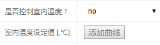
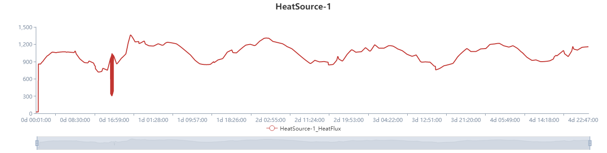

## 基本描述

本仿真模块的预置算例共计12个，均处于冬季供热条件下。用户在进入算例后可根据自身需要进一步更改仿真参数、网络拓扑、设备参数以及气象条件等，从而实现对特定场景（如夏季供冷）下的供热系统运行仿真。仿真算例形式的示意图如下。

## 应用场景

根据不同的边界条件设置情况及组合方式，区域集中供热系统运行仿真的应用场景各不相同，其中比较典型的两种应用场景为供热计划制定和室内温度预测，所预置的12个热网算例也基于这两种应用场景。在设置边界条件时，需注意边界条件的总数应该使系统能够封闭求解。

### 供热计划制定

供热计划制定的应用场景是指获得在特定气象条件下，为维持各负荷节点（建筑物）室内温度不变时热源在未来一段时间内的供热量变化情况，此时在使用该仿真模块时需要对各负荷的室内温度进行控制，而热源的供热量参数则无须控制，再根据实际需要设定其它的控制条件。

### 室内温度预测

室内温度预测的应用场景是指在已知供热计划的情况下，根据实际气象条件，预测未来一段时间内各负荷室内温度的变化情况，此时在使用该仿真模块时需要对热源的供热量进行控制，而无须控制负荷的室内温度，再根据实际需要设定其它的控制条件。

## 仿真

进入区域集中供热系统运行仿真模块的算例模板后，根据需要选择相应的节点数目、仿真时长和供热场景，点击完成即可进入相应的仿真算例，或直接打开对应的算例链接。进入算例后点击仿真参数>开始，选择神威节点，即可得到仿真结果。计算结束后选中各元件在系统监控面板中查看所预测的供热量、室内温度、供热温度、压力、流量等参数的变化情况。

### 供热计划制定

以1热源3负荷系统未来5天供热计划制定的仿真算例为例，其中热源节点的供热量变化情况如下图。可以看出在刚开始时室内初始温度大于室内控制温度，此时供热量较小，在室内温度降低至控制温度后，供热量开始增加，而后随着气象条件变化基本在900kw~1200kw之间不停波动。在大约17h附近供热量出现大幅振动，这主要由于室外风速的急剧变化造成的。

另外值得一提的是，查看负荷节点3的室内温度变化情况发现尽管室内温度为控制条件，但其室内温度仍然出现了波动，这主要是由于热源的供水温度和供水流量为定值，而负荷节点3离热源较远，导致供水温度在某些时刻较低，此时无论如何都无法满足负荷节点的供热需求，因此室内温度出现了下降。

### 室内温度预测

以1热源3负荷系统未来3天室内温度预测的仿真算例为例，其中负荷节点2的室内温度变化情况如下图。可以看出在当前的供热计划下，负荷节点2的室内温度基本维持在27度到30度之间，对于该负荷来说当前的供热计划是满足要求的。

