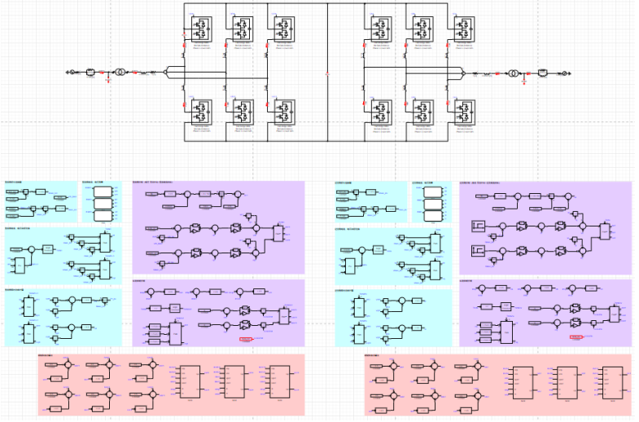
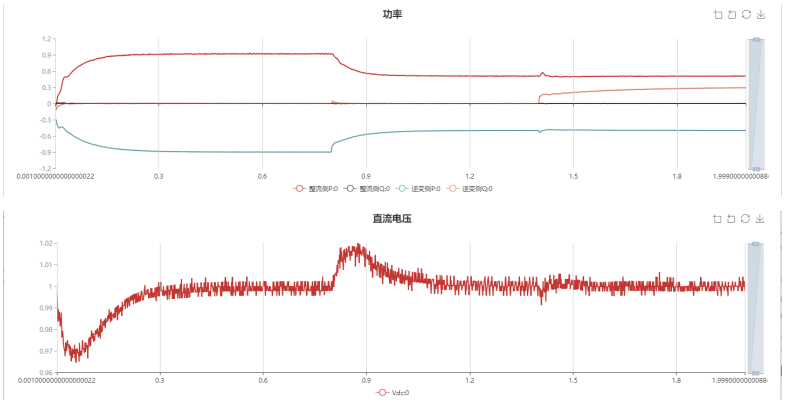
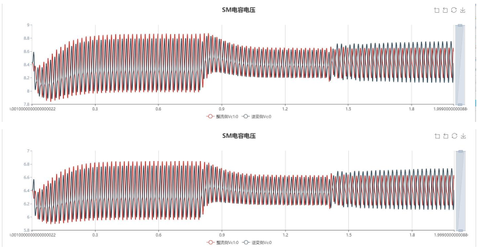

## 描述
模块化多电平换流器（MMC）是一种新型的电压变换电路，它通过将多个子模块级联，叠加输出高电压。具有输出谐波少、模块化程度高等特点，因而在电力系统中具有广泛的应用前景。

本仿真默认为77电平640kV双端MMC模型，用户可根据需要修改电平数及系统电压、功率参数。为保证仿真速度，本模型中的半桥子模块(SM)采用诺顿等效建模，可快速仿真电容电压充放电过程，但不能仿真子模块的内部故障。

## 运行原则

本仿真分为整流侧与逆变侧，两侧的电路拓扑及控制基本一致，仅存在微小差异。控制系统包括：标幺值换算、电流电压测量、电流电压坐标变换、瞬时功率计算、功率控制(整流侧为直流电压-无功功率控制，逆变侧为有功-无功功率控制)、环流抑制以及调制和排序算法。用户可更改“全局参数”内容实现不同的仿真组合及分析验证，仿真图如图所示。

## 仿真1：逆变侧功率控制暂态响应

点击工作空间右侧的“全局参数”栏，设定逆变侧的有功给定\$Pinv\_ref及无功给定\$Qinv\_ref。仿真默认为\$Pinv\_ref=-0.9，\$Qinv\_ref=0。在逆变侧控制中，有/无功的参考值由两个阶跃发生器给出，其初始输出值为\$Pinv\_ref和\$Qinv\_ref，0.8s后有功参考变为-0.5，1.4s后无功参考变为0.3。点击电磁暂态>仿真控制>开始，选择神威节点，即可得到仿真结果。可以发现，逆变侧的有/无功功率、整流侧无功以及直流电压在参考变化时可快速调整至设定值。

## 仿真2：环流抑制对比

环流抑制是MMC控制的关键环节之一，点击工作空间右侧的“全局参数”栏，设定整流侧环流抑制使能$CN_inv为0，即禁用整流侧的环流抑制。点击电磁暂态>仿真控制>开始，选择神威节点，即可得到仿真结果。可以发现，逆变侧环流峰峰值远小于整流侧，环流抑制效果明显。

## 仿真3：不同电平数/模块数仿真

点击工作空间右侧的“全局参数”栏，分别改变模块数$N的值为76和100，对应的输出电平数为77和101.点击电磁暂态>仿真控制>开始，选择神威节点，得到仿真结果。可以发现模块电容电压的值分别为8.42kV(640/76)、6.4kV(640/100)，且电容电压均衡效果明显。

