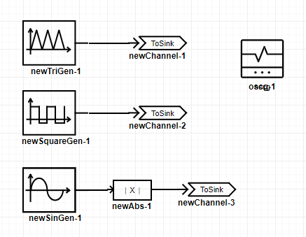
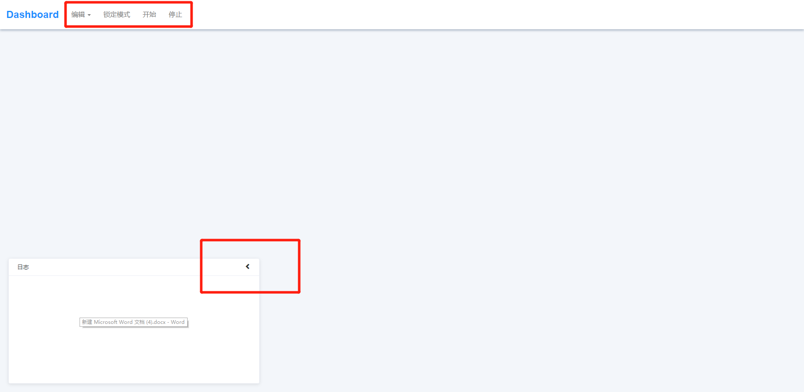
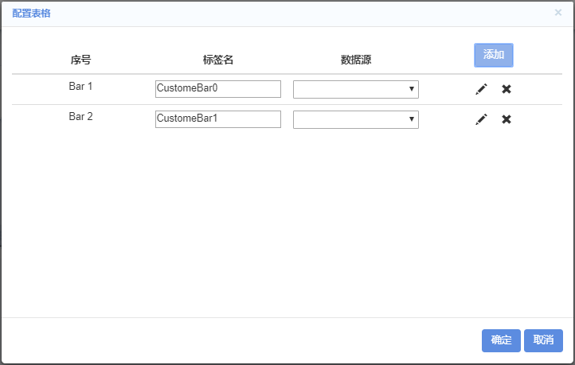
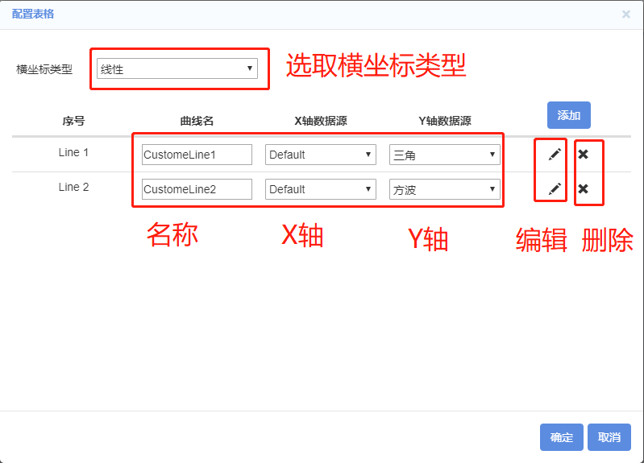
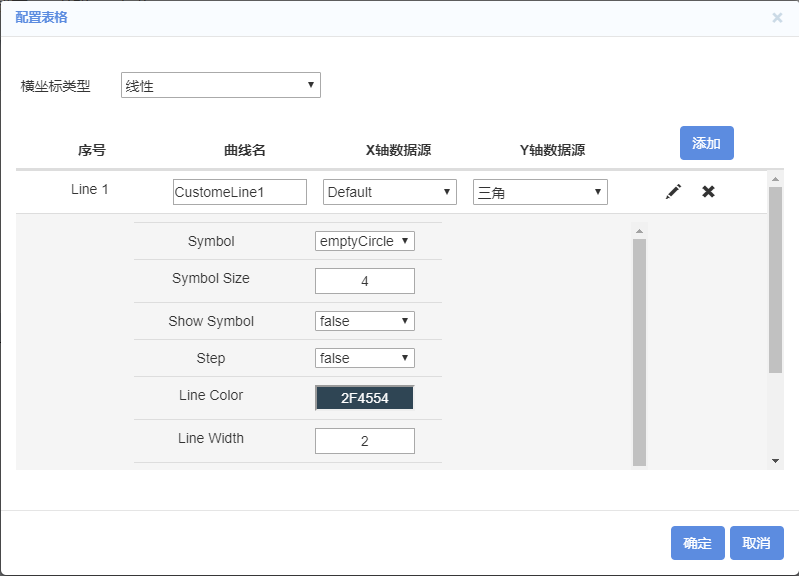
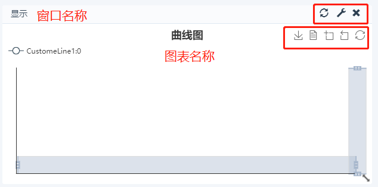
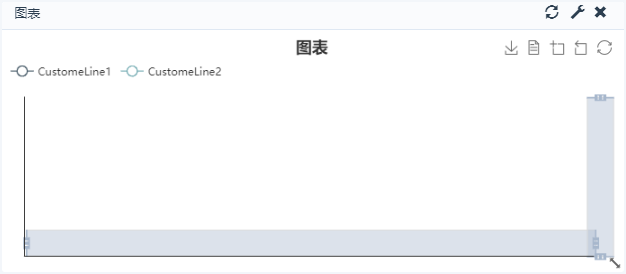
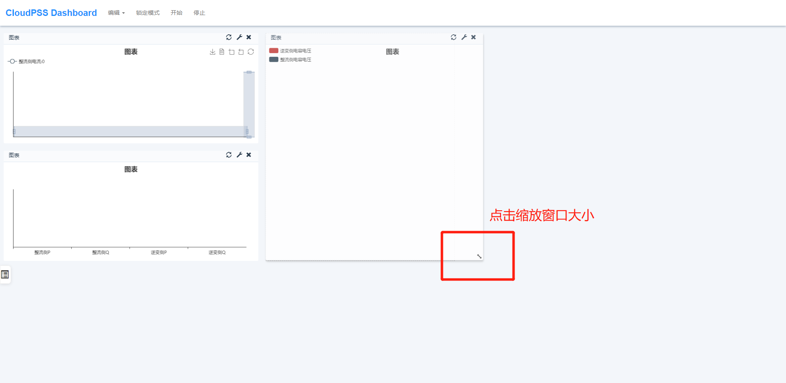
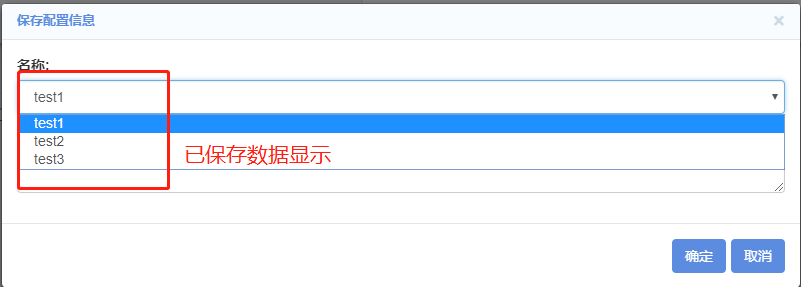

CloudPSS的dashboard功能提供了仿真数据可视化功能，借助图形化手段，用户可更加清晰有效的查看或展示仿真结果信息。

## 添加显示图表

建立如下图所示仿真，三角波发生器、正弦发生器及方波发生器分别连接三个输出通道，示波器分组用以显示该三路信号。

点击电磁暂态->仿真控制->打开Dashboard，将弹出新的页面，如下图所示：

该页面顶端包含编辑、锁定模式、开始和停止，底端为日志栏，点击日志栏右上角’’<’’符号可将其隐藏至左侧小图标中。

## 添加曲线

点击编辑->添加图表可弹出如下对话框，该框定义了待添加图表的大小、类型、标题等信息。

+ 选择大小：预定义的图表大小，可选择为4x4、4x6、5x5、6x4。
+ 选择图表：图标的类型可选择为曲线图、柱状图、饼图以及用户自定义类型。
+ 窗口标题：建立的图表所在窗口的标题。
+ 图标标题：所建立的图表的标题。

本例中选择大小为4x4，图表类型为曲线，窗口标题为“显示”，图表标题为“曲线图”，点击下一步，将弹出如下窗口。

横坐标类型可选取为线性或对数，点击添加按钮，填写待显示图表上显示的曲线名称，其x轴的数据来源，可以选择为Default，即时间为X轴，也可选择为其他。该下拉框的选项来自于仿真工作空间的“输出通道”。再次，选择Y轴的数据来源。点击编辑按钮可进一步设置曲线的样式特性，如图标、大小、线宽、颜色等等，如图所示。

点击确定即可在页面上显示该图表窗口，如图所示。该窗口右上角为刷新、设置删除按钮。

同理，还可添加新的图表，如柱状图、饼图。点击编辑->添加图表，选择添加柱状图/饼图，弹出对话框，点击添加，选择对应要显示的数据，点击确定即可。如下图所示。

## 图表位置与大小调节

在Dashboard的主页面上，点击窗口标题，移动鼠标可实现对窗口的移动。点击窗口右下角的缩放按钮，可实现图表的大小调节。

## 移除图表

图表移除方法有两种：第一种为点击图表右上方的删除按钮，可对该图表进行删除。或者点击编辑->移除所有图表对全部图表进行删除。

## 保存与加载图表

点击编辑->保存，将跳出如下窗口，填写名称并点击确定即可。用户可保存多个dashboard信息。

点击编辑->加载，将出现如下对话框，点击名称的下拉框将出现已保存文件的列表，选择相应的名称点击确认即可加载已保存的文件。

## 锁定/编辑模式

点击菜单页面的锁定/编辑模式可实现互相之间的切换，在锁定模式下不可对图表位置、大小等进行修改，有利于避免用户在展示可视化数据时出现误操作。

## 开始/停止

点击菜单页面的开始和停止，可控制dashboard的数据显示。

