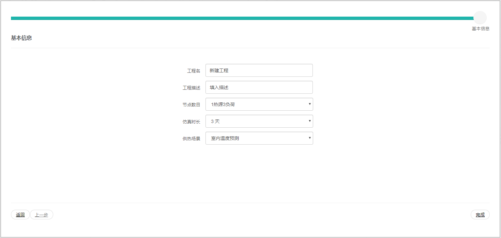
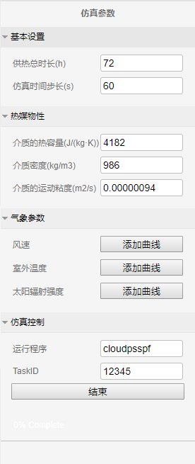

## 模块功能

区域集中供热系统运行仿真模块于2018年12月25号正式上线，该模块在2017年12月6日发布的热网潮流分析模块的基础上进行了更新和扩展，主要面向区域集中供热系统，分析其运行特性，为系统的运行调节和优化提供帮助。在该模块中，用户可根据实际需要，对网络拓扑、气象条件、设备配置等参数进行设置，系统将计算出供热系统中所有有效对象的稳态运行工况参数，并且通过图表等形式展示相应结果。

目前，本模块主要支持以下功能和应用场景：
1. 建筑物热负荷预测
2. 室内温度变化预测
3. 热源供热计划制定

上述功能旨在为用户提供集中供热系统运行方案优化、节能降耗等方面的帮助。未来本模块将陆续加入更多的功能满足用户的多样化需求。

## 元件介绍

本模块的元件主要位于页面左侧的元件面板“基本元件”模块内，包括建筑物（负荷）、热源、连接点、中继泵4种元件，另外还有管道元件，需通过其它元件相连而得，现依次对其进行介绍。

### [建筑物（负荷）](/components/compHeatLoad_Building.html)

建筑物（负荷）元件代表集中供热系统中的热用户，诸如居民建筑、学校、医院等都可以用该元件进行表示。建筑物（负荷）元件的图标如下所示：



建筑物（负荷）元件共有1个引脚可与其它元件相连，引脚位于图标上方竖线的顶端，该引脚只允许其它元件连入而不允许连出。

### [热源](/components/compHeatSource.html)

热源元件代表集中供热系统中提供热量的设备，诸如热电厂、供暖锅炉、热泵等。热源元件的图标如下所示：

 

热源元件共有1个引脚可与其它元件相连，引脚位于图标上方竖线的顶端，该引脚只允许连出而不允许其它元件连入。

### [连接点](/components/compConnectionNode.html)

连接点元件代表集中供热系统中实现多股热介质汇聚和分流的设备，诸如管汇、三通等。连接点元件的图标如下所示：



连接点元件共有1个引脚可与其它元件互连，引脚位于黑色圆圈的中心位置，需要注意的是该引脚与其它元件连接时应至少保证有一个连入和一个连出。

### [中继泵](/components/compPump.html)

中继泵元件代表集中供热系统中给热介质的输送提供动力的设备，实际中泵的种类较多，如离心泵、螺杆泵、滑片泵等。中继泵元件的图标如下所示：

 

中继泵元件共有2个引脚可与其它元件相连，分别为入口引脚和出口引脚，且各自都只能与最多一个元件相连。其中入口引脚位于元件图标左侧凸起处，该引脚只允许其它元件连入而不能连向其它元件；出口引脚位于元件图标顶端凸起处，该引脚只允许连向其它元件而不能由其它元件连入。

### [管道](/components/compPipeline.html)

管道元件用于热介质的输送。本模块中管道元件并不位于元件面板内，而是需要通过连接其它元件获得，如下图将一个热源和一个建筑物（负荷）的引脚相连便得到相应的管道元件（图中pipeLine_7），需要注意的图中连接的管道实际上同时代表了供水管道和回水管道：

元件的连接方法可参考《CloudPSS用户手册》。

## 参数输入

### 算例模板

在新建区域集中供热系统运行仿真的工程之后，会出现算例模板的输入面板，如下图所示：

算例模板的选项主要包括工程名、工程描述、节点数目、供热时长和供热场景。这里主要介绍节点数目、供热时长和供热场景。

+ 节点数目

  节点数目包含两个选项，分别是1热源3负荷和1热源5负荷，代表算例的初始热源和建筑物（负荷）的数量情况，用户也可以根据自己需要在这两个算例的基础上新建（或删除）元件。

+ 供热时长
 
  供热时长包含三个选项，分别是3天、5天和7天，代表了集中供热系统需要进行仿真模拟的运行时长，用户也可以根据自己需要在这两个算例的基础上增加或减少仿真时长。

+ 供热场景

  供热场景包含两个选项，分别是室内温度预测和供热计划制定，其各自含义可以参见区域集中供热系统运行仿真的[算例文档](/examples/HeatingSystem.html)。在进入算例后，用户也可以根据自己需要调整应用场景。

### 全局参数

在进入区域集中供热系统运行仿真模块的工作页面后，全局参数位于页面右侧仿真参数面板内，主要分为基本设置、热媒物性、气象参数和仿真控制四个模块儿，如下图：

下面分别对四个模块的参数进行介绍：

+ 基本设置

  基本设置中包含供热总时长和仿真时间步长两个选项，其中供热总时长即为算例模板中的“供热时长”，仿真时间步长代表每两次全局稳态仿真的时间间隔。通过供热时长和仿真时间步长的大小可以计算出总共的稳态仿真次数，通常建议仿真次数不超过一万次，否则会因为输入的大量数据而导致网页响应过慢。

+ 热媒物性

  热媒物性表示供热系统中热流体（或热介质）的物理性质，主要包括热容量（即比热容）、密度和运动粘度。  