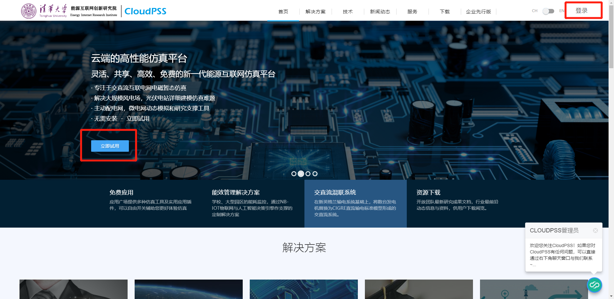
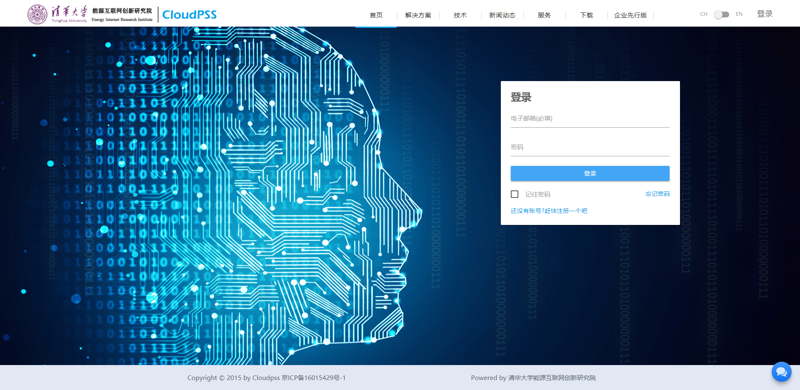
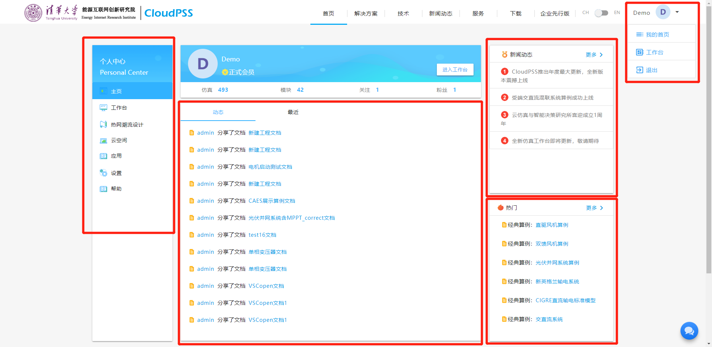

## 1. CloudPSS简介

CloudPSS是一个位于云端的高性能仿真平台，是具有灵活、共享、高效、免费等特点的新一代电力系统仿真平台。该平台专注于交直流互联电网的电磁暂态仿真，可以解决大规模风电场、光伏电站详细建模仿真难题，可作为主动配电网、微电网动态模拟和研究的支撑工具。

CloudPSS是一款基于云计算的电磁仿真工具，其利用GPU并行计算的快速解决方案，提供了统一数据接口的应用平台，其具有以下三大特点：

**1.云仿真**
CloudPSS的核心技术是云仿真，由清华大学电机系自主研发。其基于“云计算”思想，由云端仿真服务器完成大规模风电场电磁暂态仿真、电力系统硬件在环仿真、多功能互补耦合仿真以及其他电力系统暂态仿真功能，客户运用普通计算机即可免费享受昂贵的大型计算机对庞大算量的高效计算成果。

**2.云同步**
所有设计及计算工作都由云数据库存储，加上平台提供不同的数据接口以及调用API供各种应用使用，用户只要登录账号，即可随时在任何终端访问设计文档，较之传统的离线仿真软件只能在本地环境运行，CloudPSS极大解放了设计者的时间与空间，让您随时随地随心工作。

**3.云协作**
针对日益复杂化的电网设计趋势以及团队工作的重要性，CloudPSS采用图层管理思路，各人在不同的图层中进行设计，从而实现相对独立同时又能无缝对接的分工工作。

## 2. 账号管理

### 2.1 账号注册
CloudPSS无需下载，只需在在线注册账号即可免费试用。现今推出的是CloudPSS3.0版本，本文将针对该版本的账号注册进行介绍。

打开任意浏览器，在浏览器地址栏输入：<http://www.cloudpss.net/>，进入欢迎界面，点击欢迎界面右上方的“注册”按钮进行注册，或点击页面左下方的“立即试用”按钮进行注册，按键位置在图2.1中用红色箭头标注。

图2.1 CloudPSS欢迎界面

点击按钮，进入如图2.2所示的注册页面，按照提示填写相应位置信息，填写完毕后，点击“发送注册码”按钮对注册所用邮箱进行验证，此时，可打开注册邮箱来获取注册码，并将其填入注册页面相应位置，最后点击“注册”，即完成了一个对新用户的注册。若出现“用户名已存在”等错误提示，请按照提示进行修改。注册成功后，页面将转入登录界面，登录部分将在下一节进行介绍。

图2.2 CloudPSS登录界面

### 2.2 账号登陆
进入CloudPSS欢迎界面后，点击右上角的“登录”按钮，进入登录页面，如图2.3所示。在页面的相应位置填写用户邮箱以及登录密码，点击“登录”后即实现用户的登录。

图2.3 CloudPSS登录界面

登录成功后，即进入主界面（图2.4）。页面左侧包含“主页”、“工作台”、“热网潮流设计”、“云空间”、“应用”、“设置”与“帮助”。

图2.4 登录成功后的用户界面